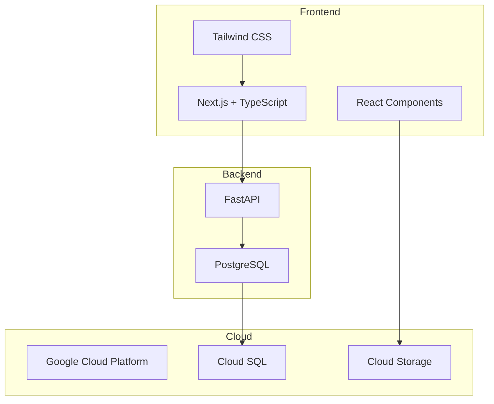
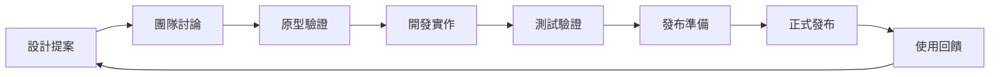

# 井然 Orderly 設計系統

> **版本**: v1.0  
> **更新日期**: 2025-01-17  
> **技術棧**: Next.js + TypeScript + FastAPI + PostgreSQL + Google Cloud

---

## 目錄

1. [簡介 (Overview)](#簡介-overview)
2. [品牌基礎 (Brand Foundations)](#品牌基礎-brand-foundations)
3. [設計原則 (Design Principles)](#設計原則-design-principles)
4. [樣式規範 (Style Guidelines)](#樣式規範-style-guidelines)
5. [元件庫 (Component Library)](#元件庫-component-library)
6. [互動規範 (Interaction Guidelines)](#互動規範-interaction-guidelines)
7. [響應式設計 (Responsive Design)](#響應式設計-responsive-design)
8. [無障礙設計 (Accessibility)](#無障礙設計-accessibility)
9. [技術實作指南 (Implementation Guide)](#技術實作指南-implementation-guide)
10. [數據視覺化 (Data Visualization)](#數據視覺化-data-visualization)
11. [版本管理與治理 (Versioning & Governance)](#版本管理與治理-versioning--governance)

---

## 簡介 (Overview)

### 設計系統使命

井然 Orderly 設計系統旨在為餐飲產業的全鏈路數位供應平台提供一致、高效、可擴展的設計解決方案。我們服務三方角色：餐廳端、供應端、平台管理端，確保每個角色都能獲得專屬而一致的用戶體驗。

### 設計系統目標

- **一致性**：跨產品與平台保持統一的視覺語言和互動模式
- **效率性**：提升開發效率，減少重複設計和開發工作
- **可擴展性**：支援未來功能擴展和新平台整合
- **易維護性**：便於設計和開發團隊協作，降低維護成本
- **可預測性**：讓用戶能夠直覺性地操作和理解介面

### 技術架構



---

## 品牌基礎 (Brand Foundations)

### 品牌願景

**讓餐飲產業的供應鏈管理井然有序**

井然 Orderly 致力於透過數位化轉型，解決餐飲業「下單 → 配送 → 驗收 → 對帳 → 結算」全流程的痛點，打造透明、高效、可信賴的供應鏈生態系統。

### 品牌核心價值

1. **效率 (Efficiency)**
   - 簡化複雜的業務流程
   - 減少人工重複作業
   - 提升決策速度

2. **透明 (Transparency)**
   - 全程可追溯的交易記錄
   - 公開透明的價格資訊
   - 清晰的狀態回饋

3. **可靠 (Reliability)**
   - 穩定的系統服務
   - 準確的數據計算
   - 及時的異常處理

4. **協作 (Collaboration)**
   - 促進多方角色合作
   - 建立信任關係
   - 共創商業價值

### 品牌語調 (Tone of Voice)

- **專業而友善**：既展現專業能力，又保持親和力
- **簡潔而精準**：用最少的文字傳達最準確的資訊
- **積極而務實**：正向積極，同時腳踏實地解決問題
- **值得信賴**：一致可靠的服務體驗，建立長期信任

---

## 設計原則 (Design Principles)

### 1. 效率至上 (Efficiency First)

**核心理念**：關鍵操作路徑不超過3步

- **快速下單**：支援批量選擇、歷史重複下單、智慧推薦
- **一鍵確認**：減少確認步驟，提供預設選項
- **即時驗收**：掃碼、拍照、標記一體化流程

**實作原則**：
- 優先顯示高頻操作
- 提供快捷鍵和批量操作
- 智慧預填和自動完成

### 2. 透明可追溯 (Transparent & Traceable)

**核心理念**：所有狀態變更都有視覺反饋

- **狀態可視化**：訂單、驗收、對帳全流程狀態一目了然
- **操作歷程**：完整記錄並可查詢所有操作歷史
- **異常處理**：清晰展示問題原因和解決方案

**實作原則**：
- 使用進度條和狀態指示器
- 提供詳細的操作日誌
- 異常狀態突出顯示

### 3. 角色適配 (Role-Adaptive)

**核心理念**：三方角色的界面語言差異化

**餐廳端 - 採購導向**：
- 主視覺：溫暖的主色調，強調效率
- 功能重點：商品搜尋、快速下單、待驗收提醒
- 語言風格：簡潔直接，以成本節約為導向

**供應端 - 履約導向**：
- 主視覺：穩重的主色調，強調專業
- 功能重點：待處理訂單、庫存狀態、履約KPI
- 語言風格：專業術語，以服務品質為導向

**平台管理端 - 監控導向**：
- 主視覺：中性的主色調，強調客觀
- 功能重點：實時數據、異常告警、趨勢分析
- 語言風格：數據驅動，以平台健康為導向

### 4. 穩定可靠 (Stable & Reliable)

**核心理念**：在各種環境下保持穩定運行

- **網路適應性**：支援低網速和不穩定網路環境
- **離線支援**：關鍵功能支援離線操作
- **錯誤恢復**：提供明確的錯誤處理和恢復機制

**實作原則**：
- 實作 Progressive Web App (PWA)
- 本地緩存關鍵數據
- 優雅降級機制

---

## 樣式規範 (Style Guidelines)

### 色彩系統 (Color System)

#### 品牌主色 - Mocha Mousse

我們的品牌主色 Mocha Mousse (#A47864) 象徵著溫暖、穩重和專業，完美體現餐飲業的親和力與商業的可靠性。

```css
:root {
  /* Primary Colors - Mocha Mousse */
  --primary-50: #faf9f7;
  --primary-100: #f5f2ee;
  --primary-200: #ebe4dc;
  --primary-300: #ddd2c5;
  --primary-400: #ccb8a6;
  --primary-500: #a47864;  /* Brand Primary */
  --primary-600: #936b58;
  --primary-700: #7a5a4a;
  --primary-800: #64493e;
  --primary-900: #523c32;
  --primary-950: #2b1f1a;
}
```

#### 功能色彩

```css
:root {
  /* Success Colors */
  --success-50: #f0fdf4;
  --success-500: #10b981;  /* 成功、完成狀態 */
  --success-700: #047857;
  
  /* Warning Colors */
  --warning-50: #fffbeb;
  --warning-500: #f59e0b;  /* 警告、待處理 */
  --warning-700: #b45309;
  
  /* Error Colors */
  --error-50: #fef2f2;
  --error-500: #ef4444;    /* 錯誤、異常 */
  --error-700: #b91c1c;
  
  /* Info Colors */
  --info-50: #eff6ff;
  --info-500: #3b82f6;     /* 資訊、提示 */
  --info-700: #1d4ed8;
  
  /* Neutral Colors */
  --gray-50: #f9fafb;
  --gray-100: #f3f4f6;
  --gray-200: #e5e7eb;
  --gray-300: #d1d5db;
  --gray-400: #9ca3af;
  --gray-500: #6b7280;
  --gray-600: #4b5563;
  --gray-700: #374151;
  --gray-800: #1f2937;
  --gray-900: #111827;
}
```

#### 數據視覺化色彩

```css
:root {
  /* Chart Colors */
  --chart-primary: #a47864;
  --chart-secondary: #10b981;
  --chart-tertiary: #f59e0b;
  --chart-quaternary: #3b82f6;
  --chart-gradient: linear-gradient(135deg, #a47864 0%, #ccb8a6 100%);
}
```

#### 色彩使用原則

- **主色調**：用於主要動作按鈕、重要連結、品牌識別
- **成功色**：訂單完成、驗收通過、支付成功
- **警告色**：待確認訂單、庫存不足、逾期提醒
- **錯誤色**：操作失敗、驗收異常、系統錯誤
- **資訊色**：一般提示、幫助資訊、中性狀態

### 字體系統 (Typography)

#### 字體族群

```css
:root {
  --font-family-primary: 'Inter', 'Noto Sans TC', -apple-system, BlinkMacSystemFont, 'Segoe UI', system-ui, sans-serif;
  --font-family-mono: 'JetBrains Mono', 'SF Mono', Monaco, 'Cascadia Code', monospace;
}
```

#### 字體階層

```css
/* Heading Styles */
.text-h1 {
  font-size: 2rem;     /* 32px */
  font-weight: 700;    /* Bold */
  line-height: 1.25;
  letter-spacing: -0.025em;
}

.text-h2 {
  font-size: 1.5rem;   /* 24px */
  font-weight: 600;    /* SemiBold */
  line-height: 1.333;
  letter-spacing: -0.025em;
}

.text-h3 {
  font-size: 1.25rem;  /* 20px */
  font-weight: 600;    /* SemiBold */
  line-height: 1.4;
}

.text-h4 {
  font-size: 1.125rem; /* 18px */
  font-weight: 600;    /* SemiBold */
  line-height: 1.444;
}

/* Body Styles */
.text-body-lg {
  font-size: 1.125rem; /* 18px */
  font-weight: 400;    /* Regular */
  line-height: 1.556;
}

.text-body {
  font-size: 1rem;     /* 16px */
  font-weight: 400;    /* Regular */
  line-height: 1.5;
}

.text-body-sm {
  font-size: 0.875rem; /* 14px */
  font-weight: 400;    /* Regular */
  line-height: 1.429;
}

/* Caption & Labels */
.text-caption {
  font-size: 0.75rem;  /* 12px */
  font-weight: 500;    /* Medium */
  line-height: 1.333;
  text-transform: uppercase;
  letter-spacing: 0.05em;
}

.text-label {
  font-size: 0.875rem; /* 14px */
  font-weight: 500;    /* Medium */
  line-height: 1.429;
}
```

#### 字體使用原則

- **標題**：用於頁面標題、區塊標題、重要資訊標示
- **內文**：用於一般內容、描述文字、表格內容
- **標籤**：用於表單標籤、分類標籤、狀態標示
- **說明文字**：用於輔助說明、提示文字、版權資訊

### 間距與格線 (Spacing & Grid)

#### 間距系統

基於 **8px** 的基準單位建立一致的間距系統：

```css
:root {
  --spacing-1: 0.25rem;  /* 4px */
  --spacing-2: 0.5rem;   /* 8px */
  --spacing-3: 0.75rem;  /* 12px */
  --spacing-4: 1rem;     /* 16px */
  --spacing-5: 1.25rem;  /* 20px */
  --spacing-6: 1.5rem;   /* 24px */
  --spacing-8: 2rem;     /* 32px */
  --spacing-10: 2.5rem;  /* 40px */
  --spacing-12: 3rem;    /* 48px */
  --spacing-16: 4rem;    /* 64px */
  --spacing-20: 5rem;    /* 80px */
  --spacing-24: 6rem;    /* 96px */
}
```

#### 格線系統

基於 **12欄** 的響應式格線系統：

```css
.grid-container {
  display: grid;
  grid-template-columns: repeat(12, 1fr);
  gap: 1.5rem; /* 24px */
  max-width: 1200px;
  margin: 0 auto;
  padding: 0 1rem;
}

/* Responsive Grid */
@media (max-width: 768px) {
  .grid-container {
    grid-template-columns: 1fr;
    gap: 1rem; /* 16px */
    padding: 0 0.75rem;
  }
}
```

#### 圓角與陰影

```css
:root {
  /* Border Radius */
  --border-radius-sm: 2px;
  --border-radius: 4px;      /* 品牌統一圓角 */
  --border-radius-md: 6px;
  --border-radius-lg: 8px;
  --border-radius-xl: 12px;
  --border-radius-full: 9999px;
  
  /* Shadows */
  --shadow-sm: 0 1px 2px 0 rgba(0, 0, 0, 0.05);
  --shadow: 0 1px 3px 0 rgba(0, 0, 0, 0.1), 0 1px 2px 0 rgba(0, 0, 0, 0.06);
  --shadow-md: 0 4px 6px -1px rgba(0, 0, 0, 0.1), 0 2px 4px -1px rgba(0, 0, 0, 0.06);
  --shadow-lg: 0 10px 15px -3px rgba(0, 0, 0, 0.1), 0 4px 6px -2px rgba(0, 0, 0, 0.05);
  --shadow-xl: 0 20px 25px -5px rgba(0, 0, 0, 0.1), 0 10px 10px -5px rgba(0, 0, 0, 0.04);
}
```

---

## 元件庫 (Component Library)

### 元件優先級分類

基於產品經理的建議，我們將元件分為三個優先級：

#### P0 - 核心業務元件（MVP 必備）

這些元件直接影響核心業務流程，是平台能夠正常運作的基礎。

#### P1 - 效率提升元件（第二階段）

這些元件提升用戶操作效率和體驗品質。

#### P2 - 進階功能元件（第三階段）

這些元件提供高級功能和個性化體驗。

### P0 核心業務元件

#### 1. 訂單卡片 (Order Card)

支援 8 個狀態節點的訂單卡片元件，是平台最重要的展示元件。

**設計規範**：
- 卡片尺寸：最小高度 120px，響應式寬度
- 狀態指示：使用色彩編碼和圖標組合
- 快速操作：一鍵確認、拒絕、修改按鈕
- 資訊層級：訂單號 > 金額 > 時間 > 狀態

**狀態定義**：
```typescript
type OrderStatus = 
  | 'draft'           // 草稿 - 灰色
  | 'pending'         // 待確認 - 黃色
  | 'confirmed'       // 已確認 - 藍色
  | 'preparing'       // 備貨中 - 紫色
  | 'shipping'        // 配送中 - 橙色
  | 'delivered'       // 已送達 - 綠色
  | 'completed'       // 已完成 - 深綠
  | 'cancelled'       // 已取消 - 紅色
```

**Next.js 實作範例**：
```tsx
// components/OrderCard.tsx
import { Card } from '@/components/ui/Card'
import { Badge } from '@/components/ui/Badge'
import { Button } from '@/components/ui/Button'

interface OrderCardProps {
  order: {
    id: string
    amount: number
    status: OrderStatus
    createdAt: string
    supplierName: string
  }
  onConfirm?: () => void
  onReject?: () => void
}

export function OrderCard({ order, onConfirm, onReject }: OrderCardProps) {
  return (
    <Card className="relative overflow-hidden">
      {/* 狀態色條 */}
      <div className={`absolute top-0 left-0 w-1 h-full ${getStatusColor(order.status)}`} />
      
      <Card.Header>
        <div className="flex justify-between items-start">
          <div>
            <h3 className="text-h4 font-semibold">訂單 #{order.id}</h3>
            <p className="text-body-sm text-gray-500">{order.supplierName}</p>
          </div>
          <Badge variant={getStatusVariant(order.status)}>
            {getStatusText(order.status)}
          </Badge>
        </div>
      </Card.Header>
      
      <Card.Body>
        <div className="flex justify-between items-center">
          <div>
            <p className="text-h3 font-bold text-primary-600">
              NT$ {order.amount.toLocaleString()}
            </p>
            <p className="text-body-sm text-gray-500">
              {formatDate(order.createdAt)}
            </p>
          </div>
          
          {order.status === 'pending' && (
            <div className="flex gap-2">
              <Button size="sm" variant="secondary" onClick={onReject}>
                拒絕
              </Button>
              <Button size="sm" onClick={onConfirm}>
                確認
              </Button>
            </div>
          )}
        </div>
      </Card.Body>
    </Card>
  )
}
```

#### 2. 商品選擇器 (Product Selector)

支援搜尋、篩選、批量選擇的商品選擇元件。

**設計規範**：
- 搜尋框：固定在頂部，支援即時搜尋
- 篩選器：可摺疊的側邊欄，支援多條件組合
- 商品卡片：展示關鍵資訊（圖片、名稱、價格、庫存）
- 批量操作：全選、取消全選、已選計數

**Next.js 實作範例**：
```tsx
// components/ProductSelector.tsx
'use client'

import { useState, useMemo } from 'react'
import { Input } from '@/components/ui/Input'
import { Button } from '@/components/ui/Button'
import { Checkbox } from '@/components/ui/Checkbox'

interface Product {
  id: string
  name: string
  price: number
  stock: number
  image?: string
  category: string
}

interface ProductSelectorProps {
  products: Product[]
  selectedIds: string[]
  onSelectionChange: (ids: string[]) => void
}

export function ProductSelector({ 
  products, 
  selectedIds, 
  onSelectionChange 
}: ProductSelectorProps) {
  const [searchTerm, setSearchTerm] = useState('')
  const [categoryFilter, setCategoryFilter] = useState<string>('')
  
  const filteredProducts = useMemo(() => {
    return products.filter(product => {
      const matchesSearch = product.name.toLowerCase()
        .includes(searchTerm.toLowerCase())
      const matchesCategory = !categoryFilter || 
        product.category === categoryFilter
      return matchesSearch && matchesCategory
    })
  }, [products, searchTerm, categoryFilter])
  
  const toggleProduct = (productId: string) => {
    const newSelection = selectedIds.includes(productId)
      ? selectedIds.filter(id => id !== productId)
      : [...selectedIds, productId]
    onSelectionChange(newSelection)
  }
  
  const selectAll = () => {
    onSelectionChange(filteredProducts.map(p => p.id))
  }
  
  const deselectAll = () => {
    onSelectionChange([])
  }
  
  return (
    <div className="space-y-4">
      {/* 搜尋和篩選 */}
      <div className="flex gap-4">
        <Input
          placeholder="搜尋商品..."
          value={searchTerm}
          onChange={(e) => setSearchTerm(e.target.value)}
          className="flex-1"
        />
        <select 
          value={categoryFilter}
          onChange={(e) => setCategoryFilter(e.target.value)}
          className="form-input w-48"
        >
          <option value="">所有分類</option>
          <option value="蔬菜">蔬菜</option>
          <option value="肉類">肉類</option>
          <option value="海鮮">海鮮</option>
        </select>
      </div>
      
      {/* 批量操作 */}
      <div className="flex justify-between items-center">
        <div className="flex gap-2">
          <Button size="sm" variant="ghost" onClick={selectAll}>
            全選
          </Button>
          <Button size="sm" variant="ghost" onClick={deselectAll}>
            取消全選
          </Button>
        </div>
        <span className="text-body-sm text-gray-500">
          已選 {selectedIds.length} 項
        </span>
      </div>
      
      {/* 商品列表 */}
      <div className="grid grid-cols-1 md:grid-cols-2 lg:grid-cols-3 gap-4">
        {filteredProducts.map(product => (
          <ProductCard
            key={product.id}
            product={product}
            selected={selectedIds.includes(product.id)}
            onToggle={() => toggleProduct(product.id)}
          />
        ))}
      </div>
    </div>
  )
}
```

#### 3. 驗收掃碼介面 (Verification Scanner)

整合相機、條碼掃描、拍照上傳的驗收介面。

**設計規範**：
- 全螢幕相機取景
- 掃描框居中顯示
- 底部操作區：拍照、閃光燈、切換鏡頭
- 支援多張照片上傳

**Next.js 實作範例**：
```tsx
// components/VerificationScanner.tsx
'use client'

import { useState, useRef, useCallback } from 'react'
import { Camera } from '@/components/ui/Camera'
import { Button } from '@/components/ui/Button'

interface VerificationScannerProps {
  onScanResult: (code: string) => void
  onPhotoCapture: (photos: File[]) => void
}

export function VerificationScanner({ 
  onScanResult, 
  onPhotoCapture 
}: VerificationScannerProps) {
  const [mode, setMode] = useState<'scan' | 'photo'>('scan')
  const [capturedPhotos, setCapturedPhotos] = useState<File[]>([])
  const [flashEnabled, setFlashEnabled] = useState(false)
  
  const handleScan = useCallback((result: string) => {
    onScanResult(result)
  }, [onScanResult])
  
  const handlePhotoCapture = useCallback((file: File) => {
    const newPhotos = [...capturedPhotos, file]
    setCapturedPhotos(newPhotos)
    onPhotoCapture(newPhotos)
  }, [capturedPhotos, onPhotoCapture])
  
  return (
    <div className="fixed inset-0 bg-black z-50">
      {/* 相機取景區 */}
      <div className="relative h-full">
        <Camera
          mode={mode}
          flashEnabled={flashEnabled}
          onScan={handleScan}
          onPhotoCapture={handlePhotoCapture}
        />
        
        {/* 掃描框 */}
        {mode === 'scan' && (
          <div className="absolute inset-0 flex items-center justify-center">
            <div className="w-64 h-64 border-2 border-white border-dashed rounded-lg">
              <div className="w-full h-full flex items-center justify-center">
                <p className="text-white text-center">
                  對準條碼掃描
                </p>
              </div>
            </div>
          </div>
        )}
        
        {/* 底部控制區 */}
        <div className="absolute bottom-0 left-0 right-0 bg-black bg-opacity-50 p-6">
          <div className="flex justify-between items-center">
            {/* 模式切換 */}
            <div className="flex gap-2">
              <Button
                size="sm"
                variant={mode === 'scan' ? 'primary' : 'ghost'}
                onClick={() => setMode('scan')}
              >
                掃描
              </Button>
              <Button
                size="sm"
                variant={mode === 'photo' ? 'primary' : 'ghost'}
                onClick={() => setMode('photo')}
              >
                拍照
              </Button>
            </div>
            
            {/* 功能按鈕 */}
            <div className="flex gap-4 items-center">
              <Button
                size="sm"
                variant="ghost"
                onClick={() => setFlashEnabled(!flashEnabled)}
              >
                {flashEnabled ? '關閃光燈' : '開閃光燈'}
              </Button>
              
              {capturedPhotos.length > 0 && (
                <span className="text-white text-sm">
                  已拍攝 {capturedPhotos.length} 張
                </span>
              )}
            </div>
          </div>
        </div>
      </div>
    </div>
  )
}
```

### P1 效率提升元件

#### 4. 數據表格 (Data Table)

支援虛擬滾動、排序、篩選、批量操作的高效能表格元件。

**設計規範**：
- 固定表頭：表頭固定，內容可滾動
- 虛擬滾動：大數據量時使用虛擬滾動
- 排序指示：可排序欄位顯示排序圖標
- 批量選擇：支援全選、部分選擇狀態

#### 5. 通知系統 (Notification System)

支援多種通知類型和優先級的通知元件。

**通知類型**：
- Toast 通知：短暫顯示的操作回饋
- Banner 通知：頁面頂部的重要公告
- 應用內通知：通知中心的訊息列表
- 推播通知：系統推送到設備

#### 6. 表單元件庫 (Form Components)

智慧驗證、自動儲存、錯誤處理的表單元件集合。

**包含元件**：
- Input（文字輸入框）
- Select（下拉選擇器）
- Checkbox（複選框）
- Radio（單選按鈕）
- DatePicker（日期選擇器）
- FileUpload（檔案上傳）

### P2 進階功能元件

#### 7. 圖表元件 (Chart Components)

基於 Chart.js 的數據視覺化元件庫。

#### 8. 地圖元件 (Map Components)

基於 Google Maps 的地理位置功能元件。

#### 9. 高級搜尋 (Advanced Search)

支援複雜查詢條件的搜尋介面。

---

## 互動規範 (Interaction Guidelines)

### 訂單建立流程

**設計模式**：漸進式表單 + 智慧預填

```
1. 商品選擇 (Product Selection)
   ├── 搜尋/篩選介面
   ├── 商品卡片展示
   └── 購物車預覽

2. 訂單資訊 (Order Information)
   ├── 自動填入常用資訊
   ├── 配送時間選擇
   └── 特殊需求備註

3. 確認下單 (Order Confirmation)
   ├── 訂單摘要檢視
   ├── 預計送達時間
   └── 一鍵送出訂單
```

### 驗收操作流程

**設計模式**：步驟式引導 + 異常處理

```
1. 準備驗收 (Preparation)
   ├── 待驗收清單顯示
   ├── 預期送達提醒
   └── 相機權限確認

2. 逐項驗收 (Item Verification)
   ├── 掃描商品條碼
   ├── 數量核對確認
   ├── 品質狀態檢查
   └── 異常項目標記

3. 完成驗收 (Completion)
   ├── 驗收結果摘要
   ├── 異常處理選擇
   └── 確認並通知供應商
```

### 動畫與轉場

**動畫時長**：
- 微互動：150ms（hover、click）
- 頁面轉場：300ms（路由切換）
- 複雜動畫：500ms（展開/收起）

**緩動函數**：
```css
:root {
  --ease-in: cubic-bezier(0.4, 0.0, 1, 1);
  --ease-out: cubic-bezier(0.0, 0.0, 0.2, 1);
  --ease-in-out: cubic-bezier(0.4, 0.0, 0.2, 1);
}
```

### 錯誤處理機制

**錯誤層級**：

1. **系統級錯誤**：
   - 顯示：全頁面錯誤頁
   - 內容：問題說明 + 重試按鈕 + 客服聯繫
   - 行為：自動重試機制

2. **功能級錯誤**：
   - 顯示：Toast 通知 + 內聯錯誤訊息
   - 內容：具體錯誤原因 + 解決建議
   - 行為：保留用戶輸入，提供修正指引

3. **驗證錯誤**：
   - 顯示：表單欄位下方錯誤文字
   - 內容：明確的驗證規則說明
   - 行為：即時驗證，逐步引導

---

## 響應式設計 (Responsive Design)

### 斷點系統

```css
:root {
  --breakpoint-sm: 640px;   /* 手機橫向 */
  --breakpoint-md: 768px;   /* 平板直向 */
  --breakpoint-lg: 1024px;  /* 平板橫向/小筆電 */
  --breakpoint-xl: 1280px;  /* 桌面 */
  --breakpoint-2xl: 1536px; /* 大桌面 */
}
```

### 移動端優先策略

**設計原則**：
- 320px 最小寬度適配
- 44×44px 最小觸控區域（符合 WCAG 2.1 AA）
- 單手操作友好的介面布局
- 網路條件適應的內容載入

**布局適配**：

```css
/* 移動端（320px-767px）*/
.container {
  padding: 1rem;
  grid-template-columns: 1fr;
}

/* 平板（768px-1023px）*/
@media (min-width: 768px) {
  .container {
    padding: 1.5rem;
    grid-template-columns: 1fr 2fr;
  }
}

/* 桌面（1024px+）*/
@media (min-width: 1024px) {
  .container {
    padding: 2rem;
    grid-template-columns: 1fr 3fr 1fr;
  }
}
```

### PWA 支援

**功能特性**：
- 離線瀏覽：快取關鍵頁面和數據
- 應用安裝：可安裝到桌面/主畫面
- 推播通知：重要訊息推送
- 背景同步：網路恢復時自動同步

**實作配置**：

```typescript
// next.config.js
const withPWA = require('next-pwa')({
  dest: 'public',
  disable: process.env.NODE_ENV === 'development',
  register: true,
  skipWaiting: true,
})

module.exports = withPWA({
  // Next.js config
})
```

```json
// public/manifest.json
{
  "name": "井然 Orderly",
  "short_name": "Orderly",
  "description": "餐飲供應鏈管理平台",
  "theme_color": "#a47864",
  "background_color": "#ffffff",
  "display": "standalone",
  "start_url": "/",
  "icons": [
    {
      "src": "/icons/icon-192x192.png",
      "sizes": "192x192",
      "type": "image/png"
    }
  ]
}
```

---

## 無障礙設計 (Accessibility)

### WCAG 2.1 AA 合規

#### 色彩對比度

所有文字內容必須達到 4.5:1 的對比度要求：

```css
/* 已驗證的高對比組合 */
.text-primary-on-light {
  color: #523c32; /* 對比度 7.02:1 */
}

.text-white-on-primary {
  color: #ffffff; /* 對比度 4.52:1 */
}

.text-error {
  color: #b91c1c; /* 對比度 5.91:1 */
}
```

#### 鍵盤導航

**Focus 樣式**：
```css
.focus-visible {
  outline: 2px solid var(--primary-500);
  outline-offset: 2px;
  border-radius: 4px;
}

/* Skip Links */
.skip-link {
  position: absolute;
  top: -40px;
  left: 6px;
  background: var(--primary-500);
  color: white;
  padding: 8px 16px;
  text-decoration: none;
  border-radius: 4px;
  transition: top 0.3s ease;
}

.skip-link:focus {
  top: 6px;
}
```

**Tab 順序**：
1. 主要導航
2. 頁面內容區
3. 表單元素（按邏輯順序）
4. 次要操作按鈕

#### ARIA 標籤規範

**標準模式**：
```typescript
// 表格
const tableAria = {
  role: "table",
  "aria-label": "訂單列表",
  "aria-describedby": "table-summary"
}

// 表單
const inputAria = {
  "aria-invalid": "true",
  "aria-describedby": "error-message",
  "aria-required": "true"
}

// 狀態更新
const statusAria = {
  role: "status",
  "aria-live": "polite",
  "aria-atomic": "true"
}

// 警告訊息
const alertAria = {
  role: "alert",
  "aria-live": "assertive"
}
```

#### 螢幕閱讀器支援

**內容結構**：
- 使用語義化 HTML 元素
- 提供準確的標題階層（h1-h6）
- 為複雜互動提供文字說明

**圖片替代文字**：
```tsx
// 裝飾性圖片


// 功能性圖片


// 資訊性圖片

```

---

## 技術實作指南 (Implementation Guide)

### Next.js App Router 架構

**專案結構**：
```
src/
├── app/                    # App Router 頁面
│   ├── (auth)/            # 認證路由群組
│   ├── dashboard/         # 儀表板頁面
│   ├── orders/            # 訂單相關頁面
│   ├── layout.tsx         # 根布局
│   └── page.tsx           # 首頁
├── components/            # 可重用元件
│   ├── ui/               # 基礎 UI 元件
│   ├── forms/            # 表單元件
│   └── charts/           # 圖表元件
├── lib/                  # 工具函式
│   ├── api.ts           # API 客戶端
│   ├── auth.ts          # 認證邏輯
│   └── utils.ts         # 通用工具
├── hooks/               # 自定義 React Hooks
├── types/               # TypeScript 類型定義
└── styles/              # 樣式文件
    ├── globals.css      # 全域樣式
    └── components.css   # 元件樣式
```

### Server 與 Client Components

**使用原則**：

```tsx
// Server Component（預設）
// 用於：靜態內容、數據獲取、SEO 重要頁面
export default async function OrdersPage() {
  const orders = await fetchOrders()
  
  return (
    <div>
      <h1>訂單列表</h1>
      <OrderList orders={orders} />
    </div>
  )
}

// Client Component
// 用於：互動性、狀態管理、瀏覽器 API
'use client'

import { useState } from 'react'

export function OrderList({ orders }) {
  const [selectedOrders, setSelectedOrders] = useState([])
  
  return (
    <div>
      {orders.map(order => (
        <OrderCard 
          key={order.id} 
          order={order}
          selected={selectedOrders.includes(order.id)}
          onSelect={() => /* 處理選擇 */}
        />
      ))}
    </div>
  )
}
```

### FastAPI 整合

**API 路由結構**：
```typescript
// lib/api.ts
const API_BASE_URL = process.env.NEXT_PUBLIC_API_URL

export class ApiClient {
  private async request<T>(
    endpoint: string, 
    options: RequestInit = {}
  ): Promise<T> {
    const url = `${API_BASE_URL}${endpoint}`
    const response = await fetch(url, {
      headers: {
        'Content-Type': 'application/json',
        ...options.headers,
      },
      ...options,
    })
    
    if (!response.ok) {
      throw new Error(`API Error: ${response.statusText}`)
    }
    
    return response.json()
  }
  
  // 訂單相關 API
  async getOrders(params?: OrderQueryParams) {
    const searchParams = new URLSearchParams(params)
    return this.request<Order[]>(`/orders?${searchParams}`)
  }
  
  async createOrder(order: CreateOrderDto) {
    return this.request<Order>('/orders', {
      method: 'POST',
      body: JSON.stringify(order),
    })
  }
}

export const apiClient = new ApiClient()
```

### 狀態管理

**使用 Zustand 進行全域狀態管理**：

```typescript
// stores/useOrderStore.ts
import { create } from 'zustand'
import { devtools } from 'zustand/middleware'

interface OrderState {
  orders: Order[]
  selectedOrderIds: string[]
  loading: boolean
  error: string | null
  
  // Actions
  fetchOrders: () => Promise<void>
  selectOrder: (id: string) => void
  deselectOrder: (id: string) => void
  clearSelection: () => void
}

export const useOrderStore = create<OrderState>()(
  devtools(
    (set, get) => ({
      orders: [],
      selectedOrderIds: [],
      loading: false,
      error: null,
      
      fetchOrders: async () => {
        set({ loading: true, error: null })
        try {
          const orders = await apiClient.getOrders()
          set({ orders, loading: false })
        } catch (error) {
          set({ error: error.message, loading: false })
        }
      },
      
      selectOrder: (id) => {
        const { selectedOrderIds } = get()
        if (!selectedOrderIds.includes(id)) {
          set({ selectedOrderIds: [...selectedOrderIds, id] })
        }
      },
      
      deselectOrder: (id) => {
        const { selectedOrderIds } = get()
        set({ 
          selectedOrderIds: selectedOrderIds.filter(orderId => orderId !== id) 
        })
      },
      
      clearSelection: () => {
        set({ selectedOrderIds: [] })
      },
    }),
    { name: 'order-store' }
  )
)
```

### Google Cloud 整合

#### Cloud Storage 檔案上傳

```typescript
// lib/storage.ts
import { Storage } from '@google-cloud/storage'

const storage = new Storage({
  projectId: process.env.GOOGLE_CLOUD_PROJECT_ID,
  keyFilename: process.env.GOOGLE_CLOUD_KEY_FILE,
})

const bucket = storage.bucket(process.env.GOOGLE_CLOUD_STORAGE_BUCKET)

export async function uploadFile(
  file: File, 
  path: string
): Promise<string> {
  const blob = bucket.file(path)
  const blobStream = blob.createWriteStream({
    metadata: {
      contentType: file.type,
    },
  })
  
  return new Promise((resolve, reject) => {
    blobStream.on('error', reject)
    blobStream.on('finish', () => {
      const publicUrl = `https://storage.googleapis.com/${bucket.name}/${blob.name}`
      resolve(publicUrl)
    })
    blobStream.end(file)
  })
}

// 使用範例
export function FileUploadComponent() {
  const handleFileUpload = async (file: File) => {
    try {
      const timestamp = Date.now()
      const path = `verification-photos/${timestamp}-${file.name}`
      const url = await uploadFile(file, path)
      console.log('檔案上傳成功:', url)
    } catch (error) {
      console.error('檔案上傳失敗:', error)
    }
  }
  
  return (
    <input
      type="file"
      accept="image/*"
      onChange={(e) => {
        const file = e.target.files?.[0]
        if (file) handleFileUpload(file)
      }}
    />
  )
}
```

#### Cloud SQL 連線配置

```typescript
// lib/database.ts
import { Pool } from 'pg'

const pool = new Pool({
  host: process.env.CLOUD_SQL_CONNECTION_NAME,
  database: process.env.POSTGRES_DB,
  user: process.env.POSTGRES_USER,
  password: process.env.POSTGRES_PASSWORD,
  port: 5432,
  ssl: process.env.NODE_ENV === 'production' ? { rejectUnauthorized: false } : false,
})

export async function query<T>(text: string, params?: any[]): Promise<T[]> {
  const client = await pool.connect()
  try {
    const result = await client.query(text, params)
    return result.rows
  } finally {
    client.release()
  }
}

// 使用範例
export async function getOrdersByUser(userId: string): Promise<Order[]> {
  const orders = await query<Order>(
    'SELECT * FROM orders WHERE user_id = $1 ORDER BY created_at DESC',
    [userId]
  )
  return orders
}
```

### 效能最佳化

#### 圖片最佳化

```tsx
// 使用 Next.js Image 元件
import Image from 'next/image'

export function ProductImage({ product }: { product: Product }) {
  return (
    <Image
      src={product.imageUrl}
      alt={product.name}
      width={300}
      height={200}
      placeholder="blur"
      blurDataURL="data:image/jpeg;base64,..."
      className="rounded-orderly object-cover"
    />
  )
}
```

#### 代碼分割

```tsx
// 動態載入重型元件
import dynamic from 'next/dynamic'

const ChartComponent = dynamic(
  () => import('../components/Chart'),
  { 
    loading: () => <div>載入中...</div>,
    ssr: false // 僅在客戶端渲染
  }
)

export function Dashboard() {
  return (
    <div>
      <h1>儀表板</h1>
      <ChartComponent data={chartData} />
    </div>
  )
}
```

---

## 數據視覺化 (Data Visualization)

### KPI 儀表板設計

#### 資訊層級架構

**Level 1 - 關鍵指標卡片**：
- 大數字展示：GMV、訂單量、履約率、異常率
- 趨勢指示器：上升/下降箭頭 + 百分比變化
- 色彩編碼：綠色（正向）、紅色（警告）、灰色（中性）

**Level 2 - 趨勢圖表**：
- 時間序列線圖：支援日/週/月切換
- 對比分析：同期對比、目標達成率
- 互動功能：懸停顯示詳細數據、點擊鑽取

**Level 3 - 詳細數據**：
- 數據表格：可排序、篩選、分頁
- 匯出功能：CSV、PDF、Excel
- 批量操作：選擇多筆數據進行操作

#### 圖表元件規範

```tsx
// components/charts/KPICard.tsx
interface KPICardProps {
  title: string
  value: number
  unit: string
  trend: {
    direction: 'up' | 'down' | 'stable'
    percentage: number
    period: string
  }
  color: 'success' | 'warning' | 'danger' | 'neutral'
}

export function KPICard({ title, value, unit, trend, color }: KPICardProps) {
  const formatValue = (value: number, unit: string) => {
    if (unit === 'currency') {
      return `NT$ ${value.toLocaleString()}`
    }
    if (unit === 'percentage') {
      return `${value}%`
    }
    return value.toLocaleString()
  }
  
  const getTrendIcon = (direction: string) => {
    switch (direction) {
      case 'up': return '↗'
      case 'down': return '↘'
      default: return '→'
    }
  }
  
  const getColorClass = (color: string) => {
    switch (color) {
      case 'success': return 'border-green-200 bg-green-50'
      case 'warning': return 'border-yellow-200 bg-yellow-50'
      case 'danger': return 'border-red-200 bg-red-50'
      default: return 'border-gray-200 bg-white'
    }
  }
  
  return (
    <div className={`card ${getColorClass(color)}`}>
      <div className="card-body">
        <h3 className="text-body-sm text-gray-600 mb-2">{title}</h3>
        <div className="flex items-baseline justify-between">
          <span className="text-h1 font-bold text-gray-900">
            {formatValue(value, unit)}
          </span>
          <div className={`flex items-center text-sm ${
            trend.direction === 'up' ? 'text-green-600' :
            trend.direction === 'down' ? 'text-red-600' :
            'text-gray-500'
          }`}>
            <span className="mr-1">{getTrendIcon(trend.direction)}</span>
            <span>{trend.percentage}%</span>
          </div>
        </div>
        <p className="text-body-sm text-gray-500 mt-1">
          與{trend.period}相比
        </p>
      </div>
    </div>
  )
}
```

#### 圖表色彩系統

```css
:root {
  /* 數據視覺化專用色彩 */
  --chart-primary: #a47864;
  --chart-secondary: #10b981;
  --chart-tertiary: #f59e0b;
  --chart-quaternary: #3b82f6;
  --chart-quinary: #8b5cf6;
  
  /* 狀態色彩 */
  --chart-success: #10b981;
  --chart-warning: #f59e0b;
  --chart-danger: #ef4444;
  --chart-info: #3b82f6;
  
  /* 漸變色 */
  --chart-gradient-primary: linear-gradient(135deg, #a47864 0%, #ccb8a6 100%);
  --chart-gradient-success: linear-gradient(135deg, #10b981 0%, #34d399 100%);
}
```

### 報表設計規範

#### 數據密度原則

- **高密度區域**：表格、詳細數據
- **中密度區域**：圖表、統計摘要
- **低密度區域**：標題、導航、重要提示

#### 數據準確性標示

```tsx
// 數據時效性標示
export function DataFreshness({ lastUpdated }: { lastUpdated: Date }) {
  const getTimeAgo = (date: Date) => {
    const diff = Date.now() - date.getTime()
    const minutes = Math.floor(diff / 60000)
    
    if (minutes < 1) return '剛剛更新'
    if (minutes < 60) return `${minutes} 分鐘前更新`
    
    const hours = Math.floor(minutes / 60)
    if (hours < 24) return `${hours} 小時前更新`
    
    const days = Math.floor(hours / 24)
    return `${days} 天前更新`
  }
  
  return (
    <div className="flex items-center text-body-sm text-gray-500">
      <span className="w-2 h-2 bg-green-400 rounded-full mr-2"></span>
      {getTimeAgo(lastUpdated)}
    </div>
  )
}
```

---

## 版本管理與治理 (Versioning & Governance)

### 設計系統版本管理

#### 版本編號規則

採用語意化版本控制（Semantic Versioning）：

- **主版本 (Major)**：不相容的 API 變更或重大設計改版
- **次版本 (Minor)**：向下相容的功能新增
- **修訂版本 (Patch)**：向下相容的錯誤修復

**範例**：
- `v1.0.0` → `v1.1.0`：新增元件或功能
- `v1.1.0` → `v1.1.1`：修復 bug 或小幅調整
- `v1.x.x` → `v2.0.0`：重大架構變更或 Breaking Changes

#### 變更管理流程



**各階段責任人**：
- **設計提案**：UI/UX 設計師
- **團隊討論**：產品經理 + 設計師 + 前端工程師
- **原型驗證**：UI/UX 設計師 + 產品經理
- **開發實作**：前端工程師
- **測試驗證**：QA 工程師 + 設計師
- **發布準備**：技術負責人
- **正式發布**：產品經理

#### 文檔管理

**文檔結構**：
```
design-system/
├── docs/
│   ├── design-tokens.json     # 設計變數
│   ├── component-specs/       # 元件規範
│   ├── patterns/             # 設計模式
│   └── changelog.md          # 更新日誌
├── assets/
│   ├── icons/               # 圖標資源
│   ├── images/              # 圖片資源
│   └── fonts/               # 字體文件
└── code/
    ├── react/               # React 元件
    ├── css/                 # 樣式文件
    └── tokens/              # Design Tokens
```

### 設計決策記錄 (ADR)

#### ADR 模板

```markdown
# ADR-001: 採用 Tailwind CSS 作為樣式框架

## 狀態
已採用

## 背景
需要選擇一個適合的 CSS 框架來實現設計系統

## 決策
採用 Tailwind CSS + 自定義設計令牌

## 理由
1. 高度可定制化，符合品牌設計需求
2. 與 Next.js 整合良好
3. 社群活躍，文檔完整
4. 支援 PurgeCSS，產品包大小可控

## 後果
- 正面：開發效率提升，樣式一致性強
- 負面：學習成本，需要建立自定義工具類

## 替代方案
- Emotion/Styled Components：過度靈活，難以維護一致性
- Material-UI：設計風格與品牌需求不符
- 純 CSS：開發效率低，維護困難
```

### 跨團隊協作機制

#### 設計系統委員會

**成員組成**：
- 產品經理（1人）：業務需求和優先級
- UI/UX 設計師（2人）：設計規範和使用者體驗
- 前端工程師（2人）：技術實現和效能優化
- QA 工程師（1人）：品質保證和測試規範

**例會安排**：
- **每週例會**：進度同步、問題討論
- **雙週衝刺評估**：版本規劃、需求評估
- **月度設計評論**：設計系統健康度檢查

#### 貢獻流程

**新元件提案流程**：
1. **需求分析**：產品經理提出業務需求
2. **設計制訂**：UI/UX 設計師創建設計稿
3. **技術評估**：前端工程師評估實現可行性
4. **原型開發**：建立可互動原型
5. **使用者測試**：收集目標用戶回饋
6. **正式開發**：實現最終版本
7. **文檔更新**：更新設計系統文檔
8. **正式發布**：納入元件庫

### 品質保證機制

#### 設計系統健康度指標

**一致性指標**：
- 元件使用覆蓋率：目標 >90%
- 設計規範遵循度：目標 >95%
- 跨平台一致性分數：目標 >85%

**效率指標**：
- 新功能開發時間縮短：目標 30%
- 設計稿到代碼轉換時間：目標 <2天
- Bug 修復回歸時間：目標 <1天

**滿意度指標**：
- 設計師滿意度：目標 NPS >40
- 開發者滿意度：目標 NPS >40
- 最終用戶體驗評分：目標 >4.0/5.0

#### 自動化測試

**視覺回歸測試**：
```typescript
// tests/visual-regression.test.ts
import { test, expect } from '@playwright/test'

test.describe('元件視覺回歸測試', () => {
  test('按鈕元件外觀一致性', async ({ page }) => {
    await page.goto('/storybook/button')
    
    // 測試不同狀態
    await expect(page.locator('[data-testid="button-primary"]'))
      .toHaveScreenshot('button-primary.png')
    
    await expect(page.locator('[data-testid="button-secondary"]'))
      .toHaveScreenshot('button-secondary.png')
      
    await expect(page.locator('[data-testid="button-disabled"]'))
      .toHaveScreenshot('button-disabled.png')
  })
})
```

**無障礙性測試**：
```typescript
// tests/accessibility.test.ts
import { test, expect } from '@playwright/test'
import AxeBuilder from '@axe-core/playwright'

test.describe('無障礙性測試', () => {
  test('頁面符合 WCAG 2.1 AA 標準', async ({ page }) => {
    await page.goto('/dashboard')
    
    const accessibilityScanResults = await new AxeBuilder({ page })
      .withTags(['wcag2a', 'wcag2aa'])
      .analyze()
    
    expect(accessibilityScanResults.violations).toEqual([])
  })
})
```

---

## 總結

井然 Orderly 設計系統是一個專為餐飲供應鏈行業設計的綜合性設計解決方案。通過整合 UI/UX 專家的設計原則、產品經理的業務洞察，以及現代化的技術棧（Next.js + FastAPI + GCP），我們建立了一個既符合行業特性又具備高度可擴展性的設計系統。

### 核心價值

1. **效率至上**：3步內完成關鍵操作，顯著提升用戶工作效率
2. **角色適配**：為餐廳端、供應端、平台端提供差異化體驗
3. **技術先進**：採用最新的 Web 技術確保效能和可維護性
4. **無障礙友好**：全面符合 WCAG 2.1 AA 標準
5. **業務驅動**：每個設計決策都與業務目標和用戶痛點直接相關

### 實施路線圖

- **Phase 1（3個月）**：P0 核心元件實現，支撐 MVP 上線
- **Phase 2（6個月）**：P1 效率元件完成，提升用戶體驗
- **Phase 3（12個月）**：P2 進階元件發布，實現功能完整性

### 持續改進

設計系統將隨著業務發展和用戶回饋持續進化，確保始終為井然 Orderly 平台的成功提供強有力的設計支撐。

---

**文檔維護者**：井然 Orderly 設計系統委員會  
**最後更新**：2025-01-17  
**下次審核**：2025-04-17