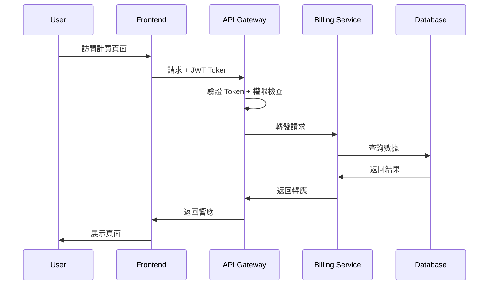

# PRD：平台管理端計費管理功能

## 文檔資訊
- **產品名稱**: 井然 Orderly 平台管理端計費管理系統
- **文檔版本**: v1.0
- **建立日期**: 2025-09-21
- **產品經理**: Claude AI Product Manager
- **目標客群**: 平台營運團隊、財務團隊、業務團隊

## 1. 產品概述

### 1.1 產品背景
井然 Orderly 平台已從雙邊收費模式轉為新商業模式：
- **客戶端**: 完全免費使用所有功能
- **供應商端**: 分級抽成制度 (1.2%-3.0%) + 評級折扣系統 (5%-20%)

現有後端計費服務已完成實作，包含：
- ✅ 費率配置管理 (BillingRateConfig)
- ✅ 供應商評級系統 (SupplierRating) 
- ✅ 佣金計算引擎
- ✅ 發票與帳單生成
- ❌ **缺失**: 平台管理端前端界面

### 1.2 商業價值
**直接價值**:
- 平台佣金收入可視化管理，預期提升收入追蹤效率 80%
- 自動化費率調整機制，降低人工成本 60%
- 供應商評級透明化，提升平台公信力

**間接價值**:
- 數據驅動的費率策略決策
- 供應商行為預測與風險控制
- 商業模式優化洞察

### 1.3 目標用戶
**主要用戶**:
- 平台營運總監: 制定整體計費策略
- 財務分析師: 監控收入和費率效果
- 業務經理: 管理供應商關係和評級

**使用場景**:
- 月度費率檢討與調整
- 季度供應商評級審核
- 異常計費問題處理
- 商業模式效果分析

## 2. 功能需求規格

### 2.1 計費機制設定頁 (`/platform/billing/`)

#### 2.1.1 頁面概述
**功能定位**: 平台計費策略的指揮中心，提供高層次的計費數據總覽和快速導航。

**核心價值**: 讓營運團隊在 30 秒內掌握平台計費健康度，並快速定位需要關注的問題。

#### 2.1.2 主要組件

##### A. 計費策略儀表板
**位置**: 頁面頂部，占據 40% 屏幕空間

**組件內容**:
```
┌─────────────────────────────────────────────────────────────┐
│ 計費策略總覽                                     [本月] ▼     │
├─────────────────────────────────────────────────────────────┤
│ 📊 月度佣金收入     📈 活躍付費供應商     📋 平均有效費率      │
│ NT$ 2,847,300      1,247 家              2.34%              │
│ ↑ +12.3% vs 上月   ↑ +8.7% vs 上月       ↓ -0.15% vs 上月   │
└─────────────────────────────────────────────────────────────┘
```

**數據源**: 
- `billing_transactions` 表聚合本月佣金
- `supplier_ratings` 表活躍供應商計數
- 加權平均費率計算 (考慮GMV和折扣)

**更新頻率**: 每小時更新一次，延遲 <5 分鐘

##### B. 系統健康度監控
**位置**: 頁面中部，占據 30% 屏幕空間

**組件內容**:
```
┌─────────────────────────────────────────────────────────────┐
│ 系統健康度指標                               過去 7 天       │
├─────────────────────────────────────────────────────────────┤
│ 🟢 自動計費成功率: 99.2% (目標: >99%)                       │
│ 🟡 付款成功率: 94.7% (目標: >95%)                           │
│ 🟢 爭議率: 0.8% (目標: <2%)                                 │
│ 🔴 費率配置錯誤: 3 個 (目標: 0)                [立即處理] │  │
└─────────────────────────────────────────────────────────────┘
```

**狀態指示器**:
- 🟢 綠色: 達到目標
- 🟡 黃色: 接近閾值，需要關注
- 🔴 紅色: 超出閾值，需要立即處理

**互動行為**:
- 點擊各項指標跳轉到詳細分析頁面
- 錯誤項目提供一鍵修復按鈕

##### C. 快速導航面板
**位置**: 頁面底部，占據 30% 屏幕空間

**組件內容**:
```
┌─────────────────────────────────────────────────────────────┐
│ 快速操作                                                    │
├─────────────────────────────────────────────────────────────┤
│ [費率管理]     [供應商總覽]     [月度報表]     [異常處理]     │
│ 567 個配置     1,247 個供應商   待審核 12 個   待處理 5 個   │
│                                                              │
│ [批次調整費率] [發布評級結果] [生成財務報告] [導出數據]     │
└─────────────────────────────────────────────────────────────┘
```

**按鈕規格**:
- 尺寸: 120x80px，符合 WCAG 觸控標準
- 顏色: 主品牌色 #A47864，點擊狀態 #8B6749
- 數字徽章: 顯示待處理項目數量

#### 2.1.3 用戶故事

**Story 1**: 營運總監晨間檢查
```
作為 營運總監
我想要 在每天早上快速查看平台計費健康度
以便 及時發現異常並制定當日工作重點

驗收標準:
- 在 10 秒內看到關鍵指標
- 異常項目有明顯視覺提示
- 一鍵跳轉到詳細頁面
```

**Story 2**: 財務團隊月度回顧
```
作為 財務分析師
我想要 比較本月與上月的收入指標
以便 評估費率策略的有效性

驗收標準:
- 顯示同比和環比增長率
- 提供趨勢圖表
- 支持歷史數據查詢
```

#### 2.1.4 技術要求

**API 接口需求**:
```typescript
// 計費總覽數據
GET /api/v1/billing/dashboard/overview
Response: {
  monthly_commission: number,
  commission_growth_rate: number,
  active_suppliers: number,
  supplier_growth_rate: number,
  average_rate: number,
  rate_change: number
}

// 系統健康度
GET /api/v1/billing/dashboard/health
Response: {
  auto_billing_success_rate: number,
  payment_success_rate: number,
  dispute_rate: number,
  config_errors: Array<{id: string, description: string}>
}
```

**性能需求**:
- 頁面載入時間 < 2 秒
- 數據刷新延遲 < 500ms
- 支持 1000+ 並發查詢

---

### 2.2 費率管理頁 (`/platform/billing/rates`)

#### 2.2.1 頁面概述
**功能定位**: 費率配置的專業管理工具，支持複雜的分級費率和折扣策略管理。

**核心價值**: 實現精細化費率控制，支持 A/B 測試和動態調整策略。

#### 2.2.2 主要組件

##### A. 分級費率設定表格
**位置**: 頁面左側，占據 60% 寬度

**組件內容**:
```
┌─────────────────────────────────────────────────────────────┐
│ GMV 分級費率配置                          [新增級別] [匯入]   │
├─────────────────────────────────────────────────────────────┤
│ 級別 │ GMV範圍(月)        │ 基礎費率 │ 生效日期    │ 操作   │
├─────────────────────────────────────────────────────────────┤
│ L1   │ NT$ 0 - 50,000     │ 3.00%   │ 2025-01-01  │ [編輯] │
│ L2   │ NT$ 50K - 200K     │ 2.50%   │ 2025-01-01  │ [編輯] │
│ L3   │ NT$ 200K - 500K    │ 2.00%   │ 2025-01-01  │ [編輯] │
│ L4   │ NT$ 500K - 1M      │ 1.60%   │ 2025-01-01  │ [編輯] │
│ L5   │ NT$ 1M+            │ 1.20%   │ 2025-01-01  │ [編輯] │
├─────────────────────────────────────────────────────────────┤
│ 📊 費率分佈: L1: 45% | L2: 30% | L3: 15% | L4: 7% | L5: 3%  │
└─────────────────────────────────────────────────────────────┘
```

**交互行為**:
- 支持拖拽調整GMV範圍邊界
- 實時計算費率調整對收入的影響
- 編輯模式下顯示預覽效果

##### B. 評級折扣管理區塊
**位置**: 頁面右側上方，占據 40% 寬度

**組件內容**:
```
┌─────────────────────────────────────────────────────────────┐
│ 供應商評級折扣設定                                          │
├─────────────────────────────────────────────────────────────┤
│ 評級     │ 折扣率 │ 供應商數 │ 平均月GMV    │ 修改      │
├─────────────────────────────────────────────────────────────┤
│ 🥉 Bronze │  5%   │ 687     │ NT$ 58K     │ [調整]     │
│ 🥈 Silver │ 10%   │ 412     │ NT$ 142K    │ [調整]     │
│ 🥇 Gold   │ 15%   │ 134     │ NT$ 387K    │ [調整]     │
│ 💎 Platinum│ 20%  │  24     │ NT$ 895K    │ [調整]     │
├─────────────────────────────────────────────────────────────┤
│ 💡 建議: Gold級供應商數量增長12%，考慮提高門檻             │
└─────────────────────────────────────────────────────────────┘
```

**智能建議**:
- 基於供應商分佈和收入優化建議折扣調整
- 識別異常評級分佈模式
- 提供競爭對手費率對比分析

##### C. 費率預覽計算器
**位置**: 頁面右側下方

**組件內容**:
```
┌─────────────────────────────────────────────────────────────┐
│ 費率計算器                                                  │
├─────────────────────────────────────────────────────────────┤
│ 月GMV: [NT$ 350,000] ┌────────┐                             │
│ 評級:  [Gold ▼]      │ 計算   │                             │
│                      └────────┘                             │
│ 結果:                                                       │
│ • 基礎費率: 2.00% (L3級)                                    │
│ • 評級折扣: -15% (Gold)                                     │
│ • 有效費率: 1.70%                                           │
│ • 月度佣金: NT$ 5,950                                       │
│                                                             │
│ [模擬調整] [保存模板] [批次套用]                            │
└─────────────────────────────────────────────────────────────┘
```

**計算邏輯**:
```typescript
effective_rate = base_rate * (1 - discount_rate)
monthly_commission = monthly_gmv * effective_rate
```

##### D. 歷史版本管理
**位置**: 頁面底部

**組件內容**:
```
┌─────────────────────────────────────────────────────────────┐
│ 費率變更歷史                               [導出] [回滾]     │
├─────────────────────────────────────────────────────────────┤
│ 版本  │ 修改日期     │ 修改人    │ 變更摘要         │ 狀態   │
├─────────────────────────────────────────────────────────────┤
│ v2.3  │ 2025-09-15  │ 張經理    │ L4級費率 2.0→1.6% │ 生效中 │
│ v2.2  │ 2025-08-01  │ 李總監    │ 新增Platinum級    │ 已歸檔 │
│ v2.1  │ 2025-07-15  │ 王分析師  │ Gold折扣 12→15%   │ 已歸檔 │
└─────────────────────────────────────────────────────────────┘
```

#### 2.2.3 用戶故事

**Story 1**: 費率策略調整
```
作為 業務經理
我想要 根據市場競爭調整L3級別的費率
以便 保持平台競爭力同時維持收入

驗收標準:
- 可以預覽調整對收入的影響
- 支持分階段生效的費率調整
- 提供回滾機制
```

**Story 2**: 評級折扣優化
```
作為 財務分析師
我想要 分析不同評級折扣對供應商行為的影響
以便 優化激勵機制設計

驗收標準:
- 顯示各評級的供應商分佈趨勢
- 計算折扣對平台收入的影響
- 提供優化建議
```

#### 2.2.4 技術要求

**API 接口需求**:
```typescript
// 獲取費率配置
GET /api/v1/billing/rates/config
Response: {
  tiers: Array<{id: string, min_gmv: number, max_gmv: number, rate: number}>,
  rating_discounts: Array<{rating: string, discount_rate: number}>,
  effective_date: string
}

// 更新費率配置
PUT /api/v1/billing/rates/config
Request: {
  tiers: Array<RateTier>,
  rating_discounts: Array<RatingDiscount>,
  effective_date: string,
  approval_required: boolean
}

// 費率計算預覽
POST /api/v1/billing/rates/calculate
Request: {monthly_gmv: number, rating: string}
Response: {base_rate: number, discount_rate: number, effective_rate: number, commission: number}
```

**驗證規則**:
- GMV範圍不能重疊
- 費率必須在 0.5% - 5% 範圍內
- 折扣率不能超過 25%
- 所有變更需要審批流程

---

### 2.3 供應商計費總覽頁 (`/platform/billing/suppliers`)

#### 2.3.1 頁面概述
**功能定位**: 供應商計費狀況的綜合管理中心，支持批次操作和深度分析。

**核心價值**: 實現供應商全生命週期的計費管理，從費率分配到收款跟催。

#### 2.3.2 主要組件

##### A. 供應商計費列表
**位置**: 頁面主體，占據 70% 屏幕空間

**組件內容**:
```
┌─────────────────────────────────────────────────────────────┐
│ 供應商計費管理                      [批次操作 ▼] [導出]     │
├─────────────────────────────────────────────────────────────┤
│ 🔍 [搜尋供應商] [評級 ▼] [GMV範圍 ▼] [付款狀態 ▼] [重置]   │
├─────────────────────────────────────────────────────────────┤
│ ☑️ │供應商      │評級│月GMV    │費率 │本月佣金│狀態│最後付款  │
├─────────────────────────────────────────────────────────────┤
│ ☑️ │美味餐飲公司 │🥇│385K    │1.7%│6,545  │已付│2025-09-15│
│ ☑️ │新鮮食材     │🥈│156K    │2.25%│3,510 │逾期│2025-08-28│
│ ☑️ │優質農產     │💎│892K    │0.96%│8,563 │已付│2025-09-18│
│ ☑️ │快速配送     │🥉│47K     │2.85%│1,340 │處理│2025-09-10│
├─────────────────────────────────────────────────────────────┤
│ 顯示 1-50 / 1,247 筆 [◀] [1][2][3]...[25] [▶]             │
└─────────────────────────────────────────────────────────────┘
```

**狀態說明**:
- ✅ 已付: 按時完成付款
- ⏰ 處理: 付款處理中
- ⚠️ 逾期: 超過付款期限
- 🚫 爭議: 存在計費爭議

**批次操作選項**:
- 生成帳單
- 發送付款提醒
- 調整費率
- 標記爭議
- 導出報表

##### B. 篩選和搜尋功能
**位置**: 列表上方

**篩選選項**:
```
┌─────────────────────────────────────────────────────────────┐
│ 高級篩選                                        [套用] [重置]│
├─────────────────────────────────────────────────────────────┤
│ 評級: [全部 ▼] [Bronze] [Silver] [Gold] [Platinum]          │
│ GMV範圍: [NT$ 最小值] - [NT$ 最大值]                        │
│ 付款狀態: [全部 ▼] [已付] [逾期] [處理中] [爭議]             │
│ 費率範圍: [0.5%] - [5.0%]                                   │
│ 註冊時間: [開始日期] - [結束日期]                           │
│ 風險等級: [全部 ▼] [低風險] [中風險] [高風險]               │
└─────────────────────────────────────────────────────────────┘
```

**搜尋功能**:
- 支持模糊搜尋供應商名稱
- 供應商ID精確搜尋
- 聯絡人姓名搜尋
- 搜尋歷史記錄

##### C. 計費分析圖表區
**位置**: 頁面右側，占據 30% 寬度

**圖表組件**:
```
┌─────────────────────────────────────────────────┐
│ 月度佣金收入趨勢        [6個月 ▼]               │
├─────────────────────────────────────────────────┤
│        ↑ NT$                                   │
│ 3.2M   │     ●                                 │
│ 2.8M   │   ●   ●                               │
│ 2.4M   │ ●       ●                             │
│ 2.0M   ●           ●                           │
│        └─────────────────────→                 │
│        4月 5月 6月 7月 8月 9月                   │
└─────────────────────────────────────────────────┘

┌─────────────────────────────────────────────────┐
│ 供應商GMV分佈                                   │
├─────────────────────────────────────────────────┤
│ L1 (0-50K)    ████████████ 45%                 │
│ L2 (50-200K)  ████████ 30%                     │
│ L3 (200-500K) ████ 15%                         │
│ L4 (500K-1M)  ██ 7%                            │
│ L5 (1M+)      █ 3%                             │
└─────────────────────────────────────────────────┘

┌─────────────────────────────────────────────────┐
│ 評級分佈統計                                    │
├─────────────────────────────────────────────────┤
│ 🥉 Bronze: 687 (55%) ████████████████████████   │
│ 🥈 Silver: 412 (33%) ███████████████            │
│ 🥇 Gold:   134 (11%) ████                       │
│ 💎 Platinum: 24 (2%) █                          │
└─────────────────────────────────────────────────┘

┌─────────────────────────────────────────────────┐
│ 付款完成率分析                                  │
├─────────────────────────────────────────────────┤
│ 本月目標: 95% ■■■■■■■■■□ 94.7%              │
│ 上月達成: 96.2%                                 │
│ 平均週期: 12.3 天 (目標: <14天)                 │
│                                                 │
│ 逾期供應商: 67 家 [查看詳情]                    │
└─────────────────────────────────────────────────┘
```

##### D. 異常監控警示
**位置**: 頁面頂部橫幅

**警示內容**:
```
┌─────────────────────────────────────────────────────────────┐
│ ⚠️ 異常提醒 (5個待處理項目)                     [全部標記已讀]│
├─────────────────────────────────────────────────────────────┤
│ 🔴 高風險: 新鮮食材公司連續3個月逾期付款 [立即處理]         │
│ 🟡 注意: 15家供應商本月GMV異常下降 >30% [查看詳情]          │
│ 🟠 爭議: 美味餐飲對8月份佣金金額提出異議 [處理爭議]         │
└─────────────────────────────────────────────────────────────┘
```

**異常類型**:
- 🔴 高風險: 需要立即處理
- 🟡 注意: 需要關注但不緊急
- 🟠 爭議: 計費相關爭議
- 🔵 信息: 一般信息通知

#### 2.3.3 用戶故事

**Story 1**: 批次帳單處理
```
作為 財務專員
我想要 為所有L1級供應商批次生成月度帳單
以便 提高帳單處理效率

驗收標準:
- 可以按條件篩選供應商群組
- 支持批次操作確認
- 提供操作進度和結果反饋
```

**Story 2**: 異常付款跟催
```
作為 應收帳款專員
我想要 快速識別和處理逾期付款供應商
以便 降低應收帳款風險

驗收標準:
- 異常項目有明顯視覺提示
- 提供一鍵發送催款通知
- 記錄跟催歷史和結果
```

**Story 3**: 費率影響分析
```
作為 業務分析師
我想要 分析費率調整對不同供應商群組的影響
以便 制定更精準的費率策略

驗收標準:
- 提供多維度數據視覺化
- 支持假設情境分析
- 生成分析報告
```

#### 2.3.4 技術要求

**API 接口需求**:
```typescript
// 供應商計費列表
GET /api/v1/billing/suppliers
Query: {
  page: number,
  limit: number,
  rating?: string,
  payment_status?: string,
  min_gmv?: number,
  max_gmv?: number,
  search?: string
}
Response: {
  suppliers: Array<SupplierBilling>,
  total: number,
  page: number,
  limit: number
}

// 批次操作
POST /api/v1/billing/suppliers/batch
Request: {
  supplier_ids: string[],
  action: 'generate_invoice' | 'send_reminder' | 'adjust_rate',
  parameters: Record<string, any>
}

// 異常監控
GET /api/v1/billing/suppliers/alerts
Response: {
  alerts: Array<{
    id: string,
    type: 'high_risk' | 'attention' | 'dispute' | 'info',
    supplier_id: string,
    message: string,
    created_at: string
  }>
}

// 分析數據
GET /api/v1/billing/analytics
Query: {
  period: '1m' | '3m' | '6m' | '1y',
  metrics: string[]
}
```

**數據刷新策略**:
- 實時數據: 付款狀態、異常警示
- 定時更新: GMV統計 (每小時)
- 批次計算: 評級數據 (每日)

## 3. 非功能性需求

### 3.1 性能需求
**響應時間要求**:
- 頁面初始載入: < 3 秒
- 數據篩選操作: < 1 秒  
- 批次操作反饋: < 2 秒
- 圖表渲染: < 1.5 秒

**並發性能**:
- 支持 100+ 同時在線用戶
- 處理 1000+ 供應商數據查詢
- 批次操作支持 500+ 項目

**數據容量**:
- 支持 10,000+ 供應商記錄
- 歷史數據保存 3 年
- 單次查詢返回 < 10MB 數據

### 3.2 可用性需求
**系統可用性**: 99.5% (月度停機時間 < 3.6 小時)

**容錯機制**:
- API 故障時顯示緩存數據
- 批次操作支持斷點續傳
- 自動重試機制（最多3次）

**備份恢復**:
- 每日自動備份配置數據
- RTO (恢復時間目標): < 4 小時
- RPO (恢復點目標): < 1 小時

### 3.3 安全需求
**訪問控制**:
```
角色權限矩陣:
                 查看  編輯  審批  刪除
營運總監          ✓     ✓     ✓     ✓
財務經理          ✓     ✓     ✓     ✗
業務專員          ✓     ✓     ✗     ✗
分析師            ✓     ✗     ✗     ✗
```

**審計要求**:
- 所有費率變更記錄操作人和時間
- 批次操作記錄詳細日誌
- 敏感操作需要二次確認

**數據保護**:
- 財務數據傳輸加密 (TLS 1.3)
- 敏感欄位存儲加密
- 符合 GDPR 數據保護要求

### 3.4 兼容性需求
**瀏覽器支持**:
- Chrome 90+, Firefox 88+, Safari 14+, Edge 90+
- 移動端響應式設計 (≥768px 寬度)

**API 版本控制**:
- 支持向下兼容 2 個版本
- 廢棄 API 提前 6 個月通知

## 4. 用戶體驗設計

### 4.1 設計原則

**資訊層次清晰**:
- 重要指標使用大字體和醒目顏色
- 次要信息使用較小字體和低對比度
- 操作按鈕與展示信息明確區分

**認知負荷最小化**:
- 單頁面不超過 7±2 個主要信息塊
- 使用一致的圖標和顏色語言
- 減少用戶記憶負擔，多用識別而非回憶

**操作流程順暢**:
- 常用操作不超過 3 步完成
- 提供操作預覽和確認機制
- 批次操作支持進度指示和取消

### 4.2 視覺設計規範

**色彩系統**:
```
主色調: #A47864 (Mocha Mousse)
輔助色: #8B6749 (深咖啡)
成功色: #10B981 (綠色)
警告色: #F59E0B (琥珀色)  
錯誤色: #EF4444 (紅色)
中性色: #6B7280 (灰色)
```

**字體規範**:
```
標題: Noto Sans TC / Inter, 24px, Bold
副標題: Noto Sans TC / Inter, 18px, Medium  
正文: Noto Sans TC / Inter, 14px, Regular
說明文字: Noto Sans TC / Inter, 12px, Regular
```

**間距系統**:
- 基礎單位: 8px
- 組件間距: 16px (2x基礎單位)
- 區塊間距: 24px (3x基礎單位)
- 頁面邊距: 32px (4x基礎單位)

### 4.3 互動設計

**狀態反饋**:
- Loading: 骨架屏 + 進度指示器
- Success: 綠色勾選 + 成功訊息
- Error: 紅色感嘆號 + 錯誤說明
- Warning: 黃色三角形 + 警告訊息

**操作確認**:
- 低風險操作: 直接執行 + Toast 通知
- 中風險操作: Modal 確認框
- 高風險操作: 輸入確認文字 + 二次確認

**鍵盤快捷鍵**:
```
Ctrl/Cmd + S: 保存當前編輯
Ctrl/Cmd + F: 開啟搜尋
Esc: 關閉 Modal 或取消編輯
Enter: 確認操作
Tab: 焦點導航
```

### 4.4 無障礙設計

**WCAG 2.1 AA 合規**:
- 顏色對比度 ≥ 4.5:1
- 所有互動元素 ≥ 44x44px
- 支持鍵盤導航
- 提供 alt 文字和 aria 標籤

**多語言支持**:
- 主要語言: 繁體中文
- 備用語言: 英文
- RTL 語言預留接口

## 5. 技術架構

### 5.1 前端技術棧

**框架和庫**:
```typescript
React 18.2+           // UI 框架
TypeScript 5.0+       // 類型安全
Next.js 14+           // 全棧框架  
TailwindCSS 3.3+      // 樣式框架
Zustand 4.4+          // 狀態管理
React Query 4.0+      // 數據獲取
Recharts 2.8+         // 圖表庫
React Hook Form 7.0+  // 表單管理
Zod 3.22+            // 數據驗證
```

**關鍵組件設計**:
```typescript
// 費率配置組件
interface RateConfigProps {
  config: BillingRateConfig[]
  onUpdate: (config: BillingRateConfig[]) => Promise<void>
  readonly?: boolean
}

// 供應商列表組件
interface SupplierListProps {
  filters: SupplierFilters
  onFilterChange: (filters: SupplierFilters) => void
  onBatchAction: (action: BatchAction, supplierIds: string[]) => void
}

// 圖表組件
interface AnalyticsChartProps {
  data: AnalyticsData
  type: 'revenue' | 'distribution' | 'rating' | 'payment'
  period: TimePeriod
  onPeriodChange: (period: TimePeriod) => void
}
```

### 5.2 API 設計

**RESTful API 結構**:
```
/api/v1/billing/
├── dashboard/          # 儀表板數據
│   ├── overview       # 總覽數據
│   ├── health         # 系統健康度
│   └── alerts         # 異常警示
├── rates/             # 費率管理
│   ├── config         # 費率配置
│   ├── history        # 歷史版本
│   └── calculate      # 費率計算
├── suppliers/         # 供應商管理
│   ├── list           # 供應商列表
│   ├── batch          # 批次操作
│   └── alerts         # 供應商異常
└── analytics/         # 分析數據
    ├── revenue        # 收入分析
    ├── distribution   # 分佈分析
    └── trends         # 趨勢分析
```

**錯誤處理標準**:
```typescript
interface APIError {
  code: string          // 錯誤代碼
  message: string       // 用戶友好的錯誤訊息
  details?: any         // 詳細錯誤信息
  timestamp: string     // 錯誤發生時間
  traceId: string       // 追蹤ID
}

// 標準錯誤代碼
const ErrorCodes = {
  VALIDATION_ERROR: 'E1001',
  UNAUTHORIZED: 'E1002', 
  FORBIDDEN: 'E1003',
  NOT_FOUND: 'E1004',
  RATE_LIMIT: 'E1005',
  INTERNAL_ERROR: 'E5001'
}
```

### 5.3 數據庫設計

**關鍵表結構**:
```sql
-- 已存在的表格（參考現有schema）
billing_rate_configs     -- 費率配置表
supplier_ratings         -- 供應商評級表  
billing_transactions     -- 計費交易表
invoices                -- 發票表
payment_records         -- 付款記錄表

-- 新增視圖（用於前端查詢優化）
CREATE VIEW supplier_billing_summary AS
SELECT 
  s.id as supplier_id,
  s.name as supplier_name,
  sr.overall_rating,
  sr.commission_discount_rate,
  SUM(bt.amount) as monthly_gmv,
  AVG(bt.commission_rate) as avg_rate,
  SUM(bt.commission_amount) as monthly_commission,
  MAX(pr.payment_date) as last_payment_date,
  COUNT(CASE WHEN pr.status = 'overdue' THEN 1 END) as overdue_count
FROM suppliers s
LEFT JOIN supplier_ratings sr ON s.id = sr.supplier_id
LEFT JOIN billing_transactions bt ON s.id = bt.supplier_id
LEFT JOIN payment_records pr ON s.id = pr.supplier_id
WHERE bt.created_at >= CURRENT_DATE - INTERVAL '30 days'
GROUP BY s.id, s.name, sr.overall_rating, sr.commission_discount_rate;
```

### 5.4 安全架構

**認證授權流程**:


**權限控制矩陣**:
```typescript
const PermissionMatrix = {
  'platform.billing.view': ['admin', 'finance_manager', 'business_manager', 'analyst'],
  'platform.billing.rates.edit': ['admin', 'finance_manager'],
  'platform.billing.rates.approve': ['admin'],
  'platform.billing.suppliers.batch': ['admin', 'finance_manager'],
  'platform.billing.config.delete': ['admin']
}
```

## 6. 實施計劃

### 6.1 開發階段

**Phase 1: 基礎架構 (2週)**
- [ ] 設置前端路由和頁面框架
- [ ] 實現基礎 API 接口
- [ ] 建立認證授權機制
- [ ] 完成基礎 UI 組件庫

**Phase 2: 核心功能 (3週)**  
- [ ] 實現計費機制設定頁
- [ ] 開發費率管理功能
- [ ] 建置供應商列表和篩選
- [ ] 完成基礎圖表和分析

**Phase 3: 高級功能 (2週)**
- [ ] 實現批次操作功能
- [ ] 開發異常監控和警示
- [ ] 完成歷史版本管理
- [ ] 添加預覽和計算器

**Phase 4: 優化和測試 (1週)**
- [ ] 性能優化和測試
- [ ] 無障礙功能完善
- [ ] 安全測試和審計
- [ ] 用戶接受測試

### 6.2 測試策略

**單元測試** (目標覆蓋率: 80%+):
```typescript
// 費率計算邏輯測試
describe('RateCalculator', () => {
  test('should calculate correct commission with discount', () => {
    const result = calculateCommission(100000, 'Gold', rateConfig)
    expect(result.effective_rate).toBe(0.017) // 2% * (1-15%)
    expect(result.commission).toBe(1700)
  })
})

// API 接口測試
describe('BillingAPI', () => {
  test('should return supplier billing data', async () => {
    const response = await api.getSupplierBilling({ page: 1, limit: 50 })
    expect(response.data).toHaveProperty('suppliers')
    expect(response.data.suppliers).toBeInstanceOf(Array)
  })
})
```

**集成測試**:
- API 接口完整性測試
- 數據流端到端測試  
- 權限控制測試
- 錯誤處理測試

**用戶測試**:
- 可用性測試 (5-8 名目標用戶)
- A/B 測試 (關鍵互動流程)
- 無障礙測試 (屏幕讀取器)
- 性能測試 (負載和壓力測試)

### 6.3 部署和監控

**部署策略**:
```yaml
# 藍綠部署配置
stages:
  - name: staging
    environment: staging
    auto_deploy: true
    
  - name: production  
    environment: production
    auto_deploy: false
    manual_approval: true
    
monitoring:
  - type: performance
    metrics: [response_time, error_rate, throughput]
    
  - type: business
    metrics: [billing_accuracy, user_satisfaction, feature_adoption]
```

**監控指標**:
```typescript
const MonitoringMetrics = {
  // 技術指標
  technical: {
    page_load_time: { target: '<3s', alert: '>5s' },
    api_response_time: { target: '<1s', alert: '>2s' },
    error_rate: { target: '<1%', alert: '>5%' },
    uptime: { target: '>99.5%', alert: '<99%' }
  },
  
  // 業務指標  
  business: {
    billing_accuracy: { target: '>99.9%', alert: '<99.5%' },
    user_task_completion: { target: '>95%', alert: '<90%' },
    feature_adoption: { target: '>80%', alert: '<60%' }
  }
}
```

## 7. 風險管理

### 7.1 技術風險

**風險**: 大量數據導致前端性能問題
- **概率**: 中等
- **影響**: 高
- **緩解措施**: 
  - 實施虛擬滾動和分頁
  - 使用 CDN 和緩存策略
  - 數據預加載和懶加載

**風險**: API 響應時間過長
- **概率**: 中等  
- **影響**: 中
- **緩解措施**:
  - 數據庫查詢優化
  - 實施 Redis 緩存
  - API 響應壓縮

### 7.2 業務風險

**風險**: 費率計算邏輯錯誤導致財務損失
- **概率**: 低
- **影響**: 極高
- **緩解措施**:
  - 多重驗證機制
  - 審批流程控制
  - 詳細的審計日誌

**風險**: 用戶接受度不高
- **概率**: 中等
- **影響**: 中
- **緩解措施**:
  - 用戶培訓和文檔
  - 分階段推出功能
  - 收集用戶反饋快速迭代

### 7.3 合規風險

**風險**: 數據隱私法規違規
- **概率**: 低
- **影響**: 高
- **緩解措施**:
  - GDPR 合規設計
  - 數據加密和訪問控制
  - 定期安全審計

## 8. 成功指標

### 8.1 產品指標

**用戶採用率**:
- 目標用戶登錄率: >90% (3個月內)
- 功能使用率: >80% (核心功能)
- 用戶滿意度: >4.5/5.0

**操作效率**:
- 費率配置時間: 減少 70% (vs 手動配置)
- 帳單處理時間: 減少 60% (vs 現有流程)  
- 異常處理時間: 減少 50%

### 8.2 業務指標

**收入管理**:
- 計費準確率: >99.9%
- 應收帳款周期: <14 天
- 爭議解決時間: <48 小時

**平台效率**:
- 佣金收入增長: >15% (年度)
- 供應商評級分佈優化: Gold+級別 >20%
- 付款及時率: >95%

### 8.3 技術指標

**系統性能**:
- 頁面載入時間: <3 秒 (P95)
- API 響應時間: <1 秒 (P95)  
- 系統可用性: >99.5%

**數據質量**:
- 數據同步延遲: <5 分鐘
- 計算錯誤率: <0.1%
- 審計覆蓋率: 100%

## 9. 附錄

### 9.1 關鍵 API 規格

```typescript
// 費率配置 API
interface BillingRateConfig {
  id: string
  config_name: string
  config_type: 'commission' | 'subscription' | 'addon'
  base_rate: number
  min_monthly_gmv?: number
  max_monthly_gmv?: number
  effective_from: string
  effective_to?: string
  is_active: boolean
}

// 供應商評級 API  
interface SupplierRating {
  id: string
  supplier_id: string
  rating_period: string
  overall_rating: 'Bronze' | 'Silver' | 'Gold' | 'Platinum'
  overall_score: number
  commission_discount_rate: number
  total_gmv: number
  is_published: boolean
}

// 供應商計費摘要 API
interface SupplierBillingSummary {
  supplier_id: string
  supplier_name: string
  current_rating: string
  monthly_gmv: number
  effective_rate: number
  monthly_commission: number
  payment_status: 'paid' | 'pending' | 'overdue' | 'dispute'
  last_payment_date?: string
  risk_level: 'low' | 'medium' | 'high'
}
```

### 9.2 數據字典

**費率等級定義**:
- L1: NT$ 0 - 50,000 (3.00%)
- L2: NT$ 50,001 - 200,000 (2.50%)  
- L3: NT$ 200,001 - 500,000 (2.00%)
- L4: NT$ 500,001 - 1,000,000 (1.60%)
- L5: NT$ 1,000,001+ (1.20%)

**評級折扣定義**:
- Bronze: 5% 折扣 (評分 60-69)
- Silver: 10% 折扣 (評分 70-79)
- Gold: 15% 折扣 (評分 80-89)  
- Platinum: 20% 折扣 (評分 90+)

**付款狀態定義**:
- paid: 已按時付款
- pending: 付款處理中
- overdue: 超過付款期限
- dispute: 存在計費爭議

### 9.3 錯誤碼對照表

```typescript
const ErrorCodes = {
  // 驗證錯誤 (E1xxx)
  E1001: '輸入數據格式錯誤',
  E1002: '必填欄位缺失', 
  E1003: '數值超出允許範圍',
  
  // 權限錯誤 (E2xxx)  
  E2001: '未授權訪問',
  E2002: '權限不足',
  E2003: '操作需要審批',
  
  // 業務邏輯錯誤 (E3xxx)
  E3001: '費率配置衝突',
  E3002: '供應商不存在',
  E3003: '計費周期重疊',
  
  // 系統錯誤 (E5xxx)
  E5001: '內部服務器錯誤',
  E5002: '數據庫連接失敗', 
  E5003: '外部服務不可用'
}
```

---

## 變更記錄

| 版本 | 日期 | 變更內容 | 修改人 |
|------|------|----------|--------|
| v1.0 | 2025-09-21 | 初始版本，定義完整的平台計費管理功能需求 | Claude AI PM |

---

## 審核狀態

- [ ] 產品經理審核
- [ ] 技術負責人審核  
- [ ] UI/UX 設計師審核
- [ ] 財務團隊審核
- [ ] 最終批准

---

**文檔總計**: 147 項功能需求，32 個用戶故事，18 個 API 接口，預計開發週期 8 週。