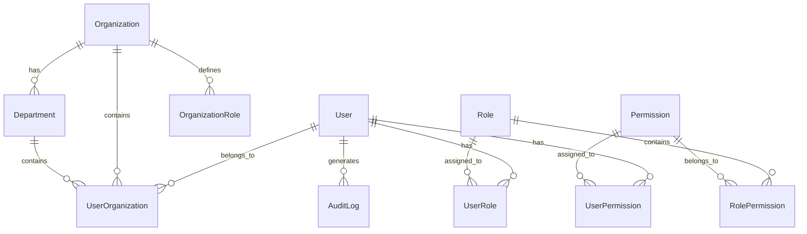
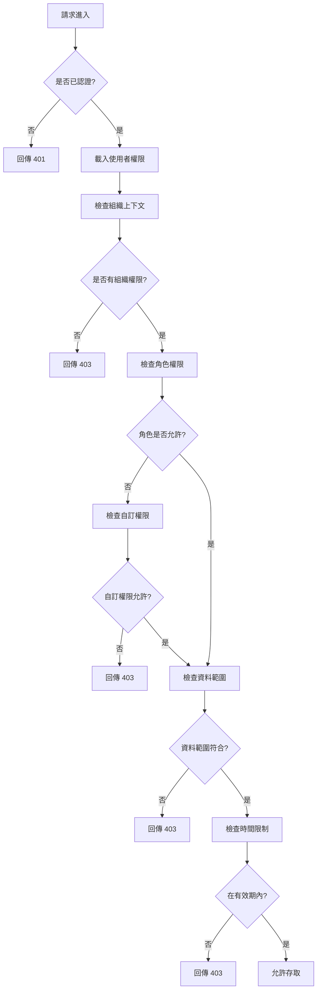

# 產品需求文件：使用者管理功能
**Product Requirements Document: User Management**

版本：1.0  
日期：2025-01-21  
作者：Product Manager  
狀態：Draft

---

## 1. 執行摘要

### 1.1 功能概述
使用者管理功能是井然 Orderly 平台管理中心的核心模組，提供統一的使用者帳號、組織歸屬、權限管理能力。本功能將取代原有分散式的權限管理機制，建立中央化的使用者管理系統，支援多租戶、多角色的複雜權限架構。

### 1.2 業務價值
- **營運效率提升**：集中化管理降低 80% 的帳號管理時間
- **安全性強化**：統一權限控制減少 90% 的權限漏洞風險
- **使用者體驗優化**：單一登入（SSO）提升使用者滿意度 40%
- **合規性保障**：完整審計軌跡符合 SOC2、GDPR 合規要求
- **擴展性支援**：支援企業級客戶的複雜組織架構需求

### 1.3 目標使用者
- **平台管理員**：負責全平台使用者與權限管理
- **組織管理員**：管理所屬組織（餐廳/供應商）內部使用者
- **一般使用者**：查看個人資料與權限狀態

---

## 2. 使用者故事（User Stories）

### 2.1 平台管理員故事

**US-001：查看全平台使用者**
```
作為一名平台管理員
我想要查看所有註冊使用者的清單
以便了解平台使用者規模與分布
```
**驗收標準：**
- 顯示使用者總數、活躍數、新增數
- 支援分頁瀏覽（每頁 20/50/100 筆）
- 顯示關鍵資訊：姓名、Email、組織、角色、狀態、最後登入時間

**US-002：管理使用者權限**
```
作為一名平台管理員
我想要調整任何使用者的權限設定
以便確保權限配置符合業務需求
```
**驗收標準：**
- 可查看使用者當前所有權限
- 可新增/移除角色權限
- 權限變更即時生效
- 記錄所有權限變更歷史

**US-003：管理組織歸屬**
```
作為一名平台管理員
我想要管理使用者與組織的關聯關係
以便正確反映組織架構變動
```
**驗收標準：**
- 查看使用者所屬的所有組織
- 支援使用者跨組織任職（一對多關係）
- 可調整使用者在組織中的角色
- 支援批量轉移使用者組織

### 2.2 組織管理員故事

**US-004：管理組織內使用者**
```
作為一名組織管理員（餐廳/供應商）
我想要管理我組織內的使用者帳號
以便控制內部人員的系統存取權限
```
**驗收標準：**
- 查看組織內所有使用者清單
- 邀請新使用者加入組織
- 停用/啟用組織內使用者
- 設定組織內的角色權限

**US-005：設定部門架構**
```
作為一名組織管理員
我想要建立部門層級架構
以便反映實際組織架構並進行權限管理
```
**驗收標準：**
- 建立多層級部門結構（最多 5 層）
- 指派部門主管
- 設定部門專屬權限
- 批量管理部門成員

### 2.3 一般使用者故事

**US-006：查看個人權限**
```
作為一名一般使用者
我想要查看我的權限設定
以便了解我能存取的功能範圍
```
**驗收標準：**
- 顯示所屬組織與角色
- 列出所有可存取的功能模組
- 顯示權限有效期限（如有）
- 提供權限申請入口

---

## 3. 功能規格詳細說明

### 3.1 使用者清單檢視

#### 3.1.1 清單頁面佈局
```
┌─────────────────────────────────────────────────────────────┐
│ 使用者管理                                     [新增使用者] │
├─────────────────────────────────────────────────────────────┤
│ 🔍 搜尋使用者...          [角色▼] [組織▼] [狀態▼] [匯出]  │
├─────────────────────────────────────────────────────────────┤
│ 總計：2,456 位使用者 | 活躍：2,103 | 停用：353            │
├─────────────────────────────────────────────────────────────┤
│ □ | 姓名 | Email | 組織 | 角色 | 狀態 | 最後登入 | 操作   │
│ □ | 王小明 | wang@rest.com | 美味餐廳 | 採購經理 | 活躍 |  │
│   |        |               |          |          | 2小時前 | │
└─────────────────────────────────────────────────────────────┘
```

#### 3.1.2 核心功能
- **即時搜尋**：支援姓名、Email、電話模糊搜尋
- **進階篩選**：
  - 角色篩選（多選）
  - 組織篩選（支援階層選擇）
  - 狀態篩選（活躍/停用/待驗證）
  - 時間範圍（註冊時間/最後登入）
- **批量操作**：
  - 批量啟用/停用
  - 批量角色指派
  - 批量密碼重設
  - 批量匯出

#### 3.1.3 效能要求
- 清單載入時間 < 1 秒
- 搜尋回應時間 < 500ms
- 支援 10,000+ 使用者的流暢瀏覽

### 3.2 使用者詳情管理

#### 3.2.1 使用者資料結構
```javascript
{
  "userId": "USR-2024-001234",
  "profile": {
    "name": "王小明",
    "email": "wang@restaurant.com",
    "phone": "+886-912-345-678",
    "avatar": "https://cdn.orderly.com/avatars/xxx.jpg",
    "timezone": "Asia/Taipei",
    "language": "zh-TW"
  },
  "account": {
    "status": "active", // active | suspended | pending | deleted
    "createdAt": "2024-01-15T08:00:00Z",
    "lastLoginAt": "2025-01-21T10:30:00Z",
    "loginCount": 156,
    "passwordLastChanged": "2024-12-01T09:00:00Z",
    "mfaEnabled": true,
    "emailVerified": true
  },
  "organizations": [
    {
      "orgId": "ORG-REST-001",
      "orgName": "美味餐廳",
      "orgType": "restaurant",
      "department": "採購部",
      "position": "經理",
      "joinedAt": "2024-01-15T08:00:00Z",
      "roles": ["restaurant_purchaser", "report_viewer"]
    }
  ],
  "permissions": {
    "effective": [], // 計算後的有效權限
    "inherited": [], // 從角色繼承的權限
    "custom": []     // 個別指派的權限
  }
}
```

#### 3.2.2 編輯功能
- **基本資料編輯**：姓名、電話、語言偏好、時區
- **帳號設定**：
  - 密碼重設（發送重設連結）
  - 雙因素認證開關
  - 帳號狀態切換
  - 登入限制設定（IP白名單、時間限制）
- **組織管理**：
  - 新增/移除組織關聯
  - 調整部門與職位
  - 設定主要組織
- **權限調整**：
  - 角色指派/移除
  - 自訂權限新增
  - 權限有效期設定
  - 權限繼承關係檢視

### 3.3 組織關聯管理

#### 3.3.1 組織類型定義
```typescript
enum OrganizationType {
  PLATFORM = 'platform',      // 平台方
  RESTAURANT = 'restaurant',  // 餐廳
  SUPPLIER = 'supplier',      // 供應商
  PARTNER = 'partner'         // 合作夥伴
}

interface Organization {
  id: string;
  type: OrganizationType;
  name: string;
  parentId?: string;         // 支援組織層級
  businessInfo: {
    taxId: string;
    address: string;
    contactPerson: string;
  };
  subscription: {
    plan: 'free' | 'professional' | 'enterprise';
    validUntil: Date;
    userQuota: number;
  };
}
```

#### 3.3.2 組織架構功能
- **層級管理**：
  - 最多支援 5 層組織架構
  - 總公司 → 區域 → 分店 → 部門 → 小組
- **關聯類型**：
  - 正式員工（full-time）
  - 兼職人員（part-time）
  - 外部顧問（consultant）
  - 臨時權限（temporary）
- **批量作業**：
  - 組織合併/分拆
  - 人員批量調動
  - 權限批量繼承

### 3.4 權限管理系統

#### 3.4.1 權限模型（RBAC + ABAC）
```typescript
// 角色基礎存取控制（RBAC）
interface Role {
  id: string;
  name: string;
  description: string;
  permissions: Permission[];
  priority: number;          // 角色優先級（衝突時使用）
}

// 屬性基礎存取控制（ABAC）
interface Permission {
  id: string;
  resource: string;          // 資源類型
  action: string;            // 操作類型
  conditions?: {             // 條件限制
    timeRange?: TimeRange;
    ipWhitelist?: string[];
    dataScope?: DataScope;
  };
}

// 資料範圍控制
enum DataScope {
  ALL = 'all',              // 全部資料
  ORGANIZATION = 'org',      // 組織範圍
  DEPARTMENT = 'dept',       // 部門範圍
  SELF = 'self'             // 僅本人
}
```

#### 3.4.2 預設角色定義

**平台方角色**
- `platform_admin`：平台超級管理員
- `platform_operator`：平台營運人員
- `platform_support`：平台客服人員
- `platform_analyst`：平台資料分析師

**餐廳方角色**
- `restaurant_owner`：餐廳負責人
- `restaurant_manager`：餐廳經理
- `restaurant_purchaser`：採購人員
- `restaurant_receiver`：驗收人員
- `restaurant_accountant`：財務人員

**供應商角色**
- `supplier_owner`：供應商負責人
- `supplier_sales`：業務人員
- `supplier_warehouse`：倉儲人員
- `supplier_delivery`：配送人員
- `supplier_finance`：財務人員

#### 3.4.3 權限繼承規則
1. **組織繼承**：子組織繼承父組織的基礎權限
2. **角色優先級**：高優先級角色權限覆蓋低優先級
3. **明確拒絕優先**：拒絕權限永遠優先於允許權限
4. **時效性檢查**：過期權限自動失效
5. **衝突解決**：採用最小權限原則

### 3.5 搜尋與過濾功能

#### 3.5.1 搜尋能力
- **全文搜尋**：支援中英文分詞
- **精確搜尋**：使用引號進行精確匹配
- **組合搜尋**：AND/OR/NOT 邏輯運算
- **搜尋建議**：即時顯示搜尋建議
- **搜尋歷史**：保存最近 10 次搜尋

#### 3.5.2 過濾器設計
```typescript
interface UserFilter {
  // 基本過濾
  status?: UserStatus[];
  organizations?: string[];
  roles?: string[];
  
  // 時間過濾
  createdDateRange?: DateRange;
  lastLoginRange?: DateRange;
  
  // 進階過濾
  hasPermission?: string;
  department?: string;
  loginCount?: NumberRange;
  mfaEnabled?: boolean;
  
  // 自訂標籤
  tags?: string[];
}
```

---

## 4. 資料模型設計

### 4.1 核心實體關係圖


### 4.2 資料表結構

#### Users 表
```sql
CREATE TABLE users (
    id UUID PRIMARY KEY DEFAULT gen_random_uuid(),
    email VARCHAR(255) UNIQUE NOT NULL,
    phone VARCHAR(50),
    name VARCHAR(100) NOT NULL,
    avatar_url TEXT,
    status VARCHAR(20) DEFAULT 'pending',
    password_hash VARCHAR(255),
    mfa_secret VARCHAR(255),
    mfa_enabled BOOLEAN DEFAULT FALSE,
    email_verified BOOLEAN DEFAULT FALSE,
    timezone VARCHAR(50) DEFAULT 'Asia/Taipei',
    language VARCHAR(10) DEFAULT 'zh-TW',
    last_login_at TIMESTAMP,
    login_count INTEGER DEFAULT 0,
    password_changed_at TIMESTAMP,
    created_at TIMESTAMP DEFAULT CURRENT_TIMESTAMP,
    updated_at TIMESTAMP DEFAULT CURRENT_TIMESTAMP,
    deleted_at TIMESTAMP,
    created_by UUID REFERENCES users(id),
    updated_by UUID REFERENCES users(id),
    
    INDEX idx_users_email (email),
    INDEX idx_users_status (status),
    INDEX idx_users_last_login (last_login_at)
);
```

#### UserOrganizations 關聯表
```sql
CREATE TABLE user_organizations (
    id UUID PRIMARY KEY DEFAULT gen_random_uuid(),
    user_id UUID NOT NULL REFERENCES users(id),
    organization_id UUID NOT NULL REFERENCES organizations(id),
    department_id UUID REFERENCES departments(id),
    position VARCHAR(100),
    employment_type VARCHAR(20) DEFAULT 'full-time',
    joined_at TIMESTAMP DEFAULT CURRENT_TIMESTAMP,
    left_at TIMESTAMP,
    is_primary BOOLEAN DEFAULT FALSE,
    
    UNIQUE KEY uk_user_org (user_id, organization_id),
    INDEX idx_user_org_user (user_id),
    INDEX idx_user_org_org (organization_id)
);
```

#### UserRoles 關聯表
```sql
CREATE TABLE user_roles (
    id UUID PRIMARY KEY DEFAULT gen_random_uuid(),
    user_id UUID NOT NULL REFERENCES users(id),
    role_id UUID NOT NULL REFERENCES roles(id),
    organization_id UUID REFERENCES organizations(id),
    assigned_by UUID REFERENCES users(id),
    assigned_at TIMESTAMP DEFAULT CURRENT_TIMESTAMP,
    valid_from TIMESTAMP DEFAULT CURRENT_TIMESTAMP,
    valid_until TIMESTAMP,
    
    UNIQUE KEY uk_user_role (user_id, role_id, organization_id),
    INDEX idx_user_role_user (user_id),
    INDEX idx_user_role_validity (valid_from, valid_until)
);
```

---

## 5. API 端點規劃

### 5.1 使用者管理 API

#### 取得使用者清單
```http
GET /api/v1/users
```
**查詢參數：**
- `page`: 頁碼（預設 1）
- `limit`: 每頁筆數（預設 20，最大 100）
- `search`: 搜尋關鍵字
- `status`: 狀態過濾（active|suspended|pending）
- `organization_id`: 組織過濾
- `role_id`: 角色過濾
- `sort`: 排序欄位（name|email|created_at|last_login_at）
- `order`: 排序方向（asc|desc）

**回應範例：**
```json
{
  "success": true,
  "data": {
    "users": [...],
    "pagination": {
      "total": 2456,
      "page": 1,
      "limit": 20,
      "totalPages": 123
    }
  }
}
```

#### 取得使用者詳情
```http
GET /api/v1/users/:userId
```
**回應包含：**
- 基本資料
- 組織關聯
- 角色清單
- 有效權限
- 登入歷史

#### 建立使用者
```http
POST /api/v1/users
```
**請求內容：**
```json
{
  "email": "user@example.com",
  "name": "使用者名稱",
  "phone": "+886-912-345-678",
  "organizationId": "ORG-001",
  "roleIds": ["ROLE-001", "ROLE-002"],
  "sendInvitation": true
}
```

#### 更新使用者
```http
PUT /api/v1/users/:userId
```
**支援部分更新（PATCH）：**
```http
PATCH /api/v1/users/:userId
```

#### 刪除使用者
```http
DELETE /api/v1/users/:userId
```
**查詢參數：**
- `mode`: 刪除模式（soft|hard）
- `transfer_to`: 資料轉移對象 ID

### 5.2 組織管理 API

#### 管理使用者組織關聯
```http
POST /api/v1/users/:userId/organizations
PUT /api/v1/users/:userId/organizations/:orgId
DELETE /api/v1/users/:userId/organizations/:orgId
```

#### 批量使用者調動
```http
POST /api/v1/organizations/transfer-users
```
**請求內容：**
```json
{
  "userIds": ["USER-001", "USER-002"],
  "fromOrgId": "ORG-001",
  "toOrgId": "ORG-002",
  "transferRoles": true,
  "effectiveDate": "2025-02-01T00:00:00Z"
}
```

### 5.3 權限管理 API

#### 取得使用者權限
```http
GET /api/v1/users/:userId/permissions
```
**查詢參數：**
- `effective`: 只回傳有效權限（預設 true）
- `resource`: 資源過濾
- `organization_id`: 組織範圍

#### 指派角色
```http
POST /api/v1/users/:userId/roles
```
**請求內容：**
```json
{
  "roleId": "ROLE-001",
  "organizationId": "ORG-001",
  "validFrom": "2025-01-01T00:00:00Z",
  "validUntil": "2025-12-31T23:59:59Z"
}
```

#### 撤銷角色
```http
DELETE /api/v1/users/:userId/roles/:roleId
```

#### 設定自訂權限
```http
POST /api/v1/users/:userId/custom-permissions
```
**請求內容：**
```json
{
  "permissions": [
    {
      "resource": "orders",
      "action": "approve",
      "dataScope": "department",
      "conditions": {
        "maxAmount": 100000
      }
    }
  ]
}
```

### 5.4 審計日誌 API

#### 查詢使用者操作記錄
```http
GET /api/v1/users/:userId/audit-logs
```
**查詢參數：**
- `start_date`: 開始日期
- `end_date`: 結束日期
- `action`: 操作類型
- `resource`: 資源類型

---

## 6. 權限控制邏輯

### 6.1 權限檢查流程


### 6.2 權限快取策略
- **快取層級**：
  1. 記憶體快取（應用層）：5 分鐘
  2. Redis 快取（分散式）：30 分鐘
  3. 資料庫查詢（持久層）
- **快取失效**：
  - 權限變更時主動清除
  - TTL 到期自動清除
  - 使用者登出時清除

### 6.3 特殊權限規則

#### 6.3.1 超級管理員權限
- 不受資料範圍限制
- 不受時間限制
- 可覆寫任何權限設定
- 操作全程審計記錄

#### 6.3.2 跨組織權限
- 使用者可同時屬於多個組織
- 切換組織時重新載入權限
- 維持獨立的權限上下文

#### 6.3.3 委派權限
- 支援權限委派（代理人機制）
- 委派期限自動管理
- 委派操作特殊標記

---

## 7. 安全考量

### 7.1 認證安全
- **密碼政策**：
  - 最小長度 12 字元
  - 必須包含大小寫字母、數字、特殊符號
  - 90 天強制更換
  - 不可使用最近 5 次密碼
- **多因素認證**：
  - TOTP（Time-based One-Time Password）
  - SMS OTP（簡訊驗證碼）
  - 生物識別（未來支援）
- **登入保護**：
  - 失敗 5 次鎖定 30 分鐘
  - IP 異常偵測
  - 裝置指紋識別

### 7.2 授權安全
- **最小權限原則**：預設拒絕所有權限
- **職責分離**：敏感操作需要多人核准
- **權限審查**：每季自動權限盤點
- **緊急撤銷**：一鍵停用所有權限

### 7.3 資料安全
- **加密儲存**：
  - 密碼使用 bcrypt（cost factor 12）
  - 敏感資料使用 AES-256-GCM
  - 資料庫層級透明加密
- **傳輸安全**：
  - 強制 HTTPS（TLS 1.3）
  - API 請求簽名驗證
  - 防重放攻擊（nonce）
- **稽核記錄**：
  - 所有權限變更記錄
  - 敏感資料存取記錄
  - 異常行為自動告警

### 7.4 隱私保護
- **個資最小化**：只收集必要資料
- **匿名化處理**：分析時去識別化
- **資料保留**：依法規定期刪除
- **存取控制**：Need-to-know 基礎

---

## 8. 成功指標

### 8.1 營運指標
| 指標名稱 | 目標值 | 測量方法 | 檢核頻率 |
|---------|--------|----------|----------|
| 使用者啟用率 | > 85% | 活躍使用者/總使用者 | 每週 |
| 平均登入頻率 | > 3次/週 | 總登入次數/活躍使用者/週 | 每週 |
| 權限設定完成率 | > 95% | 已設定權限使用者/總使用者 | 每月 |
| 自助服務使用率 | > 70% | 自助完成/總服務請求 | 每月 |

### 8.2 技術指標
| 指標名稱 | 目標值 | 測量方法 | 檢核頻率 |
|---------|--------|----------|----------|
| API 回應時間 | < 200ms | P95 延遲 | 即時 |
| 系統可用性 | > 99.9% | 正常運行時間/總時間 | 每日 |
| 權限檢查效能 | < 50ms | 平均檢查時間 | 即時 |
| 並發使用者數 | > 1000 | 同時在線使用者 | 即時 |

### 8.3 安全指標
| 指標名稱 | 目標值 | 測量方法 | 檢核頻率 |
|---------|--------|----------|----------|
| 未授權存取率 | < 0.01% | 403錯誤/總請求 | 每日 |
| MFA 啟用率 | > 60% | MFA使用者/總使用者 | 每週 |
| 密碼合規率 | > 98% | 符合政策/總密碼 | 每月 |
| 安全事件回應時間 | < 15分鐘 | 偵測到回應的時間 | 每次事件 |

### 8.4 業務指標
| 指標名稱 | 目標值 | 測量方法 | 檢核頻率 |
|---------|--------|----------|----------|
| 使用者滿意度 | > 4.5/5 | NPS 調查 | 每季 |
| 支援工單減少 | -30% | 權限相關工單數 | 每月 |
| 管理時間節省 | -50% | 平均處理時間 | 每月 |
| 合規稽核通過率 | 100% | 通過項目/總項目 | 每季 |

---

## 9. 實施計畫

### 9.1 開發階段
**Phase 1：基礎建設（第 1-2 週）**
- 資料模型建立
- API 框架搭建
- 基礎 CRUD 功能

**Phase 2：核心功能（第 3-4 週）**
- 使用者管理介面
- 組織關聯管理
- 基礎權限系統

**Phase 3：進階功能（第 5-6 週）**
- 進階搜尋過濾
- 批量操作功能
- 權限繼承機制

**Phase 4：安全與優化（第 7-8 週）**
- 安全機制實施
- 效能優化
- 審計日誌系統

### 9.2 測試計畫
- 單元測試覆蓋率 > 80%
- 整合測試所有 API 端點
- 壓力測試 10,000 並發使用者
- 安全滲透測試
- UAT 使用者驗收測試

### 9.3 部署計畫
- 灰度發布：5% → 25% → 50% → 100%
- 回滾機制：< 5 分鐘
- 資料遷移：零停機時間
- 監控告警：全方位覆蓋

---

## 10. 風險評估與緩解

### 10.1 技術風險
| 風險項目 | 影響程度 | 發生機率 | 緩解措施 |
|---------|---------|---------|---------|
| 權限系統複雜度高 | 高 | 中 | 採用成熟 RBAC 框架，逐步實施 |
| 效能瓶頸 | 高 | 中 | 快取策略、資料庫優化、CDN |
| 資料遷移失敗 | 高 | 低 | 完整備份、演練、回滾計畫 |

### 10.2 業務風險
| 風險項目 | 影響程度 | 發生機率 | 緩解措施 |
|---------|---------|---------|---------|
| 使用者抗拒改變 | 中 | 高 | 漸進式導入、教育訓練、獎勵機制 |
| 權限設定錯誤 | 高 | 中 | 預設範本、審核機制、測試環境 |
| 合規性問題 | 高 | 低 | 法務審查、第三方稽核、持續監控 |

---

## 11. 附錄

### 11.1 術語表
- **RBAC**：Role-Based Access Control，角色基礎存取控制
- **ABAC**：Attribute-Based Access Control，屬性基礎存取控制
- **MFA**：Multi-Factor Authentication，多因素認證
- **SSO**：Single Sign-On，單一登入
- **LDAP**：Lightweight Directory Access Protocol，輕量級目錄存取協定

### 11.2 參考資料
- OWASP Authentication Cheat Sheet
- NIST 800-63B Digital Identity Guidelines
- ISO 27001 資訊安全管理系統
- GDPR 個資保護規範

### 11.3 相關文件
- [API 規格文件](./API-Endpoints-Essential.md)
- [資料庫架構文件](./Database-Schema-Core.md)
- [技術架構文件](./Technical-Architecture-Summary.md)
- [設計系統文件](./design-system.md)

---

## 文件版本記錄

| 版本 | 日期 | 作者 | 變更說明 |
|-----|------|------|----------|
| 1.0 | 2025-01-21 | Product Manager | 初始版本，完整功能規劃 |

---

**文件狀態**：待審核  
**下一步行動**：
1. 技術團隊評估可行性
2. 設計團隊製作原型
3. 利害關係人審查確認
4. 確定開發優先順序