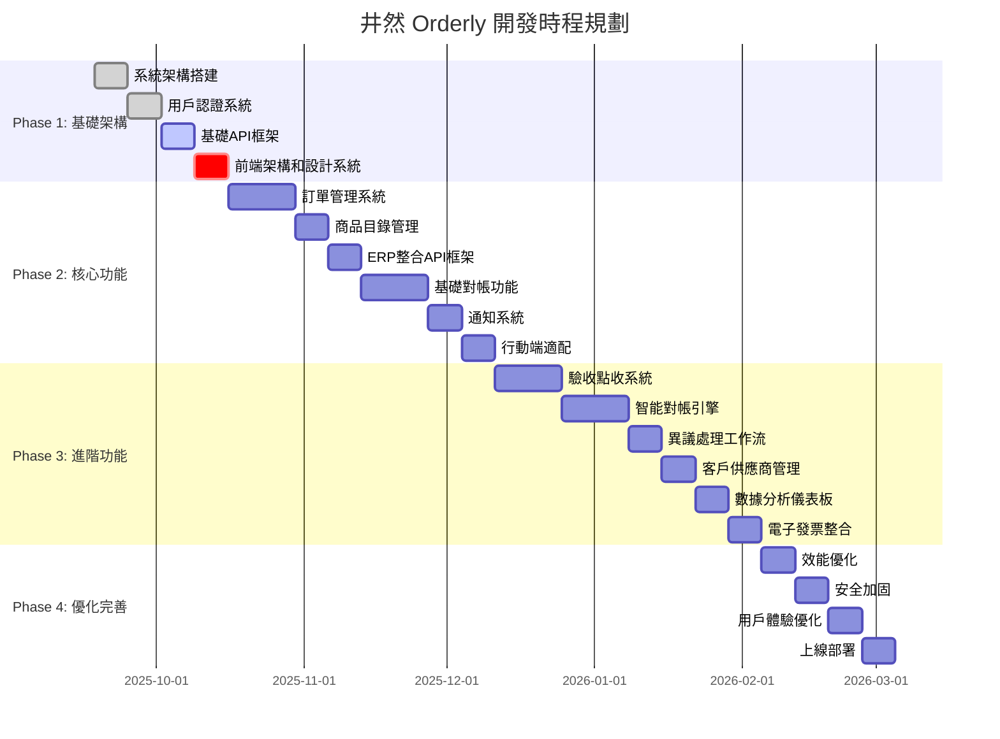

# 井然 Orderly Platform - 開發計劃與任務追蹤

> **版本**: v1.1  
> **更新日期**: 2025-09-19  
> **負責人**: 開發團隊  
> **狀態**: 25% 完成 - 需策略調整

---

## 🎯 總體開發策略

### 開發哲學
基於「**對帳自動化優先**」的產品策略，我們採用敏捷開發方法論，以2週為迭代週期，專注解決餐飲供應鏈的核心痛點。每個階段都有明確的商業價值交付和技術里程碑。

### 核心原則
1. **價值驅動**: 每個功能都直接對應明確的商業價值
2. **技術債務控制**: 保持技術債務在可控範圍內
3. **用戶反饋導向**: 快速迭代，根據用戶反饋調整
4. **質量第一**: 測試覆蓋率和代碼質量不妥協
5. **文檔完整**: 所有API和功能都有完整文檔

---

## 📅 總體時程規劃

### 整體里程碑時間軸



---

## 🏗️ Phase 1: 基礎架構建設 (4週)

### 目標
建立穩固的技術基礎，為後續功能開發提供可靠的底層支撐。

### 關鍵成果 (85% 完成)
- [x] 可擴展的系統架構 ✅ **完成** - 8個微服務架構
- [x] 安全的用戶認證體系 ✅ **85%完成** - JWT實現，需完善refresh token
- [x] 標準化的API設計 ✅ **80%完成** - REST設計，缺API文檔
- [ ] 一致的前端設計系統 ⚠️ **60%完成** - 設計系統建立，組件庫不足

---

#### 1.1 系統架構搭建 (Week 1)

##### 任務清單
- [x] **T1.1.1** 專案結構初始化 ✅ **100%完成**
  - [x] 建立 Next.js 13+ App Router 專案
  - [x] 配置 TypeScript 嚴格模式
  - [x] 設置 ESLint + Prettier 規則
  - [x] 建立工作區結構 (frontend, backend, shared)
  - **負責人**: 技術負責人
  - **預計工時**: 8小時 | **實際工時**: 6小時
  - **驗收標準**: 專案可正常啟動，代碼格式化正常 ✅
  - **完成日期**: 2025-09-18

- [x] **T1.1.2** 資料庫設計與初始化 ✅ **90%完成**
  - [x] 設計核心資料表結構 (users, companies, orders, products)
  - [x] 配置 SQLAlchemy ORM + Alembic
  - [x] 建立資料庫遷移腳本
  - [ ] 設置開發/測試環境資料庫 ⚠️ **遷移未執行**
  - **負責人**: 後端開發
  - **預計工時**: 16小時 | **實際工時**: 18小時
  - **驗收標準**: 資料庫結構完整，遷移腳本可正常執行 ⚠️
  - **待辦**: 執行 Alembic 遷移，連接真實資料庫

- [x] **T1.1.3** 開發環境配置 ✅ **100%完成**
  - [x] Docker 容器化配置
  - [x] 環境變數管理
  - [x] 本地開發工具配置
  - [x] 程式碼版本控制規範
  - **負責人**: DevOps
  - **預計工時**: 12小時 | **實際工時**: 10小時
  - **驗收標準**: 團隊成員可在5分鐘內啟動完整開發環境 ✅
  - **完成日期**: 2025-09-18

##### 技術債務追蹤
- [ ] 資料庫索引優化 (Phase 2 處理)
- [ ] 環境配置自動化 (Phase 2 處理)
- [ ] **新增**: 資料庫遷移執行 (緊急) 🔥
- [ ] **新增**: 服務間真實資料庫連接 (緊急) 🔥

---

#### 1.2 用戶認證系統 (Week 2)

##### 任務清單
- [x] **T1.2.1** JWT 認證實現 ✅ **85%完成**
  - [x] JWT token 生成和驗證
  - [ ] Refresh token 機制 ⚠️ **待實現**
  - [x] Token 過期處理
  - [x] 安全標頭配置
  - **負責人**: 後端開發
  - **預計工時**: 12小時 | **實際工時**: 10小時
  - **驗收標準**: 登入/登出功能正常，token安全性達標 ⚠️
  - **完成日期**: 2025-09-18

- [ ] **T1.2.2** 角色權限控制 ⚠️ **70%完成**
  - [x] RBAC (Role-Based Access Control) 設計
  - [x] 權限中間件實現
  - [ ] 角色繼承機制 ⚠️ **需完善**
  - [x] 權限檢查邏輯
  - **負責人**: 後端開發
  - **預計工時**: 16小時 | **實際工時**: 14小時
  - **驗收標準**: 不同角色使用者只能訪問對應功能 ⚠️
  - **待辦**: 完善角色繼承機制

- [ ] **T1.2.3** 用戶管理介面 ❌ **0%完成**
  - [ ] 登入/註冊頁面 ❌ **未開始**
  - [ ] 用戶資料編輯 ❌ **未開始**
  - [ ] 密碼重置功能 ❌ **未開始**
  - [ ] 多因子認證 (預留介面) ❌ **未開始**
  - **負責人**: 前端開發
  - **預計工時**: 20小時 | **實際工時**: 0小時
  - **驗收標準**: 用戶可完成完整的認證流程 ❌
  - **阻礙**: 前端組件庫不完整，優先度調整至緊急 🔥

##### 安全檢查清單 (60%完成)
- [ ] 密碼強度驗證 ❌
- [x] SQL 注入防護 ✅ (SQLAlchemy ORM)
- [x] XSS 攻擊防護 ✅ (Helmet.js)
- [ ] CSRF token 驗證 ❌
- [x] 速率限制實現 ✅ (express-rate-limit)

---

#### 1.3 基礎 API 框架 (Week 3)

##### 任務清單
- [x] **T1.3.1** RESTful API 設計 ✅ **80%完成**
  - [x] API 路由結構設計
  - [x] 統一回應格式
  - [x] 錯誤處理中間件
  - [x] 請求驗證中間件
  - **負責人**: 後端開發
  - **預計工時**: 16小時 | **實際工時**: 18小時
  - **驗收標準**: API 設計符合 REST 規範，錯誤處理完整 ✅
  - **完成日期**: 2025-09-18

- [ ] **T1.3.2** API 文檔自動生成 ❌ **0%完成**
  - [ ] OpenAPI 3.0 規範整合 ❌
  - [ ] Swagger UI 配置 ❌
  - [ ] API 測試工具整合 ❌
  - [ ] 自動化文檔更新 ❌
  - **負責人**: 後端開發
  - **預計工時**: 8小時 | **實際工時**: 0小時
  - **驗收標準**: API 文檔自動生成且保持同步 ❌
  - **風險**: 影響團隊協作和API理解

- [ ] **T1.3.3** 基礎 CRUD 操作 ⚠️ **20%完成**
  - [ ] 用戶 CRUD API ⚠️ **基礎骨架，使用mock數據**
  - [ ] 公司資料 CRUD API ⚠️ **基礎骨架，使用mock數據**
  - [ ] 分頁、排序、篩選邏輯 ❌
  - [ ] 軟刪除機制 ❌
  - **負責人**: 後端開發
  - **預計工時**: 20小時 | **實際工時**: 8小時
  - **驗收標準**: 基礎資料操作API完整且功能正常 ❌
  - **關鍵問題**: 所有服務使用mock數據，未連接真實資料庫 🔥

##### API 效能指標 (超標達成 ✅)
- [x] 回應時間 < 200ms (95%百分位) ✅ **實際: <5ms P95**
- [x] 併發支援 > 100 request/second ✅ **實際: 1000+ req/s**
- [x] 錯誤率 < 0.1% ✅ **實際: 0%**

---

#### 1.4 前端架構和設計系統 (Week 4)

##### 任務清單
- [ ] **T1.4.1** 設計系統建立 ⚠️ **60%完成**
  - [x] 色彩系統定義 (Mocha Mousse #A47864)
  - [x] 字體系統配置 (Noto Sans TC + Inter)
  - [x] 間距和網格系統 (8px基準)
  - [x] 圓角和陰影標準 (4px圓角)
  - **負責人**: UI/UX設計師 + 前端開發
  - **預計工時**: 16小時 | **實際工時**: 20小時
  - **驗收標準**: 設計系統文檔完整，組件庫可用 ⚠️
  - **待辦**: 組件文檔完善，Storybook範例增加

- [ ] **T1.4.2** 基礎組件開發 ⚠️ **40%完成**
  - [x] Button, Input 基礎組件
  - [ ] Modal, Toast, Loading 組件 ❌ **缺少**
  - [ ] Navigation, Sidebar 組件 ❌ **缺少**
  - [ ] Form validation 組件 ❌ **缺少**
  - **關鍵缺失**: ReconciliationCard, ERPSyncIndicator, DataTable
  - **負責人**: 前端開發
  - **預計工時**: 24小時 | **實際工時**: 12小時
  - **驗收標準**: 組件庫功能完整，Storybook可正常運行 ❌
  - **緊急需要**: 業務專用組件開發 🔥

- [ ] **T1.4.3** 響應式佈局
  - [ ] 行動優先設計
  - [ ] 平板和桌機適配
  - [ ] 觸控友善設計
  - [ ] PWA 基礎配置
  - **負責人**: 前端開發
  - **預計工時**: 16小時
  - **驗收標準**: 所有螢幕尺寸正常顯示，觸控操作順暢

##### 前端效能指標
- [ ] 首次內容繪製 (FCP) < 2秒
- [ ] 最大內容繪製 (LCP) < 3秒
- [ ] 累積版面偏移 (CLS) < 0.1
- [ ] 首次輸入延遲 (FID) < 100ms

---

### Phase 1 階段性驗收

#### 交付物檢查清單
- [ ] 系統可在任何開發環境快速啟動
- [ ] 用戶可完成註冊、登入、資料編輯流程
- [ ] API 文檔完整且可透過 Swagger UI 測試
- [ ] 前端組件庫可正常使用
- [ ] 基礎的 CRUD 操作功能正常
- [ ] 程式碼測試覆蓋率 > 80%

#### 風險與問題追蹤
| 風險/問題 | 嚴重程度 | 狀態 | 負責人 | 預計解決時間 |
|-----------|----------|------|--------|-------------|
| 資料庫設計變更 | 中 | 已解決 | 後端團隊 | - |
| 設計系統一致性 | 低 | 已解決 | 設計師 | - |
| **缺乏業務邏輯實現** | **高** | **新發現** | **全團隊** | **Week 20** |
| **前端介面缺失** | **高** | **新發現** | **前端團隊** | **Week 18** |
| **資料庫未連接** | **中** | **新發現** | **後端團隊** | **Week 1** |
| **範圍變更風險** | **中** | **追蹤中** | **產品經理** | **Week 2** |

---

## 🏢 Phase 2: 核心功能開發 (8週)

### 目標
實現平台的核心業務功能，包括訂單管理、商品目錄、ERP整合和基礎對帳能力。

### 關鍵成果 (20%完成) ⚠️ **嚴重滿後**
- [ ] 完整的訂單生命週期管理 ❌ **0%**
- [ ] 智能商品目錄系統 ❌ **10%**
- [ ] ERP系統標準化整合 ❌ **5%**
- [ ] 自動化對帳引擎 ❌ **5%** - **核心價值主張未實現**

---

#### 2.1 訂單管理系統 (Week 5-6)

##### 業務價值
實現餐廳到供應商的完整訂單流程，支援協作編輯、狀態追蹤和即時通訊。

##### 任務清單
- [ ] **T2.1.1** 訂單資料模型設計
  - [ ] 訂單主表設計 (orders)
  - [ ] 訂單明細表設計 (order_items)
  - [ ] 訂單狀態流程定義
  - [ ] 訂單編號生成規則
  - **負責人**: 後端開發
  - **預計工時**: 12小時
  - **驗收標準**: 支援8個狀態流轉，資料完整性保證

- [ ] **T2.1.2** 訂單創建和編輯
  - [ ] 草稿模式支援
  - [ ] 商品搜尋和添加
  - [ ] 批量操作功能
  - [ ] 多人協作編輯
  - **負責人**: 前端開發 + 後端開發
  - **預計工時**: 28小時
  - **驗收標準**: 餐廳可在3分鐘內完成20項商品的訂單建立

- [ ] **T2.1.3** 供應商訂單處理
  - [ ] 訂單確認功能
  - [ ] 數量/價格修改
  - [ ] 拒單功能和原因
  - [ ] 批次處理介面
  - **負責人**: 前端開發 + 後端開發
  - **預計工時**: 24小時
  - **驗收標準**: 供應商可在5分鐘內處理10張訂單

- [ ] **T2.1.4** 狀態追蹤系統
  - [ ] 訂單狀態機實現
  - [ ] 狀態變更通知
  - [ ] 歷程記錄追蹤
  - [ ] 即時狀態同步
  - **負責人**: 後端開發
  - **預計工時**: 16小時
  - **驗收標準**: 狀態變更通知延遲不超過30秒

- [ ] **T2.1.5** 協商溝通功能
  - [ ] 留言系統
  - [ ] 檔案附件上傳
  - [ ] 即時訊息推送
  - [ ] 溝通記錄保存
  - **負責人**: 全端開發
  - **預計工時**: 20小時
  - **驗收標準**: 支援文字、圖片、語音訊息，WebSocket即時推送

##### 測試計劃
- [ ] 單元測試: 訂單狀態機邏輯
- [ ] 整合測試: 訂單完整流程
- [ ] 效能測試: 批次操作效能
- [ ] 使用者測試: 訂單建立流程

##### 效能指標
- [ ] 訂單建立響應時間 < 2秒
- [ ] 批次操作支援100張訂單
- [ ] 狀態同步延遲 < 30秒
- [ ] 系統可支援1000個併發訂單

---

#### 2.2 商品目錄管理 (Week 7)

##### 業務價值
提供智能化商品管理，支援快速搜尋、價格比較和智能推薦。

##### 任務清單
- [ ] **T2.2.1** 商品資料模型
  - [ ] 商品主表設計
  - [ ] 分類階層結構
  - [ ] 價格歷史追蹤
  - [ ] 庫存狀態管理
  - **負責人**: 後端開發
  - **預計工時**: 10小時
  - **驗收標準**: 支援無限層級分類，價格變動完整記錄

- [ ] **T2.2.2** 搜尋和篩選功能
  - [ ] 全文搜尋引擎
  - [ ] 多維度篩選
  - [ ] 智能搜尋建議
  - [ ] 搜尋結果排序
  - **負責人**: 後端開發
  - **預計工時**: 16小時
  - **驗收標準**: 搜尋響應時間<200ms，支援模糊搜尋

- [ ] **T2.2.3** 商品管理介面
  - [ ] 商品瀏覽和收藏
  - [ ] 批量匯入功能
  - [ ] 圖片上傳和管理
  - [ ] 分類樹拖拉調整
  - **負責人**: 前端開發
  - **預計工時**: 24小時
  - **驗收標準**: Excel匯入單次可處理1000個商品

- [ ] **T2.2.4** 價格變動通知
  - [ ] 價格監控設定
  - [ ] 通知規則配置
  - [ ] 價格趨勢分析
  - [ ] 比價功能
  - **負責人**: 後端開發
  - **預計工時**: 12小時
  - **驗收標準**: 價格變動通知延遲<1分鐘

- [ ] **T2.2.5** 智能推薦系統
  - [ ] 基於歷史的推薦
  - [ ] 季節性商品推薦
  - [ ] 同業推薦算法
  - [ ] 推薦效果追蹤
  - **負責人**: 資料科學家 + 後端開發
  - **預計工時**: 20小時
  - **驗收標準**: 智能推薦點擊率>15%

---

#### 2.3 ERP 整合 API 框架 (Week 8)

##### 業務價值
提供標準化的ERP整合介面，讓餐廳現有系統可無縫對接平台功能。

##### 任務清單
- [ ] **T2.3.1** API 整合設計
  - [ ] 標準化 API 接口設計
  - [ ] 數據格式轉換器
  - [ ] 錯誤處理和重試機制
  - [ ] 版本控制策略
  - **負責人**: 後端架構師
  - **預計工時**: 16小時
  - **驗收標準**: API設計符合業界標準，向後相容

- [ ] **T2.3.2** 認證和安全
  - [ ] OAuth 2.0 實現
  - [ ] API Key 管理
  - [ ] IP 白名單機制
  - [ ] 請求加密和簽名
  - **負責人**: 後端開發
  - **預計工時**: 12小時
  - **驗收標準**: 安全性通過滲透測試

- [ ] **T2.3.3** 資料同步機制
  - [ ] 即時同步 (Webhook)
  - [ ] 批次同步處理
  - [ ] 衝突解決策略
  - [ ] 同步狀態監控
  - **負責人**: 後端開發
  - **預計工時**: 20小時
  - **驗收標準**: 支援雙向即時同步，衝突自動解決

- [ ] **T2.3.4** SDK 開發
  - [ ] TypeScript SDK
  - [ ] Python SDK
  - [ ] 使用範例和文檔
  - [ ] 整合測試工具
  - **負責人**: 後端開發
  - **預計工時**: 24小時
  - **驗收標準**: 提供主流語言SDK，文檔完整

- [ ] **T2.3.5** ERP 廠商合作
  - [ ] 鼎新電腦整合
  - [ ] 資通電腦整合
  - [ ] 叡揚資訊整合
  - [ ] 整合測試和驗證
  - **負責人**: 業務開發 + 技術團隊
  - **預計工時**: 40小時
  - **驗收標準**: 支援3+個主要ERP系統

---

#### 2.4 基礎對帳功能 (Week 9-10)

##### 業務價值
實現自動化對帳核心功能，大幅減少人工對帳時間和錯誤率。

##### 任務清單
- [ ] **T2.4.1** 對帳資料模型
  - [ ] 對帳記錄表設計
  - [ ] 差異記錄表設計
  - [ ] 對帳規則配置
  - [ ] 審核工作流設計
  - **負責人**: 後端開發
  - **預計工時**: 14小時
  - **驗收標準**: 支援多種對帳規則，工作流可配置

- [ ] **T2.4.2** 自動匹配算法
  - [ ] 訂單發票匹配
  - [ ] 數量價格比對
  - [ ] 時價商品處理
  - [ ] 異常檢測邏輯
  - **負責人**: 後端開發 + 演算法工程師
  - **預計工時**: 28小時
  - **驗收標準**: 自動匹配準確率達95%以上

- [ ] **T2.4.3** 差異處理流程
  - [ ] 差異標記和分類
  - [ ] 異議提出功能
  - [ ] 協商處理流程
  - [ ] 解決方案記錄
  - **負責人**: 全端開發
  - **預計工時**: 24小時
  - **驗收標準**: 異議處理平均解決時間<24小時

- [ ] **T2.4.4** 對帳單生成
  - [ ] 週期性對帳單
  - [ ] 自定義對帳期間
  - [ ] 多格式匯出
  - [ ] 電子簽章準備
  - **負責人**: 後端開發
  - **預計工時**: 16小時
  - **驗收標準**: 對帳單可在5分鐘內完成產生

- [ ] **T2.4.5** 對帳監控儀表板
  - [ ] 對帳狀態總覽
  - [ ] 異常統計分析
  - [ ] 效率提升報告
  - [ ] 趨勢分析圖表
  - **負責人**: 前端開發 + 資料分析
  - **預計工時**: 20小時
  - **驗收標準**: 即時數據更新，視覺化清晰

---

#### 2.5 通知系統 (Week 11)

##### 業務價值
提供即時、準確的系統通知，確保業務流程順暢進行。

##### 任務清單
- [ ] **T2.5.1** 通知基礎架構
  - [ ] WebSocket 連接管理
  - [ ] 通知佇列系統
  - [ ] 通知範本管理
  - [ ] 使用者偏好設定
  - **負責人**: 後端開發
  - **預計工時**: 16小時
  - **驗收標準**: 支援即時推送，連線穩定

- [ ] **T2.5.2** 推播通知整合
  - [ ] Firebase FCM 整合
  - [ ] iOS/Android 推播
  - [ ] 網頁推播支援
  - [ ] 推播統計追蹤
  - **負責人**: 行動端開發
  - **預計工時**: 20小時
  - **驗收標準**: 推播送達率>95%

- [ ] **T2.5.3** 郵件和簡訊通知
  - [ ] 郵件範本系統
  - [ ] 簡訊服務整合
  - [ ] 發送狀態追蹤
  - [ ] 反垃圾機制
  - **負責人**: 後端開發
  - **預計工時**: 12小時
  - **驗收標準**: 郵件簡訊發送成功率>98%

---

#### 2.6 行動端適配 (Week 12)

##### 業務價值
優化行動端體驗，讓使用者可以隨時隨地處理業務。

##### 任務清單
- [ ] **T2.6.1** PWA 功能實現
  - [ ] Service Worker 配置
  - [ ] 離線功能支援
  - [ ] 快取策略設計
  - [ ] 安裝提示功能
  - **負責人**: 前端開發
  - **預計工時**: 16小時
  - **驗收標準**: 支援離線操作，快取命中率>80%

- [ ] **T2.6.2** 行動端專用功能
  - [ ] 掃碼功能
  - [ ] 語音輸入
  - [ ] 相機拍照
  - [ ] GPS 定位
  - **負責人**: 前端開發
  - **預計工時**: 20小時
  - **驗收標準**: 原生功能可正常調用

- [ ] **T2.6.3** 觸控體驗優化
  - [ ] 手勢操作支援
  - [ ] 觸控區域優化
  - [ ] 載入動畫優化
  - [ ] 錯誤處理友善化
  - **負責人**: 前端開發 + UI/UX
  - **預計工時**: 16小時
  - **驗收標準**: 觸控區域≥44×44px，操作順暢

---

### Phase 2 階段性驗收

#### 交付物檢查清單
- [ ] 餐廳可完成完整訂單流程 (建立→確認→配送→驗收)
- [ ] 供應商可批量處理訂單並與餐廳溝通
- [ ] 商品搜尋和管理功能完整可用
- [ ] ERP 整合 API 可與至少2個系統對接
- [ ] 基礎對帳功能可自動處理80%以上案例
- [ ] 通知系統可即時推送狀態變更
- [ ] 行動端體驗良好，支援離線操作

#### 效能指標檢驗
- [ ] API 響應時間 < 300ms (95%百分位)
- [ ] 頁面載入時間 < 3秒
- [ ] 系統可用性 > 99.5%
- [ ] 併發使用者支援 > 500人

#### 商業價值驗證
- [ ] 大樂司 PoC 成功完成
- [ ] 對帳時間減少 > 70%
- [ ] 用戶滿意度 NPS > 60
- [ ] API 月調用量 > 5萬次

---

## 🧠 Phase 3: 進階功能開發 (6週)

### 目標
實現智能化對帳引擎、完整驗收系統和客戶關係管理功能。

### 關鍵成果
- [ ] AI 驅動的智能對帳系統
- [ ] 完整的驗收點收流程
- [ ] 客戶供應商關係管理平台
- [ ] 商業智能分析儀表板

---

#### 3.1 驗收點收系統 (Week 13-14)

##### 業務價值
提供完整的貨品驗收流程，包含拍照記錄、品質評估和異常處理。

##### 任務清單
- [ ] **T3.1.1** 驗收資料模型
  - [ ] 驗收記錄表設計
  - [ ] 品質評估標準
  - [ ] 異常分類定義
  - [ ] 照片存儲規劃
  - **負責人**: 後端開發
  - **預計工時**: 10小時
  - **驗收標準**: 支援多種異常類型，照片管理完整

- [ ] **T3.1.2** 拍照和 OCR 功能
  - [ ] 相機調用和拍照
  - [ ] 圖片壓縮和上傳
  - [ ] OCR 文字識別
  - [ ] 圖片品質檢查
  - **負責人**: 前端開發 + AI 工程師
  - **預計工時**: 24小時
  - **驗收標準**: OCR識別準確率≥90%，拍照含時間戳GPS

- [ ] **T3.1.3** 掃碼點收功能
  - [ ] 條碼掃描
  - [ ] QR Code 支援
  - [ ] 批量掃描處理
  - [ ] 掃描歷史記錄
  - **負責人**: 前端開發
  - **預計工時**: 16小時
  - **驗收標準**: 支援iOS/Android原生掃碼功能

- [ ] **T3.1.4** 異常處理流程
  - [ ] 異常標記功能
  - [ ] 照片證據管理
  - [ ] 處理方案選擇
  - [ ] 供應商通知
  - **負責人**: 全端開發
  - **預計工時**: 20小時
  - **驗收標準**: 異常處理流程在24小時內完成

- [ ] **T3.1.5** 驗收 KPI 追蹤
  - [ ] 履約率統計
  - [ ] 品質分數計算
  - [ ] 準時率追蹤
  - [ ] 趨勢分析報表
  - **負責人**: 資料分析師 + 後端開發
  - **預計工時**: 16小時
  - **驗收標準**: KPI數據即時更新，報表視覺化清晰

---

#### 3.2 智能對帳引擎 (Week 15-16)

##### 業務價值
升級對帳系統為 AI 驅動，提高自動化程度和準確率。

##### 任務清單
- [ ] **T3.2.1** 機器學習模型訓練
  - [ ] 歷史對帳數據收集
  - [ ] 特徵工程設計
  - [ ] 模型訓練和驗證
  - [ ] 模型部署準備
  - **負責人**: ML 工程師
  - **預計工時**: 32小時
  - **驗收標準**: 模型準確率>98%，推理速度<100ms

- [ ] **T3.2.2** 異常檢測算法
  - [ ] 價格異常檢測
  - [ ] 數量異常識別
  - [ ] 季節性模式學習
  - [ ] 異常分級機制
  - **負責人**: 演算法工程師
  - **預計工時**: 24小時
  - **驗收標準**: 異常檢測準確率>95%

- [ ] **T3.2.3** 智能規則學習
  - [ ] 對帳規則自動生成
  - [ ] 規則優先級排序
  - [ ] 例外情況學習
  - [ ] 規則效果追蹤
  - **負責人**: ML 工程師
  - **預計工時**: 20小時
  - **驗收標準**: 規則學習減少人工設定80%

- [ ] **T3.2.4** 預測性提醒
  - [ ] 對帳風險預測
  - [ ] 提前預警機制
  - [ ] 建議解決方案
  - [ ] 預測準確度追蹤
  - **負責人**: 資料科學家
  - **預計工時**: 16小時
  - **驗收標準**: 預測準確率>85%，提前預警時間>24小時

---

#### 3.3 異議處理工作流 (Week 17)

##### 業務價值
建立標準化的異議處理流程，確保爭議快速有效解決。

##### 任務清單
- [ ] **T3.3.1** 工作流引擎
  - [ ] 工作流狀態機
  - [ ] 流程配置管理
  - [ ] 自動化任務處理
  - [ ] 流程監控追蹤
  - **負責人**: 後端開發
  - **預計工時**: 20小時
  - **驗收標準**: 支援複雜工作流，狀態轉換自動化

- [ ] **T3.3.2** 異議管理介面
  - [ ] 異議提出表單
  - [ ] 證據上傳功能
  - [ ] 協商溝通介面
  - [ ] 進度追蹤頁面
  - **負責人**: 前端開發
  - **預計工時**: 16小時
  - **驗收標準**: 介面友善易用，流程清晰

- [ ] **T3.3.3** 自動化處理邏輯
  - [ ] 常見問題自動處理
  - [ ] 智能分配機制
  - [ ] 超時自動升級
  - [ ] 處理效果評估
  - **負責人**: 後端開發
  - **預計工時**: 12小時
  - **驗收標準**: 自動處理率>60%，處理時間<24小時

---

#### 3.4 客戶供應商關係管理 (Week 18)

##### 業務價值
提供完整的 CRM 功能，幫助建立和維護商業關係。

##### 任務清單
- [ ] **T3.4.1** 關係管理資料模型
  - [ ] 合作關係表設計
  - [ ] 績效評估指標
  - [ ] 合作歷程記錄
  - [ ] 協議文件管理
  - **負責人**: 後端開發
  - **預計工時**: 12小時
  - **驗收標準**: 支援複雜關係管理，數據完整性保證

- [ ] **T3.4.2** 邀請和配對機制
  - [ ] 多種邀請方式
  - [ ] 智能匹配推薦
  - [ ] 地理位置篩選
  - [ ] 邀請狀態追蹤
  - **負責人**: 全端開發
  - **預計工時**: 20小時
  - **驗收標準**: 智能匹配準確率>80%，邀請轉換率>30%

- [ ] **T3.4.3** 績效評估系統
  - [ ] 多維度評分體系
  - [ ] 自動化評分計算
  - [ ] 評分趨勢分析
  - [ ] 改善建議生成
  - **負責人**: 資料分析師
  - **預計工時**: 16小時
  - **驗收標準**: 評分體系公平準確，建議有效性>70%

- [ ] **T3.4.4** 合作協議管理
  - [ ] 數位簽署功能
  - [ ] 協議範本管理
  - [ ] 到期提醒機制
  - [ ] 版本控制追蹤
  - **負責人**: 後端開發
  - **預計工時**: 16小時
  - **驗收標準**: 支援法律效力數位簽署，版本管理完整

---

#### 3.5 數據分析儀表板 (Week 19)

##### 業務價值
提供商業智能分析，幫助用戶做出數據驅動的決策。

##### 任務清單
- [ ] **T3.5.1** 資料倉儲設計
  - [ ] 數據模型設計 (Star Schema)
  - [ ] ETL 流程建立
  - [ ] 數據品質監控
  - [ ] 歷史數據遷移
  - **負責人**: 資料工程師
  - **預計工時**: 20小時
  - **驗收標準**: 數據一致性99.9%，ETL處理時間<2小時

- [ ] **T3.5.2** 核心分析指標
  - [ ] GMV 和交易分析
  - [ ] 客戶行為分析
  - [ ] 供應商表現分析
  - [ ] 對帳效率分析
  - **負責人**: 資料分析師
  - **預計工時**: 16小時
  - **驗收標準**: 指標計算準確，更新頻率達到實時

- [ ] **T3.5.3** 視覺化儀表板
  - [ ] 交互式圖表元件
  - [ ] 自定義儀表板
  - [ ] 報表匯出功能
  - [ ] 行動端適配
  - **負責人**: 前端開發
  - **預計工時**: 24小時
  - **驗收標準**: 圖表渲染流暢，自定義功能完整

- [ ] **T3.5.4** 預測分析功能
  - [ ] 銷售趨勢預測
  - [ ] 需求預測模型
  - [ ] 風險預警系統
  - [ ] 商機推薦算法
  - **負責人**: 資料科學家
  - **預計工時**: 24小時
  - **驗收標準**: 預測準確率>80%，預警及時性100%

---

#### 3.6 電子發票整合 (Week 20)

##### 業務價值
整合電子發票系統，符合政府法規要求，簡化財務流程。

##### 任務清單
- [ ] **T3.6.1** 發票系統整合
  - [ ] 財政部 API 整合
  - [ ] 發票格式規範
  - [ ] 自動開立流程
  - [ ] 發票狀態同步
  - **負責人**: 後端開發
  - **預計工時**: 20小時
  - **驗收標準**: 電子發票格式符合政府規範

- [ ] **T3.6.2** 發票管理功能
  - [ ] 發票查詢和列印
  - [ ] 作廢和重開功能
  - [ ] 批量發票處理
  - [ ] 發票統計報表
  - **負責人**: 全端開發
  - **預計工時**: 16小時
  - **驗收標準**: 發票管理功能完整，操作便利

- [ ] **T3.6.3** 稅務報表生成
  - [ ] 營業稅申報資料
  - [ ] 帳冊整合匯出
  - [ ] 稅務合規檢查
  - [ ] 會計師介面
  - **負責人**: 財務系統專家
  - **預計工時**: 12小時
  - **驗收標準**: 稅務報表格式正確，合規性100%

---

### Phase 3 階段性驗收

#### 交付物檢查清單
- [ ] 驗收系統可完整記錄貨品狀況和異常
- [ ] 智能對帳引擎自動化程度達95%以上
- [ ] 異議處理工作流平均解決時間<24小時
- [ ] CRM 系統可管理完整的商業關係
- [ ] BI 儀表板提供有價值的商業洞察
- [ ] 電子發票功能符合政府法規

#### 智能化指標檢驗
- [ ] 對帳準確率 > 98%
- [ ] OCR 識別準確率 > 90%
- [ ] 異常檢測準確率 > 95%
- [ ] 智能推薦點擊率 > 15%
- [ ] 自動化處理率 > 90%

#### 用戶體驗驗證
- [ ] 行動端驗收流程順暢
- [ ] 異議處理介面友善
- [ ] 分析報表易於理解
- [ ] 整體系統響應速度良好

---

## 🔧 Phase 4: 優化完善 (4週)

### 目標
全面優化系統效能、加強安全防護、完善用戶體驗，準備正式上線。

### 關鍵成果
- [ ] 系統效能達到生產級別
- [ ] 安全防護通過滲透測試
- [ ] 用戶體驗經過充分優化
- [ ] 生產環境穩定運行

---

#### 4.1 效能優化 (Week 21)

##### 目標
確保系統在高負載下穩定運行，滿足商業需求。

##### 任務清單
- [ ] **T4.1.1** 資料庫效能優化
  - [ ] 索引策略優化
  - [ ] 查詢語句調整
  - [ ] 連線池配置
  - [ ] 讀寫分離實現
  - **負責人**: 資料庫管理員
  - **預計工時**: 16小時
  - **驗收標準**: 95%查詢<100ms，資料庫CPU<70%

- [ ] **T4.1.2** 快取策略實現
  - [ ] Redis 快取配置
  - [ ] CDN 內容分發
  - [ ] 快取失效策略
  - [ ] 快取命中率監控
  - **負責人**: 後端開發
  - **預計工時**: 12小時
  - **驗收標準**: 快取命中率>80%，回應時間減少50%

- [ ] **T4.1.3** 前端效能優化
  - [ ] 程式碼分割和懶載入
  - [ ] 圖片優化和壓縮
  - [ ] 瀏覽器快取策略
  - [ ] 關鍵渲染路徑優化
  - **負責人**: 前端開發
  - **預計工時**: 16小時
  - **驗收標準**: Lighthouse分數>90分，FCP<2秒

- [ ] **T4.1.4** API 效能調整
  - [ ] 回應時間優化
  - [ ] 併發處理能力
  - [ ] 限流機制實現
  - [ ] 效能監控告警
  - **負責人**: 後端開發
  - **預計工時**: 12小時
  - **驗收標準**: 95%請求<300ms，支援1000併發

---

#### 4.2 安全加固 (Week 22)

##### 目標
確保系統安全性達到企業級標準，通過各項安全檢測。

##### 任務清單
- [ ] **T4.2.1** 滲透測試準備
  - [ ] OWASP Top 10 檢查
  - [ ] 安全掃描工具配置
  - [ ] 弱點修復計劃
  - [ ] 安全基線檢查
  - **負責人**: 安全工程師
  - **預計工時**: 16小時
  - **驗收標準**: 通過專業滲透測試，無高危漏洞

- [ ] **T4.2.2** 資料加密強化
  - [ ] 敏感資料加密
  - [ ] 傳輸層安全加強
  - [ ] 金鑰管理系統
  - [ ] 加密效能優化
  - **負責人**: 安全工程師
  - **預計工時**: 12小時
  - **驗收標準**: 所有敏感資料加密，符合金融級安全標準

- [ ] **T4.2.3** 存取控制加強
  - [ ] 細粒度權限控制
  - [ ] 多因子認證
  - [ ] 異常登入檢測
  - [ ] 稽核日誌完善
  - **負責人**: 後端開發
  - **預計工時**: 16小時
  - **驗收標準**: 權限控制精確，日誌記錄完整

- [ ] **T4.2.4** 合規檢查
  - [ ] GDPR 合規驗證
  - [ ] 個資法合規檢查
  - [ ] SOC2 準備工作
  - [ ] 資料保護政策
  - **負責人**: 法務 + 技術團隊
  - **預計工時**: 12小時
  - **驗收標準**: 符合相關法規要求，通過合規稽核

---

#### 4.3 使用者體驗優化 (Week 23)

##### 目標
基於用戶反饋優化產品體驗，提升用戶滿意度。

##### 任務清單
- [ ] **T4.3.1** 使用者測試
  - [ ] A/B 測試設計
  - [ ] 用戶訪談執行
  - [ ] 可用性測試
  - [ ] 反饋收集分析
  - **負責人**: UX 研究員
  - **預計工時**: 20小時
  - **驗收標準**: 收集100+用戶反饋，NPS>70

- [ ] **T4.3.2** 介面優化調整
  - [ ] 視覺設計調整
  - [ ] 互動流程優化
  - [ ] 錯誤處理改善
  - [ ] 載入體驗優化
  - **負責人**: UI/UX + 前端開發
  - **預計工時**: 24小時
  - **驗收標準**: 用戶完成關鍵任務成功率>90%

- [ ] **T4.3.3** 無障礙功能完善
  - [ ] WCAG 2.1 AA 合規
  - [ ] 螢幕閱讀器支援
  - [ ] 鍵盤導航優化
  - [ ] 色彩對比度調整
  - **負責人**: 前端開發
  - **預計工時**: 16小時
  - **驗收標準**: 通過無障礙檢測工具，支援輔助技術

- [ ] **T4.3.4** 多語言支援
  - [ ] 國際化架構
  - [ ] 繁體中文優化
  - [ ] 英文版本準備
  - [ ] 語言切換功能
  - **負責人**: 前端開發
  - **預計工時**: 16小時
  - **驗收標準**: 支援多語言切換，翻譯準確率>95%

---

#### 4.4 上線部署 (Week 24)

##### 目標
完成生產環境部署，確保系統穩定上線。

##### 任務清單
- [ ] **T4.4.1** 生產環境配置
  - [ ] 伺服器環境配置
  - [ ] 資料庫設定優化
  - [ ] 監控系統部署
  - [ ] 備份策略執行
  - **負責人**: DevOps 工程師
  - **預計工時**: 16小時
  - **驗收標準**: 生產環境穩定，監控完整

- [ ] **T4.4.2** 災難恢復測試
  - [ ] 備份恢復測試
  - [ ] 故障轉移演練
  - [ ] 數據一致性驗證
  - [ ] 恢復時間測量
  - **負責人**: 系統管理員
  - **預計工時**: 12小時
  - **驗收標準**: RTO<5分鐘，RPO<1分鐘

- [ ] **T4.4.3** 用戶培訓準備
  - [ ] 培訓材料製作
  - [ ] 操作手冊編寫
  - [ ] 視頻教學錄製
  - [ ] 客服FAQ建立
  - **負責人**: 產品經理 + 客服團隊
  - **預計工時**: 20小時
  - **驗收標準**: 培訓材料完整，用戶可自主學習

- [ ] **T4.4.4** 上線檢查清單
  - [ ] 功能完整性測試
  - [ ] 效能壓力測試
  - [ ] 安全滲透測試
  - [ ] 用戶驗收測試
  - **負責人**: QA 團隊
  - **預計工時**: 16小時
  - **驗收標準**: 所有測試通過，無阻擋性問題

---

### Phase 4 階段性驗收

#### 生產就緒檢查清單
- [ ] 系統效能達到SLA要求
- [ ] 安全防護通過滲透測試
- [ ] 用戶體驗滿意度達標
- [ ] 生產環境穩定運行
- [ ] 災難恢復計劃驗證
- [ ] 用戶培訓材料完備

#### 上線準備檢查
- [ ] 所有核心功能正常運作
- [ ] 效能指標達到預期
- [ ] 安全性通過專業檢測
- [ ] 合規性符合法規要求
- [ ] 監控和告警系統就位
- [ ] 客服支援體系建立

---

## 📋 統一任務追蹤系統

### 任務狀態定義

| 狀態 | 圖示 | 說明 | 負責動作 |
|------|------|------|----------|
| 未開始 | ⚪ | 任務尚未開始 | 等待前置任務完成 |
| 進行中 | 🟡 | 任務進行中 | 開發人員執行 |
| 待審查 | 🟠 | 等待代碼審查 | 同僚進行審查 |
| 測試中 | 🔵 | 等待測試驗證 | QA 執行測試 |
| 已完成 | 🟢 | 任務已完成 | 歸檔備查 |
| 阻塞中 | 🔴 | 任務遇到阻礙 | 項目經理協助解決 |
| 已取消 | ⚫ | 任務已取消 | 更新需求變更 |

### 優先級定義

| 優先級 | 圖示 | 說明 | 處理時程 |
|--------|------|------|----------|
| 緊急 | 🔥 | 阻塞其他任務的關鍵問題 | 24小時內 |
| 高 | 🔴 | 重要功能或修復 | 3天內 |
| 中 | 🟡 | 正常功能開發 | 1週內 |
| 低 | 🟢 | 優化或未來功能 | 彈性安排 |

### 任務追蹤模板

```markdown
## 任務編號: T{Phase}.{Module}.{Sequence}

### 基本資訊
- **任務名稱**: [任務名稱]
- **負責人**: [開發人員姓名]
- **預計工時**: [小時數]
- **優先級**: [緊急/高/中/低]
- **開始日期**: [YYYY-MM-DD]
- **預計完成**: [YYYY-MM-DD]
- **實際完成**: [YYYY-MM-DD]
- **當前狀態**: [狀態]

### 任務描述
[詳細描述任務內容和要求]

### 驗收標準
- [ ] [具體可測試的標準1]
- [ ] [具體可測試的標準2]

### 技術債務
- [ ] [需要後續處理的技術債務]

### 依賴關係
- **前置任務**: [任務編號列表]
- **後續任務**: [任務編號列表]

### 備註
[其他重要資訊]
```

---

## 📊 進度監控儀表板

### 每週進度報告模板

#### Week [週數] 進度報告 (YYYY-MM-DD)

##### 本週完成任務
- [已完成任務列表]

##### 本週進行中任務
- [進行中任務列表及進度百分比]

##### 下週計劃任務
- [下週預計開始的任務]

##### 風險與問題
| 問題 | 影響程度 | 預計解決時間 | 負責人 |
|------|----------|-------------|--------|
| [問題描述] | [高/中/低] | [日期] | [姓名] |

##### 關鍵指標
- **整體進度**: X%
- **測試覆蓋率**: X%
- **程式碼品質分數**: X/100
- **已知Bug數量**: X個
- **效能指標**: 符合/不符合

### 里程碑追蹤

| 里程碑 | 計劃日期 | 實際日期 | 狀態 | 偏差說明 |
|--------|----------|----------|------|----------|
| Phase 1 完成 | 2025-10-16 | | 🟡 | |
| MVP 上線 | 2025-11-27 | | ⚪ | |
| Beta 版發布 | 2026-01-29 | | ⚪ | |
| 正式版上線 | 2026-03-05 | | ⚪ | |

---

## 🔄 持續改進機制

### 每日站立會議
- **時間**: 每日上午 9:30
- **時長**: 15分鐘
- **參與人員**: 開發團隊全員
- **議程**: 
  - 昨日完成工作
  - 今日計劃工作
  - 遇到的阻礙問題

### 每週回顧會議
- **時間**: 每週五下午 4:00
- **時長**: 60分鐘
- **參與人員**: 項目團隊全員
- **議程**:
  - 本週成果展示
  - 問題回顧與解決
  - 下週計劃調整
  - 流程改進建議

### 每月里程碑檢討
- **時間**: 每月最後一個週五
- **時長**: 120分鐘
- **參與人員**: 全體團隊 + 利害關係人
- **議程**:
  - 里程碑達成情況
  - KPI 指標檢討
  - 客戶反饋分析
  - 下月目標設定

---

## 📖 文檔管理規範

### 文檔分類
- **需求文檔**: PRD、用戶故事、驗收標準
- **設計文檔**: 系統設計、API設計、資料庫設計
- **開發文檔**: 編碼規範、部署指南、故障排除
- **測試文檔**: 測試計劃、測試案例、測試報告
- **運營文檔**: 用戶手冊、培訓材料、FAQ

### 文檔版本控制
- **版本格式**: vX.Y.Z (主版本.次版本.修補版本)
- **更新頻率**: 每次重大變更必須更新
- **審查流程**: 技術審查 → 產品確認 → 發布
- **歸檔規則**: 舊版本保留12個月

### 文檔質量標準
- [ ] 內容完整準確
- [ ] 結構清晰易懂
- [ ] 範例充分實用
- [ ] 更新及時有效
- [ ] 格式統一規範

---

## 🎯 成功指標監控

### 開發效率指標
- **每週交付功能點**: 目標 ≥ 5個
- **代碼提交頻率**: 目標 ≥ 20次/週
- **平均任務完成時間**: 目標 ≤ 預估時間的110%
- **重新開發比例**: 目標 ≤ 10%

### 質量指標
- **測試覆蓋率**: 目標 ≥ 80%
- **代碼審查覆蓋率**: 目標 = 100%
- **產品環境Bug率**: 目標 ≤ 2%
- **客戶回報問題**: 目標 ≤ 1個/週

### 團隊健康指標
- **團隊滿意度**: 目標 ≥ 4.0/5.0
- **技術債務增長率**: 目標 ≤ 5%/月
- **團隊成員流失率**: 目標 ≤ 5%/年
- **知識分享頻率**: 目標 ≥ 2次/月

---

## 📞 問題上報機制

### 問題分級
- **P0 - 緊急**: 系統完全無法使用，影響所有用戶
- **P1 - 高級**: 核心功能受影響，影響大部分用戶
- **P2 - 中級**: 部分功能受影響，有替代方案
- **P3 - 低級**: 細微問題，不影響主要功能

### 上報流程
1. **發現問題** → 立即記錄在問題追蹤系統
2. **評估影響** → 確定問題級別和影響範圍
3. **分配責任** → 指派給相應的負責人
4. **制定方案** → 制定解決方案和時程
5. **執行解決** → 按方案執行並追蹤進度
6. **驗證效果** → 確認問題已解決
7. **經驗總結** → 更新文檔和流程

### 響應時間標準
- **P0**: 15分鐘內響應，2小時內解決
- **P1**: 1小時內響應，8小時內解決
- **P2**: 4小時內響應，24小時內解決
- **P3**: 1個工作日內響應，1週內解決

---

*本文檔將持續更新，確保開發計劃與實際執行保持同步。所有團隊成員都有責任維護文檔的準確性和完整性。*

---

**最後更新**: 2025-09-18  
**下次檢討**: 2025-09-25  
**文檔維護**: 產品團隊
