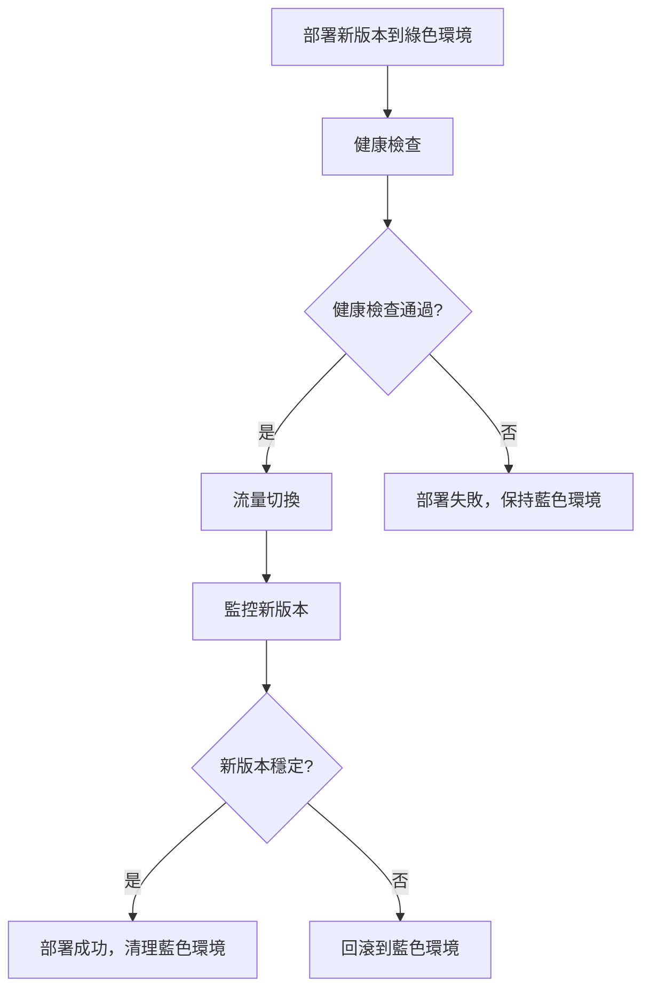

# 藍綠部署指南 - Orderly Platform

> ⚠️ **已棄用**（2025-09-25）：此文件僅保留做為歷史參考。現行部署流程請改讀 `docs/Infra-Runbook.md`、`docs/DEPLOYMENT-CHECKLIST.md`、`docs/DEPLOYMENT-ENVIRONMENTS.md` 與 `docs/DEPLOYMENT-TROUBLESHOOTING.md`。若需要藍綠部署策略，請依前述官方文檔的 Cloud Run v2 流程與服務帳戶/Secrets 規範操作，勿再依據本指南的腳本或設定。

## 🎯 概述

藍綠部署是一種零停機時間的部署策略，通過維護兩個相同的生產環境（藍色和綠色）來實現無縫的服務更新。

## 🔄 工作原理

### 基本概念

- **藍色環境**: 當前正在提供服務的生產環境
- **綠色環境**: 待部署的新版本環境
- **流量切換**: 將用戶流量從藍色環境切換到綠色環境
- **回滾**: 如果新版本有問題，可以立即切回藍色環境

### 部署流程



## 🚀 使用方法

### 1. 手動觸發部署

通過 GitHub Actions 手動觸發：

```bash
# 在 GitHub 網頁界面操作
1. 前往 Actions 頁面
2. 選擇 "Blue-Green Deployment" workflow
3. 點擊 "Run workflow"
4. 設定參數：
   - Environment: staging/production
   - Strategy: progressive/instant
   - Auto cleanup: true/false
```

### 2. 命令行部署

使用本地腳本：

```bash
# 漸進式部署到 staging
./scripts/blue-green-deployment.sh v1.2.3 \
  --strategy=progressive \
  --env=staging

# 即時部署到 production
./scripts/blue-green-deployment.sh v1.2.3 \
  --strategy=instant \
  --env=production \
  --auto-cleanup
```

### 3. 環境變數設定

```bash
export GCP_PROJECT_ID="orderly-472413"
export GCP_REGION="asia-east1"
export DATABASE_URL="postgresql://..."
export JWT_SECRET="your-jwt-secret"
```

## ⚙️ 配置選項

### 流量切換策略

#### 漸進式切換 (Progressive)

- **適用**: 生產環境重要更新
- **流量分配**: 10% → 25% → 50% → 75% → 100%
- **監控間隔**: 每個階段 30-60 秒
- **優點**: 風險最小，可逐步驗證
- **缺點**: 部署時間較長

#### 即時切換 (Instant)

- **適用**: 緊急修復或小幅更新
- **流量分配**: 0% → 100%
- **監控間隔**: 立即
- **優點**: 部署快速
- **缺點**: 風險較高

### 健康檢查配置

```bash
# 健康檢查參數
HEALTH_CHECK_TIMEOUT=300      # 5分鐘超時
HEALTH_CHECK_Interval=10      # 每10秒檢查一次
HEALTH_CHECK_RETRIES=3        # 最多重試3次
```

### 服務配置

| 服務               | 內部端口 | 記憶體 | CPU | 健康檢查端點 |
| ------------------ | -------- | ------ | --- | ------------ |
| API Gateway        | 8000     | 1Gi    | 2   | `/health`    |
| User Service       | 3001     | 512Mi  | 1   | `/health`    |
| Product Service    | 3003     | 512Mi  | 1   | `/health`    |
| Acceptance Service | 3004     | 512Mi  | 1   | `/health`    |

## 🛡️ 安全與監控

### 自動回滾條件

1. 健康檢查失敗
2. 錯誤率超過 5%
3. 響應時間超過 P95 閾值
4. 資源使用率異常

### 監控指標

- **可用性**: 服務健康狀態
- **性能**: 響應時間、吞吐量
- **錯誤率**: HTTP 4xx/5xx 錯誤
- **資源**: CPU、記憶體使用率

### 警報設定

```yaml
alerts:
  - name: 'Deployment Health Check Failed'
    condition: 'health_check_success_rate < 0.95'
    action: 'auto_rollback'

  - name: 'Error Rate Spike'
    condition: 'error_rate > 0.05'
    action: 'auto_rollback'

  - name: 'Response Time Degradation'
    condition: 'p95_response_time > 2000ms'
    action: 'alert_team'
```

## 🔧 故障排除

### 常見問題

#### 1. 健康檢查失敗

```bash
# 檢查服務狀態
gcloud run services describe orderly-api-gateway-staging-green \
  --region=asia-east1

# 查看日誌
gcloud logging read "resource.type=cloud_run_revision" \
  --limit=50 --format=json
```

#### 2. 流量切換失敗

```bash
# 手動回滾
gcloud run services update-traffic orderly-api-gateway-staging \
  --region=asia-east1 \
  --to-tags=blue=100
```

#### 3. 資源不足

```bash
# 增加資源配額
gcloud run services update orderly-api-gateway-staging-green \
  --region=asia-east1 \
  --memory=2Gi \
  --cpu=2
```

### 調試命令

```bash
# 查看當前流量分配
gcloud run services describe orderly-api-gateway-staging \
  --region=asia-east1 \
  --format="value(status.traffic[].percent,status.traffic[].tag)"

# 查看服務版本
gcloud run revisions list \
  --service=orderly-api-gateway-staging \
  --region=asia-east1

# 測試健康端點
curl -f https://your-service-url/health
```

## 📊 最佳實踐

### 部署前檢查清單

- [ ] 所有測試通過
- [ ] 資料庫遷移已執行
- [ ] 配置文件已更新
- [ ] 健康檢查端點正常
- [ ] 監控系統就緒

### 部署中監控

- [ ] 監控健康檢查狀態
- [ ] 觀察錯誤率變化
- [ ] 檢查響應時間
- [ ] 驗證業務指標

### 部署後驗證

- [ ] 完整功能測試
- [ ] 性能基準測試
- [ ] 用戶體驗驗證
- [ ] 清理舊版本

## 🚨 緊急程序

### 緊急回滾

```bash
# 立即回滾所有服務
./scripts/emergency-rollback.sh --env=production

# 或使用 GitHub Actions
# 觸發 "Manual Rollback" workflow
```

### 聯絡資訊

- **開發團隊**: dev-team@orderly.com
- **SRE 團隊**: sre@orderly.com
- **緊急熱線**: +886-xxx-xxxx

## 📈 性能指標

### 部署時間目標

- **漸進式部署**: < 15 分鐘
- **即時部署**: < 5 分鐘
- **回滾時間**: < 2 分鐘

### 可用性目標

- **服務可用性**: 99.99%
- **部署成功率**: 95%
- **回滾成功率**: 99%

## 🔮 未來改進

### 計劃功能

1. **AI 驅動的異常檢測**
2. **自動效能調優**
3. **多區域部署支援**
4. **Canary 部署整合**
5. **A/B 測試框架**

---

**更新日期**: 2024年9月  
**版本**: v1.0  
**維護者**: Orderly DevOps Team
