# 🚀 Orderly 完整部署指南

## 本地端 → Staging → Production 一站式設置

本指南將帶您從零開始設置完整的 Orderly 平台，包含本地開發、staging 測試環境和 production 生產環境。

## 📋 準備清單

### 必要工具

- [ ] Node.js 20+
- [ ] npm 10+
- [ ] Docker & Docker Compose
- [ ] Git
- [ ] Google Cloud SDK (可選，用於本地測試)

### 必要帳號

- [ ] GitHub 帳號
- [ ] Google Cloud Platform 帳號
- [ ] GCP 專案 ID: `orderly-472413`

---

## 🏠 第一步：本地開發環境設置

### 1.1 Clone 專案

```bash
git clone https://github.com/your-username/orderly.git
cd orderly
```

### 1.2 安裝依賴

```bash
# 安裝所有 workspace 依賴
npm install

# 驗證安裝
npm run build
```

### 1.3 啟動本地服務

```bash
# 啟動所有服務
npm run dev

# 或分別啟動
npm run dev:frontend    # http://localhost:8000
npm run dev:backend     # API Gateway + User Service
```

### 1.4 驗證本地環境

訪問以下 URL 確認服務正常：

- ✅ **前端**: http://localhost:8000
- ✅ **API Gateway**: http://localhost:3000/health
- ✅ **用戶服務**: http://localhost:8001/health

**預期結果**：

- 前端顯示 "Hello World from Orderly!" 頁面
- 系統狀態顯示所有服務為綠色 ✅
- 健康檢查端點返回 JSON 響應

---

## 🧪 第二步：Staging 環境設置

### 2.1 設置 GitHub Secrets

前往 GitHub 倉庫 → Settings → Secrets and variables → Actions

添加以下 4 個 Secrets：

| Secret 名稱       | 值                                             | 說明                      |
| ----------------- | ---------------------------------------------- | ------------------------- |
| `GCP_SA_KEY`      | `ewogICJ0eXBlIjogInNlcnZpY2VfYWNjb3VudCIsC...` | GCP 服務帳號密鑰 (base64) |
| `GCP_PROJECT_ID`  | `orderly-472413`                               | GCP 專案 ID               |
| `JWT_SECRET`      | `staging-jwt-secret-2024`                      | Staging JWT 密鑰          |
| `JWT_SECRET_PROD` | `production-super-secure-jwt-key-2024`         | Production JWT 密鑰       |

### 2.2 部署到 Staging

```bash
# 創建並推送到 develop 分支
git checkout -b develop
git add .
git commit -m "feat: initial Hello World deployment

🚀 Generated with [Claude Code](https://claude.ai/code)

Co-Authored-By: Claude <noreply@anthropic.com>"
git push origin develop
```

### 2.3 監控 Staging 部署

1. 前往 GitHub → Actions 頁面
2. 查看 "🚀 Orderly Hello World Deployment" 工作流程
3. 等待 "🚧 Deploy to Staging" 任務完成（約 3-5 分鐘）

### 2.4 驗證 Staging 環境

部署完成後，您將獲得 Staging URL：

- 📱 **前端**: https://orderly-frontend-staging-xxxxxx.run.app
- 🚪 **API Gateway**: https://orderly-api-gateway-staging-xxxxxx.run.app
- 👤 **用戶服務**: https://orderly-user-service-fastapi-staging-xxxxxx.run.app

**測試步驟**：

```bash
# 替換為您的實際 URL
curl https://orderly-frontend-staging-xxxxxx.run.app/api/health
curl https://orderly-api-gateway-staging-xxxxxx.run.app/health
curl https://orderly-user-service-fastapi-staging-xxxxxx.run.app/health
```

---

## 🌟 第三步：Production 環境設置

### 3.1 部署到 Production

```bash
# 合併到 main 分支
git checkout main
git merge develop
git push origin main
```

### 3.2 手動批准部署

1. 前往 GitHub → Actions
2. 找到觸發的工作流程
3. 在 "🌟 Deploy to Production" 步驟中點擊 "Review deployments"
4. 選擇 "production" 並點擊 "Approve and deploy"

### 3.3 監控 Production 部署

- 部署時間：約 5-8 分鐘
- 包含更嚴格的健康檢查
- 自動配置更高的資源配額

### 3.4 驗證 Production 環境

部署完成後，您將獲得 Production URL：

- 📱 **前端**: https://orderly-frontend-prod-xxxxxx.run.app
- 🚪 **API Gateway**: https://orderly-api-gateway-prod-xxxxxx.run.app
- 👤 **用戶服務**: https://orderly-user-service-prod-xxxxxx.run.app

---

## 📊 環境對比表

| 配置項目        | 本地開發   | Staging             | Production            |
| --------------- | ---------- | ------------------- | --------------------- |
| **前端端口**    | 8000       | 8000                | 8000                  |
| **API Gateway** | 3000       | 3000                | 3000                  |
| **用戶服務**    | 8001       | 8001                | 8001                  |
| **部署方式**    | 手動       | 自動 (develop push) | 手動批准              |
| **資源配置**    | 無限制     | 1Gi/1CPU            | 2Gi/2CPU              |
| **實例數量**    | 1          | 0-10                | 1-100 (最少1個)       |
| **JWT 密鑰**    | dev-secret | staging-jwt-secret  | production-secure-key |
| **監控**        | 基本日誌   | 健康檢查            | 完整 APM              |
| **回滾時間**    | 即時       | <1分鐘              | <30秒                 |

---

## 🔄 工作流程說明

### 開發流程

```mermaid
graph LR
    A[本地開發] --> B[推送到 develop]
    B --> C[自動部署 Staging]
    C --> D[測試驗證]
    D --> E[合併到 main]
    E --> F[手動批准]
    F --> G[部署 Production]
```



### 分支策略

- **develop**: 開發分支，自動部署到 Staging
- **main**: 主分支，手動批准後部署到 Production
- **feature/\***: 功能分支，本地開發和測試

---

## 🧪 測試與驗證

### 本地測試命令

```bash
# 健康檢查
curl http://localhost:8000/api/health
curl http://localhost:3000/health
curl http://localhost:8001/health

# 用戶服務測試
curl http://localhost:8001/auth/test

# 前端功能測試
open http://localhost:8000  # 應該看到 Hello World 頁面
```

### Staging 測試清單

- [ ] 前端頁面正常載入
- [ ] 系統狀態顯示所有服務健康
- [ ] API Gateway 路由正常
- [ ] 用戶服務認證端點響應
- [ ] 健康檢查端點返回正確狀態

### Production 測試清單

- [ ] 所有 Staging 測試項目
- [ ] 服務自動擴展（負載測試）
- [ ] SSL 證書有效
- [ ] 域名解析正確
- [ ] 監控和日誌正常

---

## 🚨 故障排除

### 常見問題

#### 1. 本地服務無法啟動

```bash
# 檢查端口是否被佔用
lsof -i :8000
lsof -i :3000
lsof -i :8001

# 清理依賴重新安裝
npm run clean
npm install
```

#### 2. GitHub Actions 部署失敗

- 檢查 GitHub Secrets 是否正確設置
- 確認 GCP 服務帳號權限
- 查看 Actions 日誌中的具體錯誤信息

#### 3. 雲端服務無法訪問

```bash
# 檢查 Cloud Run 服務狀態
gcloud run services list --region=asia-east1

# 查看服務日誌
gcloud logging read "resource.type=cloud_run_revision" --limit=50
```

#### 4. 環境變數問題

- 確認 `.env.local` 文件存在
- 檢查環境變數名稱拼寫
- 驗證 JWT 密鑰格式

### 緊急回滾程序

```bash
# 回滾到上一個版本
gcloud run services update orderly-frontend-prod \
  --image gcr.io/orderly-472413/orderly-frontend:PREVIOUS_SHA \
  --region asia-east1
```

---

## 📈 監控與維護

### 日常監控項目

- [ ] 服務健康檢查狀態
- [ ] 響應時間和錯誤率
- [ ] 資源使用率（CPU/記憶體）
- [ ] 日誌錯誤和警告

### 定期維護任務

- [ ] 依賴更新（每月）
- [ ] 安全掃描（每週）
- [ ] 備份驗證（每週）
- [ ] 性能優化檢查（每季）

---

## 🎯 下一步發展

設置完成後，您可以：

1. **添加新功能**
   - 基於現有微服務架構
   - 遵循相同的開發→測試→生產流程

2. **擴展服務**
   - 添加更多微服務（訂單服務、產品服務等）
   - 集成數據庫和快取

3. **增強監控**
   - 集成 APM 工具（DataDog、New Relic）
   - 設置警報和通知

4. **安全加固**
   - 實施 HTTPS
   - 添加認證和授權
   - API 速率限制

## 🎉 恭喜完成！

您現在擁有了一個完整的 end-to-end 部署流程：

- 🏠 **本地開發**：http://localhost:8000
- 🧪 **Staging 測試**：自動部署和驗證
- 🌟 **Production 生產**：安全的手動部署

這個基礎架構可以支撐完整的 Orderly 平台開發！
