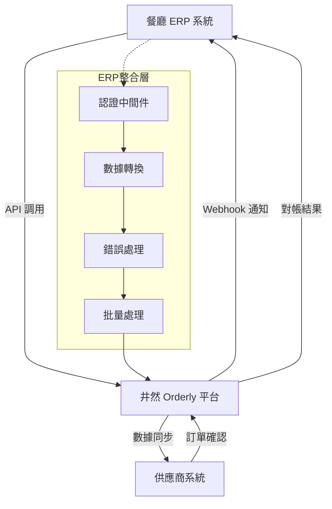
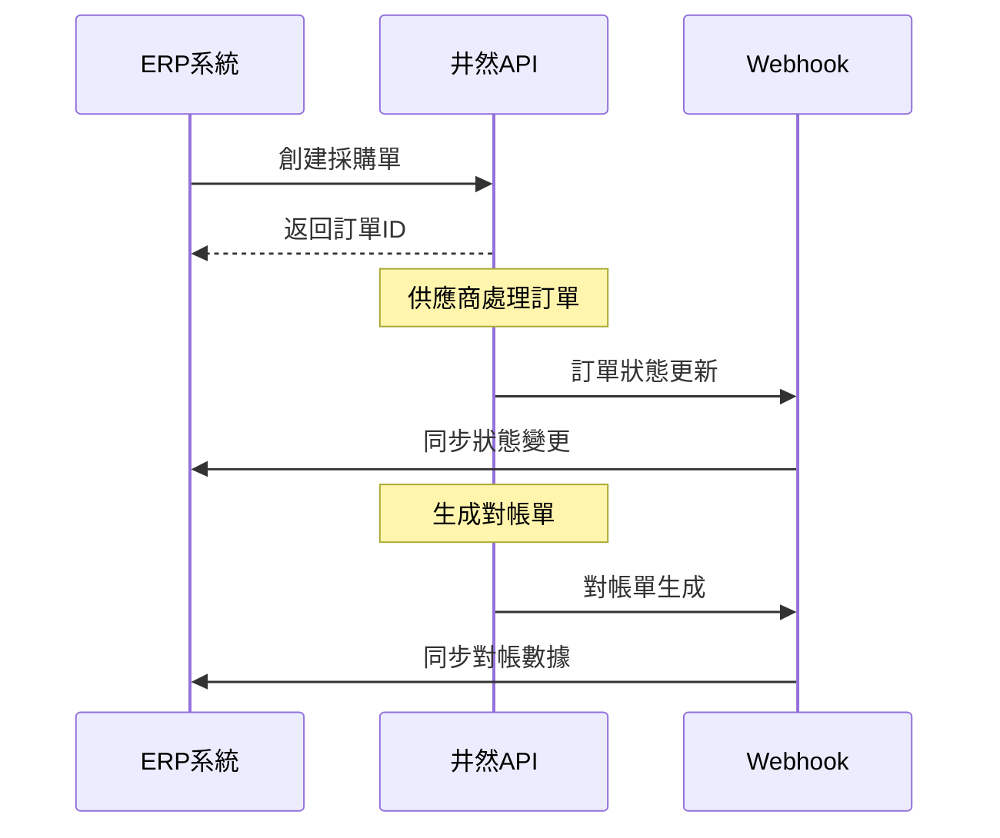

# 井然 Orderly ERP 整合指南

> **版本**: v1.0  
> **更新日期**: 2025-09-17  
> **適用對象**: ERP廠商、系統整合商、IT部門  
> **狀態**: 正式版

---

## 概述

本指南提供井然 Orderly 平台與主流 ERP 系統整合的完整技術方案。透過標準化的 API 接口和整合模式，實現餐廳採購流程與現有 ERP 系統的無縫整合，重點解決對帳自動化需求。

### 整合效益

- **對帳自動化**: 90% 減少人工對帳時間，錯誤率降至 0.5% 以下
- **工作流程整合**: ERP 原生操作體驗，無需額外培訓
- **數據同步**: 即時雙向數據同步，確保數據一致性
- **成本節省**: 年節省人力成本 30-50 萬台幣

---

## 整合架構總覽



### 核心整合點

1. **採購訂單同步**: ERP → 井然平台 → 供應商
2. **價格資訊同步**: 供應商 → 井然平台 → ERP
3. **對帳數據同步**: 井然平台 → ERP 財務模組
4. **庫存狀態同步**: 供應商 → 井然平台 → ERP 庫存

---

## 主流 ERP 系統整合方案

### 1. 鼎新 TIPTOP/EasyFlow 整合

#### 整合架構

```
鼎新 ERP ←→ WebService ←→ 井然 API Gateway ←→ 井然核心系統
```

#### 關鍵對應表

| 鼎新模組       | 井然功能 | 整合方式      |
| -------------- | -------- | ------------- |
| 採購管理 (apr) | 訂單管理 | Real-time API |
| 庫存管理 (aim) | 商品目錄 | Daily sync    |
| 應付帳款 (aap) | 對帳系統 | Event-driven  |
| 會計總帳 (agl) | 財務報表 | Batch sync    |

#### 技術實現

```xml
<!-- 鼎新 WebService 調用範例 -->
<soap:Envelope xmlns:soap="http://schemas.xmlsoap.org/soap/envelope/">
  <soap:Body>
    <CreatePurchaseOrder xmlns="http://orderly.com/erp/tiptop">
      <OrderData>
        <SupplierCode>SUP001</SupplierCode>
        <Items>
          <Item>
            <ItemCode>VEG001</ItemCode>
            <Quantity>50</Quantity>
            <Unit>斤</Unit>
          </Item>
        </Items>
      </OrderData>
    </CreatePurchaseOrder>
  </soap:Body>
</soap:Envelope>
```

### 2. 資通 ciMes/ARES 整合

#### 整合特點

- 採用 RESTful API 標準
- 支援 JSON 數據格式
- OAuth 2.0 認證機制

#### 數據映射

```json
{
  "ares_purchase_order": {
    "doc_no": "mapping to orderly order_number",
    "supplier_code": "mapping to supplier_id",
    "items": [
      {
        "item_code": "mapping to item_code",
        "quantity": "mapping to ordered_quantity",
        "unit_price": "mapping to confirmed_price"
      }
    ]
  }
}
```

### 3. 叡揚 Vital 整合

#### WebAPI 整合模式

```csharp
// C# 整合範例
public class VitalOrderlyIntegration
{
    private readonly HttpClient _httpClient;
    private readonly string _apiKey;

    public async Task<OrderResponse> CreateOrderAsync(VitalPurchaseOrder order)
    {
        var orderlyOrder = MapToOrderlyFormat(order);
        var response = await _httpClient.PostAsJsonAsync(
            "/api/orders",
            orderlyOrder
        );
        return await response.Content.ReadAsAsync<OrderResponse>();
    }
}
```

---

## 整合實施步驟

### Phase 1: 環境準備（1週）

#### 1.1 技術環境檢查

```bash
# 檢查清單
✅ ERP 系統版本兼容性
✅ 網路連接和防火牆設定
✅ API 調用權限配置
✅ 數據庫備份和恢復機制
✅ 測試環境準備
```

#### 1.2 井然平台配置

1. **建立企業帳號**
   - 註冊企業級帳號
   - 獲取 API Key 和 Secret
   - 配置 Webhook 端點

2. **權限設定**
   ```json
   {
     "permissions": [
       "orders:read",
       "orders:write",
       "reconciliation:read",
       "products:read",
       "webhooks:configure"
     ],
     "rate_limits": {
       "requests_per_minute": 5000,
       "burst_allowance": 500
     }
   }
   ```

### Phase 2: 數據映射設計（1週）

#### 2.1 主資料對應

**供應商主檔對應**

```sql
-- ERP 供應商主檔
CREATE TABLE erp_suppliers (
    supplier_code VARCHAR(20) PRIMARY KEY,
    supplier_name VARCHAR(100),
    contact_person VARCHAR(50),
    phone VARCHAR(20),
    address VARCHAR(200)
);

-- 井然供應商對應表
CREATE TABLE orderly_supplier_mapping (
    erp_supplier_code VARCHAR(20),
    orderly_supplier_id VARCHAR(50),
    mapping_status VARCHAR(20),
    created_at TIMESTAMP
);
```

**商品主檔對應**

```sql
-- ERP 商品主檔
CREATE TABLE erp_items (
    item_code VARCHAR(30) PRIMARY KEY,
    item_name VARCHAR(100),
    category_code VARCHAR(20),
    unit VARCHAR(10),
    standard_price DECIMAL(10,2)
);

-- 井然商品對應表
CREATE TABLE orderly_item_mapping (
    erp_item_code VARCHAR(30),
    orderly_item_code VARCHAR(50),
    supplier_id VARCHAR(50),
    mapping_status VARCHAR(20)
);
```

#### 2.2 交易單據對應

**採購單據結構**

```typescript
interface ERPPurchaseOrder {
  // ERP 標準欄位
  doc_no: string
  doc_date: string
  supplier_code: string
  delivery_date: string

  // 明細項目
  items: Array<{
    seq_no: number
    item_code: string
    quantity: number
    unit: string
    unit_price?: number
    amount?: number
  }>

  // 井然擴展欄位
  orderly_order_id?: string
  orderly_status?: string
  sync_timestamp?: string
}
```

### Phase 3: API 整合開發（2-3週）

#### 3.1 認證機制實現

**JWT Token 獲取**

```javascript
// Node.js 範例
const getAuthToken = async () => {
  const response = await fetch('https://api.orderly.com/auth/login', {
    method: 'POST',
    headers: {
      'Content-Type': 'application/json',
    },
    body: JSON.stringify({
      client_id: process.env.ORDERLY_CLIENT_ID,
      client_secret: process.env.ORDERLY_CLIENT_SECRET,
      grant_type: 'client_credentials',
    }),
  })

  const data = await response.json()
  return data.access_token
}
```

#### 3.2 核心 API 調用實現

**創建訂單 API**

```python
# Python 範例
import requests
import json

class OrderlyAPI:
    def __init__(self, base_url, api_key):
        self.base_url = base_url
        self.api_key = api_key

    def create_order(self, order_data):
        headers = {
            'Authorization': f'Bearer {self.api_key}',
            'Content-Type': 'application/json',
            'X-Request-ID': str(uuid.uuid4())
        }

        response = requests.post(
            f'{self.base_url}/api/orders',
            headers=headers,
            json=order_data
        )

        return response.json()
```

**訂單狀態同步**

```java
// Java 範例
@Service
public class OrderlyIntegrationService {

    @Autowired
    private RestTemplate restTemplate;

    public void syncOrderStatus(String orderId) {
        String url = String.format("%s/api/orders/%s", apiBaseUrl, orderId);

        HttpHeaders headers = new HttpHeaders();
        headers.set("Authorization", "Bearer " + getAccessToken());
        headers.setContentType(MediaType.APPLICATION_JSON);

        HttpEntity<String> entity = new HttpEntity<>(headers);

        ResponseEntity<OrderResponse> response = restTemplate.exchange(
            url, HttpMethod.GET, entity, OrderResponse.class
        );

        updateERPOrder(response.getBody());
    }
}
```

#### 3.3 Webhook 接收實現

**設定 Webhook 端點**

```php
<?php
// PHP 範例
class OrderlyWebhookHandler {

    public function handleOrderUpdate(Request $request) {
        // 驗證 Webhook 簽名
        $signature = $request->header('X-Orderly-Signature');
        if (!$this->verifySignature($request->getContent(), $signature)) {
            return response('Unauthorized', 401);
        }

        $payload = json_decode($request->getContent(), true);

        switch ($payload['event_type']) {
            case 'order.confirmed':
                $this->updateERPOrderStatus($payload['data']);
                break;
            case 'reconciliation.generated':
                $this->createERPReconciliation($payload['data']);
                break;
        }

        return response('OK');
    }

    private function verifySignature($payload, $signature) {
        $expected = 'sha256=' . hash_hmac('sha256', $payload, env('ORDERLY_WEBHOOK_SECRET'));
        return hash_equals($expected, $signature);
    }
}
?>
```

### Phase 4: 批量數據處理（1週）

#### 4.1 歷史數據遷移

**供應商數據批量匯入**

```sql
-- 批量建立供應商對應關係
INSERT INTO orderly_supplier_mapping (erp_supplier_code, orderly_supplier_id)
SELECT
    s.supplier_code,
    o.supplier_id
FROM erp_suppliers s
LEFT JOIN orderly_suppliers o ON s.supplier_name = o.company_name
WHERE o.supplier_id IS NOT NULL;
```

**商品資料同步腳本**

```python
# 批量商品同步
def sync_items_to_orderly():
    erp_items = get_erp_items()

    for item in erp_items:
        orderly_item = {
            'item_code': item['item_code'],
            'item_name': item['item_name'],
            'category': item['category_code'],
            'unit': item['unit'],
            'supplier_id': get_mapped_supplier_id(item['supplier_code'])
        }

        try:
            create_orderly_item(orderly_item)
            log_sync_success(item['item_code'])
        except Exception as e:
            log_sync_error(item['item_code'], str(e))
```

#### 4.2 定期同步作業

**每日同步排程**

```bash
#!/bin/bash
# daily_sync.sh

# 同步新增商品
curl -X POST "https://api.orderly.com/api/erp/sync" \
  -H "Authorization: Bearer $API_TOKEN" \
  -H "Content-Type: application/json" \
  -d '{
    "sync_type": "incremental",
    "data_type": "products",
    "last_sync_time": "'$(date -d yesterday +%Y-%m-%dT%H:%M:%S)'Z"
  }'

# 同步訂單狀態
curl -X GET "https://api.orderly.com/api/orders?status=confirmed,shipped&date_from=$(date -d yesterday +%Y-%m-%d)" \
  -H "Authorization: Bearer $API_TOKEN" \
  | jq '.data.orders[]' \
  | while read order; do
    # 更新 ERP 訂單狀態
    update_erp_order_status "$order"
  done
```

### Phase 5: 測試與驗證（1週）

#### 5.1 單元測試

**API 調用測試**

```python
import unittest
from unittest.mock import patch

class OrderlyAPITest(unittest.TestCase):

    def setUp(self):
        self.api = OrderlyAPI('https://api.orderly.com', 'test_token')

    @patch('requests.post')
    def test_create_order_success(self, mock_post):
        # 模擬成功響應
        mock_post.return_value.json.return_value = {
            'success': True,
            'data': {'order_id': 'order_123'}
        }

        order_data = {
            'supplier_id': 'supplier_456',
            'delivery_date': '2025-09-18',
            'items': [{'item_code': 'VEG001', 'quantity': 50}]
        }

        result = self.api.create_order(order_data)

        self.assertTrue(result['success'])
        self.assertEqual(result['data']['order_id'], 'order_123')
```

#### 5.2 整合測試

**端到端測試流程**

```gherkin
Feature: ERP訂單整合測試

Scenario: 從ERP創建訂單到對帳完成
  Given ERP系統中有供應商"SUP001"
  And 商品"VEG001"已對應至井然平台
  When ERP創建採購單"PO20250917001"
  Then 井然平台應該收到訂單創建請求
  And 供應商應該收到訂單通知
  When 供應商確認訂單
  Then ERP應該收到訂單確認Webhook
  When 供應商完成配送
  And 餐廳完成驗收
  Then 井然平台應該生成對帳單
  And ERP應該收到對帳數據
```

#### 5.3 效能測試

**負載測試腳本**

```javascript
// 使用 Artillery.js 進行負載測試
module.exports = {
  config: {
    target: 'https://api.orderly.com',
    phases: [
      { duration: 60, arrivalRate: 10 },
      { duration: 120, arrivalRate: 50 },
      { duration: 60, arrivalRate: 10 },
    ],
  },
  scenarios: [
    {
      name: '創建訂單測試',
      weight: 70,
      flow: [
        {
          post: {
            url: '/api/orders',
            headers: {
              Authorization: 'Bearer {{ token }}',
              'Content-Type': 'application/json',
            },
            json: {
              supplier_id: 'supplier_{{ $randomString() }}',
              delivery_date: '2025-09-18',
              items: [
                {
                  item_code: 'VEG001',
                  quantity: '{{ $randomInt(10, 100) }}',
                },
              ],
            },
          },
        },
      ],
    },
  ],
}
```

---

## 常見整合場景

### 場景 1: 大樂司模式 - 標準 API 整合

#### 客戶特徵

- 已有成熟 ERP 系統
- IT 能力較強
- 對自動化要求高

#### 整合方案



#### 實施重點

- Real-time API 整合
- Webhook 即時通知
- 完整數據雙向同步
- 自動化異常處理

### 場景 2: KKH 模式 - ERP 導入同步整合

#### 客戶特徵

- 正在導入新 ERP
- 希望從一開始就整合
- 預算相對有限

#### 整合方案

- 與 ERP 實施顧問合作
- 在 ERP 設計階段就考慮井然整合
- 提供標準整合模組
- 分階段實施

#### 技術實現

```yaml
integration_phases:
  phase1: 基礎數據同步
  phase2: 訂單流程整合
  phase3: 對帳自動化
  phase4: 完整整合
```

### 場景 3: 稻舍模式 - 批次處理整合

#### 客戶特徵

- 不願支付高額 API 整合費用
- 多據點運營
- 可接受非即時同步

#### 整合方案

- Excel/CSV 批次匯出入
- 每日定時同步
- 人工輔助驗證
- 漸進式自動化

#### 批次處理流程

```python
def daily_batch_process():
    # 1. 從 ERP 匯出採購數據
    export_purchase_orders_to_csv()

    # 2. 上傳至井然平台
    upload_to_orderly_bulk_import()

    # 3. 下載對帳結果
    download_reconciliation_results()

    # 4. 匯入 ERP 財務系統
    import_reconciliation_to_erp()
```

---

## 錯誤處理與故障排除

### 常見問題診斷

#### 1. 認證失敗

```bash
# 檢查 API Token 有效性
curl -H "Authorization: Bearer $TOKEN" \
     https://api.orderly.com/api/auth/verify

# 常見原因
- Token 過期
- 權限不足
- IP 白名單限制
```

#### 2. 數據同步失敗

```sql
-- 檢查數據對應關係
SELECT
    erp_code,
    orderly_id,
    mapping_status,
    last_sync_time
FROM data_mapping_log
WHERE sync_status = 'failed'
ORDER BY last_sync_time DESC;
```

#### 3. Webhook 接收異常

```python
# Webhook 測試工具
def test_webhook_endpoint():
    test_payload = {
        'event_type': 'order.confirmed',
        'data': {'order_id': 'test_order'}
    }

    response = requests.post(
        webhook_url,
        json=test_payload,
        headers={'X-Orderly-Signature': generate_signature(test_payload)}
    )

    return response.status_code == 200
```

### 監控與告警

#### 關鍵指標監控

```yaml
monitoring_metrics:
  api_response_time: <300ms
  api_success_rate: >99.5%
  data_sync_delay: <5min
  webhook_delivery_rate: >99%
  error_rate: <0.1%
```

#### 告警設定

```json
{
  "alerts": [
    {
      "name": "API響應時間過長",
      "condition": "avg(response_time) > 500ms",
      "severity": "warning",
      "notification": ["email", "slack"]
    },
    {
      "name": "數據同步失敗",
      "condition": "sync_failure_count > 5",
      "severity": "critical",
      "notification": ["email", "sms", "phone"]
    }
  ]
}
```

---

## 最佳實踐

### 1. 安全性最佳實踐

#### API 安全

- 使用 HTTPS 加密傳輸
- 定期輪換 API Key
- 實施 IP 白名單
- 記錄所有 API 調用

#### 數據安全

```python
# 敏感數據加密存儲
from cryptography.fernet import Fernet

def encrypt_sensitive_data(data):
    key = Fernet.generate_key()
    cipher = Fernet(key)
    encrypted_data = cipher.encrypt(data.encode())
    return encrypted_data, key

# 數據脫敏
def mask_sensitive_fields(order_data):
    masked_data = order_data.copy()
    if 'price' in masked_data:
        masked_data['price'] = '***'
    return masked_data
```

### 2. 效能最佳實踐

#### API 調用優化

```python
# 批量處理減少 API 調用次數
def batch_update_orders(orders):
    batch_size = 50
    for i in range(0, len(orders), batch_size):
        batch = orders[i:i + batch_size]
        api_client.bulk_update_orders(batch)
        time.sleep(1)  # 避免頻率限制
```

#### 緩存策略

```python
# Redis 緩存商品資訊
def get_product_info(item_code):
    cache_key = f"product:{item_code}"
    cached_data = redis_client.get(cache_key)

    if cached_data:
        return json.loads(cached_data)

    # API 調用獲取數據
    product_data = api_client.get_product(item_code)

    # 緩存 1 小時
    redis_client.setex(cache_key, 3600, json.dumps(product_data))

    return product_data
```

### 3. 可維護性最佳實踐

#### 配置管理

```yaml
# config.yml
orderly:
  api:
    base_url: ${ORDERLY_API_URL:https://api.orderly.com}
    timeout: ${API_TIMEOUT:30}
    retry_attempts: ${RETRY_ATTEMPTS:3}

  sync:
    batch_size: ${BATCH_SIZE:100}
    sync_interval: ${SYNC_INTERVAL:300}

  webhook:
    endpoint: ${WEBHOOK_ENDPOINT:/webhook/orderly}
    secret: ${WEBHOOK_SECRET}
```

#### 日誌記錄

```python
import logging
import structlog

# 結構化日誌
logger = structlog.get_logger()

def process_order(order_data):
    logger.info(
        "Processing order",
        order_id=order_data['id'],
        supplier_id=order_data['supplier_id'],
        total_amount=order_data['total_amount']
    )

    try:
        result = api_client.create_order(order_data)
        logger.info(
            "Order created successfully",
            order_id=order_data['id'],
            orderly_order_id=result['order_id']
        )
    except Exception as e:
        logger.error(
            "Order creation failed",
            order_id=order_data['id'],
            error=str(e),
            exc_info=True
        )
        raise
```

---

## 合作夥伴計劃

### ERP 廠商合作

#### 技術合作

- 提供標準整合套件
- 聯合技術支援
- 共同客戶培訓

#### 商業合作

- 案例分潤機制
- 聯合銷售計劃
- 市場推廣合作

### 系統整合商認證

#### 認證流程

1. 技術能力評估
2. 整合案例驗證
3. 客戶滿意度調查
4. 持續教育訓練

#### 認證等級

- **銅級夥伴**: 基礎整合能力
- **銀級夥伴**: 複雜場景整合
- **金級夥伴**: 全方位解決方案
- **白金夥伴**: 戰略合作夥伴

---

## 支援資源

### 技術支援

#### 開發者資源

- **完整 API 文檔**: https://docs.orderly.com/api
- **SDK 下載**: https://github.com/orderly/sdk
- **範例程式**: https://github.com/orderly/examples
- **測試工具**: https://developer.orderly.com/tools

#### 支援管道

- **技術論壇**: https://community.orderly.com
- **Email 支援**: integration@orderly.com
- **電話支援**: +886-2-xxxx-xxxx
- **視訊會議**: 預約制專業諮詢

### 培訓服務

#### 線上培訓

- API 整合基礎課程
- 進階整合實戰
- 故障排除指南
- 最佳實踐分享

#### 現場培訓

- 客製化整合工作坊
- 一對一技術諮詢
- 團隊培訓服務

---

## 附錄

### A. API 端點清單

| 功能模組 | HTTP 方法 | 端點                         | 說明         |
| -------- | --------- | ---------------------------- | ------------ |
| 認證     | POST      | /api/auth/login              | 獲取 Token   |
| 訂單     | POST      | /api/orders                  | 創建訂單     |
| 訂單     | GET       | /api/orders                  | 查詢訂單     |
| 訂單     | PUT       | /api/orders/{id}             | 更新訂單     |
| 對帳     | POST      | /api/reconciliation/generate | 生成對帳單   |
| 對帳     | GET       | /api/reconciliation          | 查詢對帳記錄 |
| ERP同步  | POST      | /api/erp/sync                | 數據同步     |
| ERP同步  | POST      | /api/erp/bulk-import         | 批量匯入     |

### B. 錯誤碼對照表

| 錯誤碼  | HTTP狀態 | 說明         | 處理方式       |
| ------- | -------- | ------------ | -------------- |
| AUTH001 | 401      | Token 無效   | 重新獲取 Token |
| VAL001  | 400      | 數據驗證失敗 | 檢查請求格式   |
| BIZ001  | 422      | 業務規則違反 | 檢查業務邏輯   |
| SYS001  | 500      | 系統內部錯誤 | 聯絡技術支援   |

### C. 整合檢查清單

#### 上線前檢查

- [ ] API 認證測試通過
- [ ] 核心功能整合測試完成
- [ ] Webhook 接收測試正常
- [ ] 錯誤處理機制就緒
- [ ] 監控告警配置完成
- [ ] 備份恢復機制確認
- [ ] 使用者培訓完成
- [ ] 緊急聯絡方式確認

#### 上線後檢查

- [ ] 系統穩定運行 24 小時
- [ ] 數據同步正確性確認
- [ ] 效能指標符合預期
- [ ] 用戶回饋收集
- [ ] 技術支援響應測試

---

**文件版本**: v1.0  
**發布日期**: 2025-09-17  
**維護團隊**: 井然技術團隊  
**更新週期**: 季度更新  
**緊急聯絡**: integration@orderly.com
