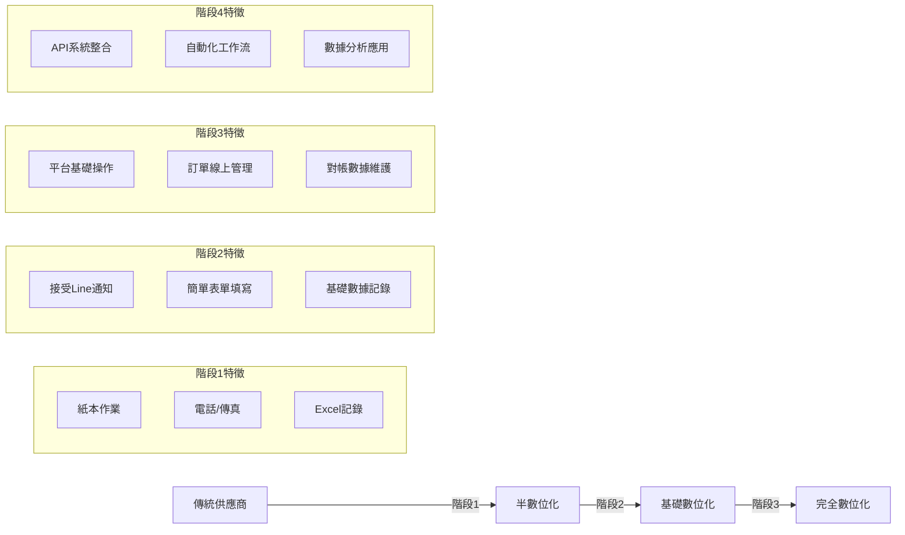
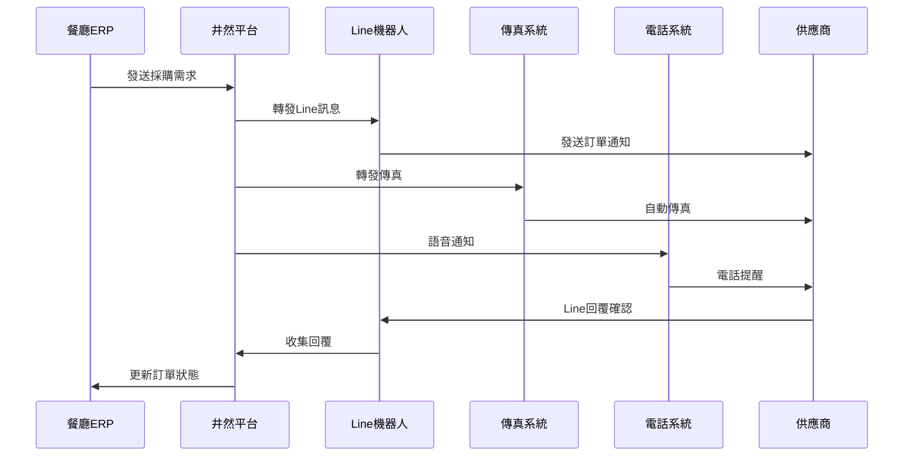

# 井然 Orderly 供應商導入手冊

> **版本**: v1.0  
> **更新日期**: 2025-09-17  
> **適用對象**: 業務團隊、客戶成功、營運團隊  
> **狀態**: 正式版

---

## 概述

本手冊提供井然 Orderly 平台供應商導入的完整策略和操作指南。採用三階段漸進式導入模式，從自動化傳統通訊方式開始，逐步引導供應商完成數位化轉型，最終實現完整的 API 整合。

### 導入策略核心理念

- **零門檻啟動**: 供應商無需改變現有作業方式
- **漸進式數位化**: 分階段降低轉換阻力
- **價值驅動**: 每個階段都有明確的價值提升
- **網絡效應**: 優先建立餐廳-供應商連結

---

## 供應商分層策略

### 數位化成熟度分級



### 供應商類型分析

#### A 類：進階型供應商（5%）

**特徵**

- 已有基礎 ERP/進銷存系統
- IT 能力較強，願意投資數位化
- 客戶多為中大型餐廳
- 年營收 5000 萬以上

**導入策略**

- 直接進入階段 3
- 提供 API 整合支援
- 重點客戶專案管理
- 技術深度合作

#### B 類：成長型供應商（25%）

**特徵**

- 有基礎電腦化作業
- 願意學習新工具
- 客戶群穩定且有成長
- 年營收 1000-5000 萬

**導入策略**

- 從階段 2 開始
- 重點培訓和支援
- 提供成功案例引導
- 逐步功能開放

#### C 類：傳統型供應商（70%）

**特徵**

- 主要使用紙本和電話作業
- 對新技術較為謹慎
- 客戶多為小型餐廳
- 年營收 1000 萬以下

**導入策略**

- 從階段 1 開始
- 強調零門檻和易用性
- 提供持續人工支援
- 重點解決對帳痛點

---

## 三階段導入流程

### 階段 1：自動化傳統通訊（0-3個月）

#### 核心目標

**讓供應商在不改變現有作業方式的前提下，享受數位化帶來的效率提升**

#### 技術架構



#### 實施步驟

**Week 1-2: 聯絡方式收集**

```bash
# 供應商基礎資料建檔
供應商基本資料:
  ✅ 公司名稱和統編
  ✅ 主要聯絡人
  ✅ Line ID/手機號碼
  ✅ 傳真號碼
  ✅ 主要商品類別
  ✅ 現有客戶概況
```

**Week 2-4: 自動化通訊設置**

_Line 機器人設置_

```javascript
// Line Bot 範例
const lineBot = {
  sendOrderNotification: (supplier, order) => {
    const message = {
      type: 'flex',
      altText: '新訂單通知',
      contents: {
        type: 'bubble',
        header: {
          type: 'box',
          layout: 'vertical',
          contents: [
            {
              type: 'text',
              text: `🛒 新訂單：${order.orderNumber}`,
              weight: 'bold',
              color: '#1DB446',
            },
          ],
        },
        body: {
          type: 'box',
          layout: 'vertical',
          contents: [
            {
              type: 'text',
              text: `餐廳：${order.restaurantName}`,
              margin: 'md',
            },
            {
              type: 'text',
              text: `交期：${order.deliveryDate}`,
              margin: 'md',
            },
            {
              type: 'text',
              text: `品項：${order.items.length}項`,
              margin: 'md',
            },
          ],
        },
        footer: {
          type: 'box',
          layout: 'vertical',
          spacing: 'sm',
          contents: [
            {
              type: 'button',
              style: 'primary',
              height: 'sm',
              action: {
                type: 'postback',
                label: '✅ 確認接單',
                data: `confirm_order_${order.id}`,
              },
            },
            {
              type: 'button',
              style: 'secondary',
              height: 'sm',
              action: {
                type: 'postback',
                label: '❌ 無法供應',
                data: `reject_order_${order.id}`,
              },
            },
          ],
        },
      },
    }

    return lineClient.pushMessage(supplier.lineId, message)
  },
}
```

_自動傳真系統_

```python
# 傳真系統整合
class FaxNotificationService:
    def send_order_fax(self, supplier, order):
        # 生成傳真格式訂單
        fax_content = self.generate_fax_template(order)

        # 發送傳真
        fax_response = self.fax_gateway.send_fax(
            to_number=supplier.fax_number,
            content=fax_content,
            priority='normal'
        )

        # 記錄發送狀態
        self.log_fax_status(order.id, fax_response)

        return fax_response

    def generate_fax_template(self, order):
        template = f"""
        【井然 Orderly 採購單】

        訂單編號：{order.order_number}
        餐廳名稱：{order.restaurant_name}
        交貨日期：{order.delivery_date}
        聯絡電話：{order.contact_phone}

        品項明細：
        {'='*40}
        """

        for item in order.items:
            template += f"""
        品名：{item.name}
        數量：{item.quantity} {item.unit}
        備註：{item.notes or '無'}
        {'='*40}
        """

        template += f"""

        請於收到傳真後1小時內回覆確認
        Line聯絡：@orderly_bot
        客服電話：02-xxxx-xxxx

        井然 Orderly 平台
        {datetime.now().strftime('%Y/%m/%d %H:%M')}
        """

        return template
```

_電話自動播報_

```python
# 語音通知系統
class VoiceNotificationService:
    def make_notification_call(self, supplier, order):
        voice_script = f"""
        您好，這裡是井然 Orderly 平台。

        您有一筆新的採購訂單，
        訂單編號：{order.order_number}，
        來自餐廳：{order.restaurant_name}，
        交貨日期：{order.delivery_date}。

        詳細資訊已發送至您的Line和傳真，
        請盡快確認是否能夠供應。

        如有問題請撥打客服電話：02-xxxx-xxxx

        謝謝！
        """

        # 調用語音服務 API
        call_response = self.voice_gateway.make_call(
            to_number=supplier.phone_number,
            script=voice_script,
            voice_type='female',
            language='zh-TW'
        )

        return call_response
```

**Week 4-8: 回覆收集系統**

_多渠道回覆整合_

```python
class ResponseCollectionService:
    def __init__(self):
        self.line_handler = LineResponseHandler()
        self.sms_handler = SMSResponseHandler()
        self.call_handler = CallResponseHandler()

    def process_supplier_response(self, response_data):
        """處理供應商各種管道的回覆"""

        if response_data['channel'] == 'line':
            return self.line_handler.process(response_data)
        elif response_data['channel'] == 'sms':
            return self.sms_handler.process(response_data)
        elif response_data['channel'] == 'call':
            return self.call_handler.process(response_data)

        # 統一格式化回覆
        standardized_response = {
            'order_id': response_data['order_id'],
            'supplier_id': response_data['supplier_id'],
            'status': response_data['status'],  # confirmed/rejected/modified
            'response_time': datetime.now(),
            'channel': response_data['channel'],
            'details': response_data.get('details', {})
        }

        # 更新訂單狀態
        self.update_order_status(standardized_response)

        # 通知餐廳
        self.notify_restaurant(standardized_response)

        return standardized_response
```

#### 成功指標

| 指標類別   | 具體指標                 | 目標值 | 測量方式   |
| ---------- | ------------------------ | ------ | ---------- |
| **覆蓋率** | 供應商聯絡方式收集完成率 | >95%   | 數據庫記錄 |
| **響應率** | 訂單通知 1 小時內回覆率  | >80%   | 系統記錄   |
| **準確率** | 回覆內容理解正確率       | >90%   | 人工抽查   |
| **效率**   | 平均回覆處理時間         | <5分鐘 | 系統統計   |

### 階段 2：基礎數位化平台（3-9個月）

#### 核心目標

**引導供應商開始使用基礎的線上平台功能，建立數位化操作習慣**

#### 功能設計

**簡化版供應商後台**

```typescript
// 供應商後台功能模組
interface SupplierPortalModules {
  // 基礎功能
  orderManagement: {
    pendingOrders: Order[]
    orderHistory: Order[]
    quickResponse: boolean
  }

  // 商品管理
  productCatalog: {
    myProducts: Product[]
    priceUpdate: boolean
    stockStatus: boolean
  }

  // 簡化對帳
  reconciliation: {
    monthlyStatements: Statement[]
    disputeManagement: boolean
    paymentTracking: boolean
  }

  // 客戶關係
  customerRelations: {
    restaurantList: Restaurant[]
    orderStatistics: Statistics
    feedback: Feedback[]
  }
}
```

#### 實施步驟

**Month 1-2: 邀請與培訓**

_供應商邀請流程_

```python
class SupplierOnboardingService:
    def invite_supplier_to_platform(self, supplier_id):
        supplier = self.get_supplier(supplier_id)

        # 生成邀請連結
        invite_token = self.generate_invite_token(supplier_id)
        invite_link = f"https://supplier.orderly.com/register?token={invite_token}"

        # 發送邀請 Line 訊息
        invitation_message = f"""
        🎉 恭喜！井然平台邀請您升級為數位化供應商

        ✨ 專屬優惠：
        • 前3個月免費使用
        • 專人一對一指導
        • 對帳效率提升90%

        📱 立即註冊：{invite_link}

        有任何問題歡迎聯絡：
        客服Line：@orderly_support
        電話：02-xxxx-xxxx
        """

        self.line_service.send_message(supplier.line_id, invitation_message)

        # 安排培訓課程
        self.schedule_training_session(supplier_id)

        return invite_token

    def schedule_training_session(self, supplier_id):
        """安排個人化培訓"""
        training_sessions = [
            {
                'title': '平台基礎操作',
                'duration': 30,
                'type': 'video_call',
                'materials': ['基礎操作手冊', '影片教學']
            },
            {
                'title': '訂單管理實務',
                'duration': 45,
                'type': 'hands_on',
                'materials': ['實際訂單練習']
            },
            {
                'title': '對帳功能介紹',
                'duration': 30,
                'type': 'demo',
                'materials': ['對帳範例', 'FAQ']
            }
        ]

        for session in training_sessions:
            self.create_training_appointment(supplier_id, session)
```

**Month 2-4: 平台功能導入**

_漸進式功能開放_

```python
class FeatureRolloutManager:
    def __init__(self):
        self.feature_stages = {
            'stage_1': ['order_view', 'basic_response'],
            'stage_2': ['product_management', 'price_update'],
            'stage_3': ['reconciliation_view', 'dispute_management'],
            'stage_4': ['analytics', 'customer_insights']
        }

    def check_stage_readiness(self, supplier_id):
        """檢查供應商是否準備進入下一階段"""
        supplier_usage = self.get_usage_metrics(supplier_id)

        current_stage = supplier_usage['current_stage']
        required_metrics = self.get_stage_requirements(current_stage)

        readiness_score = 0
        for metric, threshold in required_metrics.items():
            if supplier_usage[metric] >= threshold:
                readiness_score += 1

        # 80% 指標達成即可進入下一階段
        if readiness_score / len(required_metrics) >= 0.8:
            return True

        return False

    def unlock_next_stage(self, supplier_id):
        """解鎖下一階段功能"""
        if self.check_stage_readiness(supplier_id):
            current_stage = self.get_current_stage(supplier_id)
            next_stage = f"stage_{int(current_stage.split('_')[1]) + 1}"

            # 開放新功能
            self.enable_features(supplier_id, self.feature_stages[next_stage])

            # 發送通知
            self.notify_feature_unlock(supplier_id, next_stage)

            # 安排新功能培訓
            self.schedule_feature_training(supplier_id, next_stage)
```

**Month 4-6: 數據品質提升**

_數據完整性檢查_

```python
class DataQualityManager:
    def assess_supplier_data_quality(self, supplier_id):
        """評估供應商數據品質"""

        quality_checks = {
            'product_completeness': self.check_product_data_completeness(supplier_id),
            'price_accuracy': self.check_price_consistency(supplier_id),
            'response_timeliness': self.check_response_time(supplier_id),
            'order_accuracy': self.check_order_fulfillment_accuracy(supplier_id)
        }

        # 計算總體品質分數
        quality_score = sum(quality_checks.values()) / len(quality_checks)

        # 生成改善建議
        improvement_suggestions = self.generate_improvement_plan(quality_checks)

        return {
            'overall_score': quality_score,
            'detailed_scores': quality_checks,
            'improvement_plan': improvement_suggestions
        }

    def generate_improvement_plan(self, quality_checks):
        """生成數據品質改善計劃"""
        suggestions = []

        if quality_checks['product_completeness'] < 0.8:
            suggestions.append({
                'priority': 'high',
                'task': '完善商品資料',
                'description': '請補充商品描述、規格和圖片',
                'estimated_time': '2小時',
                'help_available': True
            })

        if quality_checks['price_accuracy'] < 0.9:
            suggestions.append({
                'priority': 'medium',
                'task': '價格資訊更新',
                'description': '建議每週更新價格資訊',
                'estimated_time': '30分鐘',
                'help_available': False
            })

        return suggestions
```

#### 激勵機制

**階段性獎勵計劃**

```yaml
incentive_program:
  stage_2_completion:
    cash_bonus: NT$ 5,000
    platform_credits: NT$ 10,000
    recognition: '數位化先鋒供應商'
    marketing_exposure: '成功案例分享'

  monthly_performance:
    data_quality_bonus:
      score_90_plus: NT$ 2,000
      score_80_89: NT$ 1,000
      score_70_79: NT$ 500

    response_time_bonus:
      under_1_hour: NT$ 1,500
      under_2_hours: NT$ 1,000
      under_4_hours: NT$ 500
```

### 階段 3：完整數位化整合（9-18個月）

#### 核心目標

**實現供應商業務全面數位化，建立先進的供應鏈協作模式**

#### 高級功能模組

**智能化供應商平台**

```typescript
interface AdvancedSupplierPlatform {
  // 智能預測
  demandForecasting: {
    aiPrediction: WeeklyDemand[]
    seasonalTrends: TrendAnalysis
    inventoryOptimization: StockRecommendation[]
  }

  // 自動化工作流
  automatedWorkflows: {
    autoConfirmOrders: boolean
    dynamicPricing: PricingRule[]
    inventoryAlerts: AlertConfig[]
  }

  // 高級分析
  businessIntelligence: {
    profitabilityAnalysis: ProfitReport
    customerSegmentation: CustomerInsights
    marketTrends: MarketAnalysis
  }

  // API 整合
  systemIntegration: {
    erpConnection: ERPConfig
    webhookEndpoints: WebhookConfig[]
    dataSync: SyncSchedule
  }
}
```

#### 實施步驟

**Month 9-12: AI 輔助功能**

_需求預測系統_

```python
class DemandForecastingService:
    def __init__(self):
        self.ml_model = self.load_trained_model()
        self.feature_extractor = FeatureExtractor()

    def generate_weekly_forecast(self, supplier_id, weeks_ahead=4):
        """生成未來4週需求預測"""

        # 獲取歷史數據
        historical_data = self.get_historical_orders(supplier_id, days=365)
        seasonal_data = self.get_seasonal_patterns(supplier_id)
        market_data = self.get_market_trends()

        # 特徵工程
        features = self.feature_extractor.extract_features({
            'historical_orders': historical_data,
            'seasonal_patterns': seasonal_data,
            'market_trends': market_data,
            'supplier_profile': self.get_supplier_profile(supplier_id)
        })

        # ML 預測
        predictions = self.ml_model.predict(features, horizon=weeks_ahead)

        # 生成建議
        recommendations = self.generate_inventory_recommendations(
            supplier_id, predictions
        )

        return {
            'forecast_period': f'{weeks_ahead} weeks',
            'predicted_demand': predictions,
            'confidence_intervals': self.calculate_confidence_intervals(predictions),
            'inventory_recommendations': recommendations,
            'risk_alerts': self.identify_supply_risks(predictions)
        }

    def generate_inventory_recommendations(self, supplier_id, predictions):
        """基於預測生成庫存建議"""
        current_inventory = self.get_current_inventory(supplier_id)
        lead_times = self.get_supplier_lead_times(supplier_id)

        recommendations = []

        for item_prediction in predictions:
            item_code = item_prediction['item_code']
            predicted_demand = item_prediction['weekly_demand']
            current_stock = current_inventory.get(item_code, 0)
            lead_time = lead_times.get(item_code, 7)  # 預設7天

            # 計算安全庫存
            safety_stock = predicted_demand * 0.2  # 20% 安全庫存
            reorder_point = predicted_demand * (lead_time / 7) + safety_stock

            if current_stock < reorder_point:
                order_quantity = predicted_demand * 2 - current_stock

                recommendations.append({
                    'item_code': item_code,
                    'action': 'reorder',
                    'suggested_quantity': max(order_quantity, 0),
                    'urgency': 'high' if current_stock < safety_stock else 'medium',
                    'reason': f'預計{lead_time}天後庫存不足'
                })

        return recommendations
```

**Month 12-15: 自動化工作流**

_智能訂單處理_

```python
class AutomatedOrderProcessor:
    def __init__(self):
        self.rule_engine = BusinessRuleEngine()
        self.pricing_engine = DynamicPricingEngine()

    def process_incoming_order(self, order):
        """自動化處理訂單流程"""

        # 步驟1: 自動驗證訂單
        validation_result = self.validate_order(order)
        if not validation_result['is_valid']:
            return self.handle_validation_error(order, validation_result)

        # 步驟2: 檢查庫存可用性
        availability_check = self.check_inventory_availability(order)
        if not availability_check['fully_available']:
            return self.handle_partial_availability(order, availability_check)

        # 步驟3: 動態定價（時價商品）
        pricing_result = self.pricing_engine.calculate_prices(order)

        # 步驟4: 自動確認或轉人工
        auto_confirm_eligible = self.check_auto_confirm_eligibility(order)

        if auto_confirm_eligible:
            confirmed_order = self.auto_confirm_order(order, pricing_result)
            self.send_confirmation_notification(confirmed_order)
            return confirmed_order
        else:
            # 轉人工處理
            self.queue_for_manual_review(order, pricing_result)
            self.notify_staff_for_review(order)
            return {'status': 'pending_review', 'order_id': order['id']}

    def check_auto_confirm_eligibility(self, order):
        """檢查是否符合自動確認條件"""

        eligibility_checks = [
            self.check_customer_trust_level(order['restaurant_id']),
            self.check_order_size_limits(order),
            self.check_item_complexity(order['items']),
            self.check_delivery_timeline(order['delivery_date']),
            self.check_supplier_capacity(order)
        ]

        # 所有檢查都通過才能自動確認
        return all(eligibility_checks)
```

**Month 15-18: 生態系統整合**

_第三方系統整合_

```python
class EcosystemIntegrationManager:
    def __init__(self):
        self.integration_plugins = {
            'accounting': AccountingSystemPlugin(),
            'logistics': LogisticsSystemPlugin(),
            'payment': PaymentSystemPlugin(),
            'inventory': InventorySystemPlugin()
        }

    def setup_supplier_integrations(self, supplier_id, integration_requirements):
        """設置供應商系統整合"""

        integration_plan = []

        for system_type, config in integration_requirements.items():
            if system_type in self.integration_plugins:
                plugin = self.integration_plugins[system_type]

                # 創建整合配置
                integration_config = plugin.create_integration_config(
                    supplier_id, config
                )

                # 測試連接
                test_result = plugin.test_connection(integration_config)

                if test_result['success']:
                    # 啟用整合
                    plugin.enable_integration(integration_config)
                    integration_plan.append({
                        'system': system_type,
                        'status': 'active',
                        'config': integration_config
                    })
                else:
                    integration_plan.append({
                        'system': system_type,
                        'status': 'failed',
                        'error': test_result['error']
                    })

        return integration_plan
```

---

## 成功案例模板

### 案例 1：傳統蔬菜供應商轉型

#### 背景

- **供應商**: 新北市場蔬菜批發商
- **成立年份**: 1995年
- **主要客戶**: 30家中小型餐廳
- **年營收**: 2,000萬台幣
- **轉型前痛點**: 電話接單易出錯、對帳耗時3天

#### 導入過程

**階段1實施（Month 1-3）**

```yaml
implementation_timeline:
  week_1:
    - 建立Line群組聯絡
    - 收集傳真號碼
    - 測試電話系統

  week_4:
    - 自動訂單通知上線
    - Line回覆機制建立
    - 傳真確認單自動化

  week_8:
    - 訂單回覆率達85%
    - 平均回覆時間縮短至45分鐘
    - 餐廳滿意度提升至4.2/5
```

**階段2升級（Month 4-9）**

```yaml
platform_adoption:
  month_4:
    - 完成平台註冊和培訓
    - 開始使用基礎訂單管理

  month_6:
    - 商品資料建檔完成
    - 價格更新機制建立
    - 簡化對帳功能上線

  month_9:
    - 對帳時間從3天縮短至4小時
    - 訂單準確率提升至98%
    - 客戶新增5家餐廳
```

#### 轉型成果

**定量效益**
| 指標 | 轉型前 | 轉型後 | 改善幅度 |
|------|--------|--------|----------|
| 接單時間 | 30分鐘 | 5分鐘 | 83% |
| 對帳時間 | 3天 | 4小時 | 89% |
| 訂單錯誤率 | 8% | 2% | 75% |
| 客戶數量 | 30家 | 35家 | 17% |
| 月營收 | 170萬 | 195萬 | 15% |

**定性效益**

- 工作壓力大幅減輕
- 客戶關係顯著改善
- 業務拓展能力增強
- 數位化技能提升

### 案例 2：中型肉品供應商整合

#### 背景

- **供應商**: 傳統肉品批發商
- **成立年份**: 1988年
- **主要客戶**: 50家餐廳（含連鎖）
- **年營收**: 8,000萬台幣
- **轉型目標**: 完整數位化整合

#### 快速通道實施

**直接進入階段2（Month 1）**

```python
# 快速通道評估
fast_track_criteria = {
    'it_capability': 'medium',
    'change_readiness': 'high',
    'business_complexity': 'medium',
    'investment_capacity': 'sufficient'
}

# 客製化導入計劃
custom_implementation = {
    'week_1_2': '密集培訓和平台設置',
    'week_3_4': '數據遷移和系統整合',
    'week_5_8': '全功能測試和優化',
    'week_9_12': '進階功能培訓和上線'
}
```

**進階功能應用（Month 3-6）**

- 需求預測系統：預測準確率達85%
- 自動化定價：時價商品自動調整
- 庫存最佳化：降低20%庫存成本
- 客戶分析：識別高價值客戶群

#### 轉型成果

**業務增長**

- 新客戶獲取：15家
- 客戶留存率：98%（行業平均85%）
- 平均客單價：提升25%
- 市場佔有率：區域內第一

**運營效率**

- 人力需求：減少2名行政人員
- 響應速度：即時處理95%訂單
- 對帳準確率：99.5%
- 客戶滿意度：4.8/5

---

## 支援體系

### 培訓計劃

#### 分層培訓體系

**Level 1: 基礎操作培訓**

```yaml
basic_training:
  target_audience: 所有供應商
  duration: 2小時
  format: 線上視訊 + 實機操作
  content:
    - 平台基礎功能介紹
    - 訂單接收和回覆
    - 基本資料維護
  certification: 基礎操作認證
```

**Level 2: 進階功能培訓**

```yaml
advanced_training:
  target_audience: 階段2供應商
  duration: 4小時
  format: 現場工作坊
  content:
    - 商品管理最佳實踐
    - 對帳流程深度應用
    - 客戶關係管理
    - 數據分析初級
  certification: 數位化供應商認證
```

**Level 3: 專家級培訓**

```yaml
expert_training:
  target_audience: 階段3供應商
  duration: 8小時（2天）
  format: 客製化諮詢
  content:
    - AI預測系統應用
    - 自動化流程設計
    - 系統整合規劃
    - 業務策略諮詢
  certification: 數位化專家認證
```

### 客戶成功支援

#### 專屬客戶成功經理（CSM）

**CSM 分工策略**

```python
class CSMAssignmentStrategy:
    def assign_csm(self, supplier):
        """依據供應商特徵分配CSM"""

        if supplier.annual_revenue > 50_000_000:
            return self.assign_senior_csm(supplier)
        elif supplier.digital_readiness > 0.7:
            return self.assign_technical_csm(supplier)
        elif supplier.stage == 1:
            return self.assign_junior_csm(supplier)
        else:
            return self.assign_standard_csm(supplier)

    def create_success_plan(self, supplier, csm):
        """制定客戶成功計劃"""

        success_milestones = [
            {
                'milestone': '完成平台註冊',
                'timeline': '1週',
                'success_criteria': '帳號啟用且基本資料完整'
            },
            {
                'milestone': '首次訂單處理',
                'timeline': '2週',
                'success_criteria': '成功接收並確認第一筆訂單'
            },
            {
                'milestone': '獨立操作能力',
                'timeline': '4週',
                'success_criteria': '無需協助完成日常操作'
            },
            {
                'milestone': '進階功能使用',
                'timeline': '8週',
                'success_criteria': '使用商品管理和對帳功能'
            }
        ]

        return {
            'supplier_id': supplier.id,
            'csm_id': csm.id,
            'milestones': success_milestones,
            'check_in_frequency': '每週',
            'escalation_criteria': self.define_escalation_rules()
        }
```

#### 多渠道支援

**支援渠道配置**

```yaml
support_channels:
  tier_1_basic:
    - Line官方帳號即時回覆
    - 電話客服（平日9-18點）
    - Email支援（24小時回覆）
    - 常見問題FAQ

  tier_2_advanced:
    - 專屬Line群組
    - 視訊會議技術支援
    - 現場拜訪服務
    - 客製化培訓

  tier_3_premium:
    - 7x24專屬熱線
    - 專屬技術顧問
    - 季度業務檢討會議
    - 優先功能開發請求
```

### 激勵與認可機制

#### 階段性獎勵計劃

**數位化里程碑獎勵**

```yaml
milestone_rewards:
  stage_1_completion:
    cash_reward: NT$ 3,000
    recognition: '數位化啟航獎'
    benefits: ['平台使用費減免1個月']

  stage_2_graduation:
    cash_reward: NT$ 8,000
    recognition: '數位化進階獎'
    benefits:
      - '成功案例宣傳機會'
      - '優先客戶推薦'
      - '進階功能搶先體驗'

  stage_3_mastery:
    cash_reward: NT$ 15,000
    recognition: '數位化專家獎'
    benefits:
      - '年度最佳合作夥伴候選'
      - '產品功能需求優先權'
      - '行業會議演講機會'
```

**績效持續激勵**

```yaml
performance_incentives:
  monthly_kpi_bonus:
    response_time:
      under_30_min: NT$ 2,000
      under_1_hour: NT$ 1,200
      under_2_hours: NT$ 800

    data_quality:
      score_95_plus: NT$ 1,500
      score_90_94: NT$ 1,000
      score_85_89: NT$ 500

    customer_satisfaction:
      rating_4_8_plus: NT$ 2,500
      rating_4_5_4_7: NT$ 1,500
      rating_4_0_4_4: NT$ 800
```

---

## 風險管理與品質控制

### 導入風險識別

#### 常見風險類型

**技術風險**

```yaml
technical_risks:
  low_digital_literacy:
    probability: high
    impact: medium
    mitigation:
      - 增加培訓時數
      - 提供視訊輔導
      - 安排現場支援

  system_integration_failure:
    probability: medium
    impact: high
    mitigation:
      - 階段性測試
      - 回滾機制準備
      - 備用方案啟動

  data_migration_error:
    probability: low
    impact: high
    mitigation:
      - 完整數據備份
      - 分批遷移測試
      - 專家團隊監控
```

**業務風險**

```yaml
business_risks:
  supplier_resistance:
    probability: medium
    impact: medium
    mitigation:
      - 強化價值宣導
      - 提供成功案例
      - 增加激勵措施

  customer_service_disruption:
    probability: low
    impact: high
    mitigation:
      - 並行運行期間
      - 緊急支援機制
      - 快速恢復流程

  competitive_response:
    probability: high
    impact: medium
    mitigation:
      - 差異化功能強化
      - 客戶黏性提升
      - 轉換成本建立
```

### 品質保證體系

#### 多層次品質檢查

**Level 1: 自動化檢查**

```python
class AutomatedQualityChecker:
    def run_quality_checks(self, supplier_data):
        """執行自動化品質檢查"""

        checks = [
            self.check_data_completeness(supplier_data),
            self.check_data_consistency(supplier_data),
            self.check_response_patterns(supplier_data),
            self.check_performance_metrics(supplier_data)
        ]

        quality_score = sum(checks) / len(checks)

        if quality_score < 0.7:
            self.trigger_manual_review(supplier_data)
        elif quality_score < 0.9:
            self.schedule_improvement_guidance(supplier_data)

        return {
            'overall_score': quality_score,
            'detailed_results': checks,
            'recommendations': self.generate_recommendations(checks)
        }
```

**Level 2: 人工審核**

```python
class ManualReviewProcess:
    def conduct_quality_review(self, supplier_id, review_type='regular'):
        """進行人工品質審核"""

        review_checklist = {
            'data_accuracy': self.verify_product_information(supplier_id),
            'communication_quality': self.assess_response_quality(supplier_id),
            'customer_feedback': self.collect_restaurant_feedback(supplier_id),
            'system_usage': self.analyze_platform_engagement(supplier_id)
        }

        review_result = self.calculate_review_score(review_checklist)

        # 生成改善計劃
        if review_result['score'] < 8.0:
            improvement_plan = self.create_improvement_plan(
                supplier_id, review_checklist
            )
            self.schedule_follow_up_review(supplier_id, improvement_plan)

        return review_result
```

**Level 3: 客戶回饋整合**

```python
class CustomerFeedbackIntegration:
    def collect_restaurant_feedback(self, supplier_id):
        """收集餐廳對供應商的回饋"""

        feedback_channels = [
            self.get_platform_ratings(supplier_id),
            self.conduct_satisfaction_surveys(supplier_id),
            self.analyze_complaint_patterns(supplier_id),
            self.track_repeat_order_rates(supplier_id)
        ]

        consolidated_feedback = self.consolidate_feedback(feedback_channels)

        # 識別改善機會
        improvement_opportunities = self.identify_improvement_areas(
            consolidated_feedback
        )

        return {
            'overall_satisfaction': consolidated_feedback['average_rating'],
            'feedback_summary': consolidated_feedback['themes'],
            'improvement_opportunities': improvement_opportunities
        }
```

---

## 效果評估與持續改進

### KPI 監控體系

#### 供應商導入效果指標

**導入成功率指標**

```yaml
onboarding_kpis:
  stage_1_metrics:
    completion_rate: 95% # 階段1完成率
    avg_completion_time: 21 days # 平均完成時間
    drop_out_rate: 5% # 流失率
    satisfaction_score: 4.2/5 # 滿意度

  stage_2_metrics:
    upgrade_rate: 80% # 升級率
    feature_adoption: 85% # 功能採用率
    data_quality_score: 8.5/10 # 數據品質
    business_impact: 25% # 業務改善幅度

  stage_3_metrics:
    advanced_adoption: 60% # 進階功能採用
    integration_success: 90% # 系統整合成功率
    roi_achievement: 300% # 投資回報率
    retention_rate: 95% # 留存率
```

**業務影響指標**

```yaml
business_impact_kpis:
  efficiency_metrics:
    order_response_time: -75% # 訂單回應時間減少
    reconciliation_time: -85% # 對帳時間減少
    error_rate: -80% # 錯誤率降低
    manual_workload: -60% # 人工作業減少

  growth_metrics:
    customer_acquisition: +20% # 客戶獲取增長
    order_frequency: +15% # 訂單頻次提升
    average_order_value: +12% # 平均訂單金額
    market_share: +8% # 市場份額增長

  satisfaction_metrics:
    supplier_nps: 65 # 供應商淨推薦值
    restaurant_satisfaction: 4.6/5 # 餐廳滿意度
    platform_stickiness: 92% # 平台黏性
    churn_rate: 3% # 流失率
```

### 持續改進機制

#### 定期評估流程

**月度評估**

```python
class MonthlyAssessment:
    def conduct_monthly_review(self):
        """執行月度評估"""

        assessment_areas = {
            'onboarding_performance': self.analyze_onboarding_trends(),
            'supplier_engagement': self.measure_engagement_levels(),
            'feature_utilization': self.track_feature_usage(),
            'support_effectiveness': self.evaluate_support_quality()
        }

        insights = self.generate_insights(assessment_areas)
        action_items = self.identify_action_items(insights)

        return {
            'assessment_date': datetime.now(),
            'key_findings': insights,
            'action_items': action_items,
            'next_review_date': self.calculate_next_review_date()
        }
```

**季度改進計劃**

```python
class QuarterlyImprovementPlanning:
    def develop_improvement_plan(self, quarterly_data):
        """制定季度改進計劃"""

        # 分析趨勢和模式
        trends = self.analyze_quarterly_trends(quarterly_data)

        # 識別改進機會
        opportunities = self.identify_improvement_opportunities(trends)

        # 優先級排序
        prioritized_opportunities = self.prioritize_opportunities(opportunities)

        # 制定具體行動計劃
        action_plan = self.create_action_plan(prioritized_opportunities)

        return {
            'planning_period': self.get_next_quarter(),
            'improvement_opportunities': prioritized_opportunities,
            'action_plan': action_plan,
            'success_metrics': self.define_success_metrics(action_plan)
        }
```

---

## 附錄

### A. 供應商評估工具

#### 數位化準備度評估表

```yaml
digital_readiness_assessment:
  basic_information:
    company_size: [small, medium, large]
    annual_revenue: [<10M, 10M-50M, >50M]
    business_years: [<5, 5-15, >15]

  technology_capability:
    computer_usage: [none, basic, intermediate, advanced]
    internet_access: [none, dial_up, broadband, fiber]
    mobile_device: [none, basic_phone, smartphone, tablet]
    existing_software: [none, basic_office, erp_system, custom_system]

  change_readiness:
    learning_attitude: [resistant, neutral, willing, eager]
    investment_capacity: [none, limited, moderate, sufficient]
    time_availability: [none, limited, flexible, dedicated]

  business_complexity:
    product_categories: [1, 2-5, 6-10, >10]
    customer_count: [<10, 10-30, 31-100, >100]
    order_frequency: [weekly, daily, multiple_daily, real_time]

  scoring:
    each_category: 1-4 points
    total_possible: 16 points
    interpretation:
      12-16: Ready for Stage 2 direct entry
      8-11: Standard Stage 1 start
      4-7: Extended Stage 1 with extra support
      <4: Manual assessment required
```

### B. 培訓教材清單

#### 階段1培訓資料

```yaml
stage_1_materials:
  quick_start_guide:
    format: PDF + Video
    duration: 15 minutes
    topics:
      - Line機器人使用方法
      - 訂單通知識別
      - 快速回覆技巧

  response_templates:
    format: Text templates
    categories:
      - 訂單確認
      - 缺貨通知
      - 價格異動
      - 交期調整

  troubleshooting_guide:
    format: FAQ document
    common_issues:
      - Line訊息收不到
      - 傳真列印問題
      - 電話通知設定
```

#### 階段2培訓資料

```yaml
stage_2_materials:
  platform_tutorial:
    format: Interactive video course
    duration: 2 hours
    modules:
      - 登入和基本導航
      - 訂單管理操作
      - 商品資料維護
      - 對帳功能使用

  best_practices_guide:
    format: PDF handbook
    topics:
      - 數據品質標準
      - 高效操作技巧
      - 客戶溝通最佳實踐

  certification_test:
    format: Online quiz
    questions: 20 multiple choice
    passing_score: 80%
    certificate: Digital Supplier Basic
```

### C. 技術整合規格

#### Line Bot 規格

```yaml
line_bot_specifications:
  messaging_api_version: 2.0
  supported_message_types:
    - text
    - flex_message
    - quick_reply
    - postback

  webhook_events:
    - message
    - postback
    - follow
    - unfollow

  rate_limits:
    push_messages: 1000/month (free tier)
    reply_messages: unlimited

  rich_menu:
    size: 2500x1686 pixels
    areas: max 20 clickable areas
    content: order_status, help, contact
```

#### 傳真系統規格

```yaml
fax_system_specifications:
  service_provider: Cloud Fax Service
  supported_formats:
    - PDF
    - TIFF
    - PNG

  delivery_confirmation: yes
  retry_mechanism: 3 attempts
  delivery_reports: detailed status

  template_specifications:
    page_size: A4
    margins: 2cm all sides
    font: Arial, 12pt
    logo_placement: top_right

  integration_method: REST API
  response_time: <30 seconds
  success_rate: >98
```

---

**文件版本**: v1.0  
**發布日期**: 2025-09-17  
**維護團隊**: 井然營運團隊  
**更新週期**: 半年更新  
**意見回饋**: ops@orderly.com
