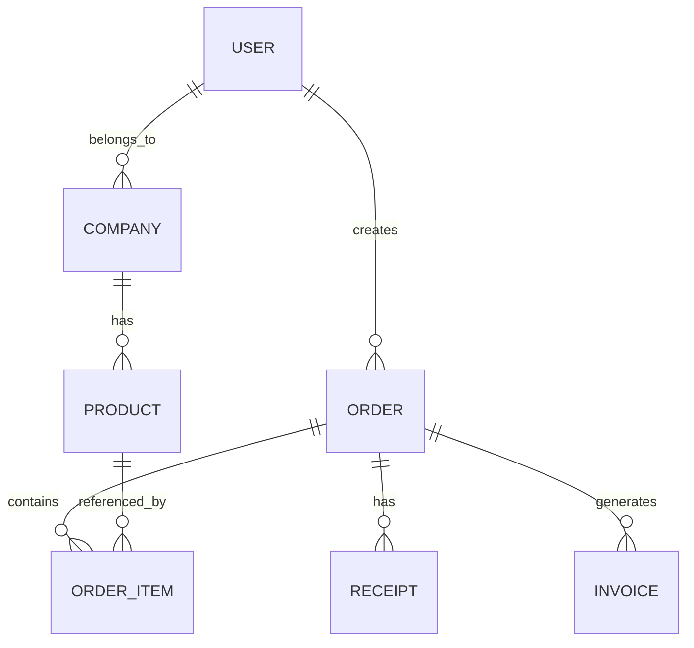

# 井然 Orderly 平台 - 產品需求文件 (PRD)

> **版本**: v2.0  
> **更新日期**: 2025-09-17  
> **負責人**: 產品團隊  
> **狀態**: 核准待開發

---

## 執行摘要

### 產品願景
井然 Orderly 是一個全鏈路數位供應平台，旨在革新餐飲產業的供應鏈管理。透過單一介面串接餐廳與供應商，實現「下單 → 配送 → 驗收 → 對帳 → 結算」全流程數位化，並提供平台級監控與數據洞察。

### 核心價值主張
- **餐廳端**: 數位化下單、透明化驗收、自動化對帳
- **供應端**: 統一訂單管理、即時庫存同步、簡化收款流程
- **平台端**: 全域數據監控、異常預警、業務洞察

### 關鍵成功指標
| 角色 | KPI |
|------|-----|
| 餐廳端 | 下單時間減少70%、驗收錯漏率降至2%以下、結帳日準確率達95% |
| 供應端 | 接單確認時長縮短至5分鐘內、補貨率提升至85%、應收週期縮短30% |
| 平台端 | 平台GMV年增長150%、異常處理週期縮短至24小時、日誌覆蓋率達99% |

---

## 商業模式與策略

### 收入模式

#### 1. 交易佣金模式
- **餐廳端**：GMV的1.5-2.5%（依月交易量分級）
  - 月GMV < 100萬：2.5%
  - 月GMV 100-500萬：2.0%  
  - 月GMV > 500萬：1.5%
- **供應端**：GMV的2-3%（依品類和毛利率分級）
  - 生鮮類：3%（毛利高、風險大）
  - 乾貨類：2.5%（標準品類）
  - 大宗採購：2%（量大優惠）
- **大客戶優惠**：年GMV超過1000萬可議價

#### 2. 訂閱制增值服務
| 方案 | 月費 | 合作夥伴限制 | 主要功能 |
|------|------|-------------|----------|
| 基礎版 | 免費 | 3個供應商/餐廳 | 基本下單、對帳、驗收 |
| 專業版 | NT$3,999 | 無限制 | 進階分析、批量操作、優先客服 |
| 企業版 | NT$9,999 | 無限制 | API開放、專屬客服、定制報表 |

#### 3. 金融增值服務
- **供應鏈金融**：應收帳款融資（年化利率8-12%）
- **保險服務**：貨品運輸險、信用保險（佣金15-20%）
- **支付服務**：整合支付手續費（0.8-1.5%）

### 成本結構
| 成本項目 | 佔比 | 說明 |
|----------|------|------|
| 技術開發與維護 | 35% | 工程師薪資、雲端服務、第三方API |
| 營運與客服 | 25% | 業務團隊、客服中心、營運支援 |
| 行銷與業務 | 20% | 數位行銷、地推BD、品牌建設 |
| 金融服務成本 | 15% | 資金成本、風控、壞帳準備 |
| 管理費用 | 5% | 辦公室租金、行政人員、法務財務 |

### 盈利預測
| 年度 | GMV目標 | 營收預估 | 成本預估 | 損益狀況 |
|------|---------|----------|----------|----------|
| Year 1 | NT$5億 | NT$1,200萬 | NT$4,200萬 | 虧損NT$3,000萬（投資期） |
| Year 2 | NT$15億 | NT$3,600萬 | NT$3,600萬 | 損益平衡 |
| Year 3 | NT$40億 | NT$9,600萬 | NT$8,640萬 | 淨利率10%（NT$960萬） |

---

## 競爭分析與差異化策略

### 主要競品對比

| 維度 | 井然Orderly | FoodPanda供應鏈 | iCHEF市集 | 傳統ERP |
|------|-------------|----------------|-----------|----------|
| **目標市場** | 中小型餐飲 | 大型連鎖 | 小型餐飲 | 各規模企業 |
| **核心優勢** | 全流程整合 | 物流配送 | POS整合 | 功能完整 |
| **月費** | NT$0-9,999 | NT$15,000+ | NT$3,000+ | NT$20,000+ |
| **上手難度** | 極簡單（10分鐘） | 中等（1週） | 簡單（3天） | 複雜（2週） |
| **供應商網絡** | 開放生態 | 封閉體系 | 有限選擇 | 無 |
| **行動支援** | 原生優化 | 基本功能 | 良好 | 有限 |
| **數據智能** | AI驅動 | 基礎分析 | 基礎報表 | 複雜查詢 |

### 差異化策略

#### 1. 極致簡單的用戶體驗
- **快速上手**：相較傳統ERP 10分鐘即可上手 vs 2週培訓
- **行動優先**：95%功能可在手機完成，支援離線操作
- **智能引導**：AI助手協助新用戶完成首次下單

#### 2. 開放的生態系統
- **供應商中立**：不綁定特定供應商或物流商
- **系統整合**：API開放，可與現有POS/ERP無縫整合
- **數據開放**：用戶完全擁有自己的數據，可隨時匯出

#### 3. 數據智能驅動
- **AI預測採購**：基於歷史數據和季節性，減少30%庫存成本
- **異常檢測**：自動識別價格異常、品質問題，降低80%對帳糾紛
- **智能定價**：市場價格比較，協助餐廳降低5-8%採購成本

#### 4. 彈性計價模式
- **零門檻起步**：小商家免費使用基礎功能
- **按價值付費**：依實際交易額和使用功能付費
- **無長期綁定**：月付制，隨時可停用

### 競爭護城河建設
1. **網絡效應**：供應商和餐廳數量越多，平台價值越大
2. **數據積累**：交易數據累積，AI預測能力持續提升
3. **轉換成本**：深度整合後，遷移成本較高
4. **規模經濟**：用戶規模擴大，單位服務成本下降

---

## MVP定義與路線圖

### Phase 0 - MVP核心功能（3個月內上線）

#### 必備功能 (Must Have)
1. **基礎訂單流程**（4週）
   - 簡化版商品目錄（支援100個SKU）
   - 單一供應商下單流程
   - 5個核心狀態追蹤
   - 基礎驗收（數量確認，無拍照）

2. **用戶與權限管理**（2週）
   - 手機號註冊/登入（OTP驗證）
   - 餐廳/供應商角色區分
   - 基礎公司資料維護
   - 簡單權限控制

3. **最小可行對帳**（2週）
   - 手動產生週/月對帳單
   - Excel/PDF匯出功能
   - 簡單異議標記
   - 基礎金額計算

#### 成功指標
| 指標類型 | 具體指標 | 目標值 | 衡量週期 |
|----------|----------|--------|----------|
| **用戶規模** | 註冊餐廳數 | 10家 | 3個月 |
| | 註冊供應商數 | 5家 | 3個月 |
| **交易指標** | 月GMV | NT$500萬 | Month 3 |
| | 平均訂單金額 | NT$15,000 | 月度 |
| **用戶體驗** | NPS淨推薦值 | >40 | 月度調查 |
| | 日活躍率 | >60% | 每日 |
| **營運健康** | 首單轉換率 | >40% | 週度 |
| | 月留存率 | >70% | 月度 |

### 功能優先級矩陣

| 影響/實現難度 | **易實現** | **難實現** |
|---------------|------------|------------|
| **高價值** | **P0**: 訂單流程、驗收基礎版、對帳基礎版 | **P1**: 電子發票、多供應商協同、進階分析 |
| **低價值** | **P2**: 報表美化、通知偏好設定、界面優化 | **P3**: AI預測、複雜工作流、高級整合 |

### 產品路線圖

#### Phase 1: 核心價值驗證 (Month 1-3)
- [ ] MVP功能開發與上線
- [ ] 種子用戶招募與深度訪談
- [ ] 核心流程優化迭代
- [ ] 基礎數據指標建立

#### Phase 2: 功能完善 (Month 4-6)
- [ ] 電子發票系統整合
- [ ] 進階驗收功能（拍照、異常處理）
- [ ] 多供應商協同管理
- [ ] 基礎數據分析報表

#### Phase 3: 生態擴展 (Month 7-12)
- [ ] POS/ERP系統整合
- [ ] 供應鏈金融服務
- [ ] AI智能推薦系統
- [ ] 開放API平台

#### Phase 4: 規模化運營 (Year 2)
- [ ] 多地區擴展
- [ ] 行業垂直解決方案
- [ ] 進階分析與BI
- [ ] 生態夥伴計劃

---

## 用戶痛點深層分析

### 餐廳端痛點層次分析

#### 表層痛點（已知問題）
- 下單流程繁瑣：電話、Line溝通效率低
- 對帳作業耗時：人工核對容易出錯
- 驗收無標準：缺乏客觀依據

#### 中層痛點（經營壓力）
- **現金流壓力**：應付帳期30天 vs 營收週期7天的錯配
- **庫存積壓風險**：生鮮損耗率15-20%，直接影響3-5%成本
- **人力成本上升**：專職採購人員薪資佔營收2-3%
- **議價能力弱勢**：單店採購量小，毛利率比連鎖店低5-8%

#### 深層痛點（管理失控）
- **資訊不對稱**：缺乏市場價格參考，被動接受供應商報價
- **採購透明度低**：老闆無法即時掌握採購狀況，月底才發現超支
- **供應商依賴風險**：單一供應商佔比過高，缺乏替代方案
- **數據孤島問題**：採購、庫存、銷售數據無法串聯分析

### 供應商端痛點層次分析

#### 表層痛點（作業效率）
- 收款週期長：平均45-60天
- 對帳流程亂：缺乏統一標準
- 訂單分散：多管道接單管理困難

#### 中層痛點（營運挑戰）
- **客戶流失率高**：年流失率30-40%，缺乏客戶黏性
- **物流成本攀升**：小額多次配送，物流成本佔8-12%
- **壞帳風險升高**：年壞帳率2-3%，缺乏有效風控
- **價格競爭激烈**：透明度低導致價格戰，毛利持續下降

#### 深層痛點（策略困境）
- **需求預測困難**：無法準確預估客戶需求，備貨不準確導致庫存周轉率低
- **客戶關係脆弱**：缺乏數據支撐的客戶經營，容易被競爭對手挖走
- **規模化困難**：人工作業模式難以支撐業務快速擴張
- **數據價值未挖掘**：大量交易數據無法轉化為商業洞察

### 平台管理端痛點（機會點）

#### 資訊碎片化
- 多組織資料無法統一管理
- 缺乏全域業務視角
- 異常檢測能力不足

#### 決策支援不足
- 缺乏即時業務監控
- 無法快速識別風險
- 數據分析能力有限

### 痛點優先級與解決方案映射

| 痛點類別 | 嚴重度 | 頻次 | 解決方案 | 預期改善 | 實現難度 |
|----------|--------|------|----------|----------|----------|
| **現金流壓力** | ★★★★★ | 高 | 供應鏈金融 | 縮短30%資金周轉期 | 中 |
| **對帳糾紛** | ★★★★☆ | 高 | 照片驗收+智能比對 | 減少80%爭議 | 低 |
| **需求預測** | ★★★★☆ | 中 | AI銷售預測 | 降低20%備貨成本 | 高 |
| **價格透明度** | ★★★☆☆ | 中 | 市場價格指數 | 降低5-8%採購成本 | 中 |
| **採購效率** | ★★★★☆ | 高 | 一鍵下單+批量操作 | 節省70%下單時間 | 低 |
| **客戶流失** | ★★★☆☆ | 中 | 客戶畫像+預警系統 | 降低40%流失率 | 中 |

### 價值主張匹配

#### 對餐廳端的核心價值
1. **降本增效**：採購成本降低5-8%，作業時間節省70%
2. **風險管控**：供應商多元化，價格異常預警
3. **現金流優化**：延長付款期限，改善資金周轉

#### 對供應商端的核心價值
1. **客戶黏性提升**：數據驅動的客戶服務，降低40%流失率
2. **營運效率提升**：自動化流程，節省50%人工作業時間
3. **業務增長支援**：精準需求預測，協助擴大市場份額

#### 對平台端的價值創造
1. **生態效應**：雙邊網絡的馬太效應，規模越大價值越高
2. **數據資產**：交易數據累積，形成行業智能中樞
3. **金融服務**：基於交易數據的風控，開展供應鏈金融

---

## 用戶增長策略

### 用戶獲取策略（Customer Acquisition）

#### Phase 1: 種子用戶培育（0-100家，Month 1-3）

**目標市場**：台北東區中型餐廳（月營收200-800萬）

**BD地推策略**
- **目標客戶**：20家指標性餐廳（每家帶動2-3家供應商）
- **獲客成本**：CAC ≤ NT$5,000/客戶
- **激勵方案**：
  - 免費使用專業版3個月（價值NT$12,000）
  - 專人1對1導入服務
  - 首月交易0佣金
- **預算配置**：NT$50萬（人力成本為主）

**KOL合作計劃**
- **合作對象**：3位餐飲業意見領袖
- **內容策略**：數位轉型成功案例分享
- **預期效果**：每位KOL帶動10-15家餐廳註冊
- **投資回報**：ROI目標3:1

#### Phase 2: 早期採用者擴展（100-1000家，Month 4-9）

**供應商驅動增長**
- **策略**：與5家大型供應商深度合作
- **機制**：供應商推薦既有客戶，雙向獎勵
- **激勵**：
  - 推薦成功獎勵：NT$2,000/家
  - 被推薦餐廳首次交易補貼：5%返現
- **目標**：每家供應商帶動20家餐廳

**內容行銷**
- **白皮書**：「餐飲業數位供應鏈轉型指南」
- **研討會**：月度線上分享會（邀請成功客戶分享）
- **SEO優化**：
  - 核心關鍵字：餐廳進貨系統、餐飲供應鏈、下單APP
  - 目標：搜尋首頁前3名
  - 月預算：NT$30萬

#### Phase 3: 規模化增長（1000+家，Month 10+）

**數位行銷矩陣**
- **Facebook/Instagram廣告**：精準投放餐飲業者
- **Google Ads**：搜尋關鍵字競價
- **LINE官方帳號**：客服+內容推播
- **YouTube頻道**：教學影片+案例分享

**合作夥伴計劃**
- **POS系統商合作**：iCHEF、iPad POS等
- **餐飲顧問公司**：推薦獎金分潤機制
- **會計師事務所**：財務管理整合方案

### 用戶留存策略（Retention）

#### Onboarding優化

**7天新手任務**（完成率目標>70%）
- Day 1: 完成公司資料設定
- Day 2: 邀請第一個合作夥伴
- Day 3: 建立首張訂單
- Day 4: 完成首次驗收
- Day 5: 產生第一份對帳單
- Day 6: 設定通知偏好
- Day 7: 參與客戶滿意度調查

**專屬客服支援**
- 新客戶專線：1對1導入協助
- 即時聊天：工作時間內5分鐘回應
- 視頻教學：客製化培訓課程

#### 使用習慣養成

**Daily Active獎勵機制**
- 連續登入獎勵：平台積分
- 週活躍挑戰：完成任務獲得優惠券
- 月度成就徽章：交易額、訂單數里程碑

**定期服務**
- 月度對帳提醒：自動化郵件+人工確認
- 季度業務回顧：個人化數據報告
- 年度客戶大會：行業交流+產品發表

#### 網絡效應建設

**雙向推薦機制**
- 邀請獎勵：推薦者獲得佣金減免
- 被邀請者優惠：首月交易免佣
- 團隊獎勵：形成3+家網絡額外獎勵

**社群經營**
- 用戶群組：區域性LINE群（台北、台中、高雄）
- 達人計劃：優秀用戶分享最佳實踐
- 用戶年會：建立線下連結

### 成長飛輪設計

**增長循環模型**
```
採購頻次增加 → 數據累積 → 預測精準度提升 → 成本降低 → 用戶滿意度提升 → 推薦更多用戶 → 網絡密度增加 → 議價能力提升 → 採購成本再降 → 採購頻次進一步增加
```

**關鍵成長槓桿**
1. **供需比優化**：維持1:5的供需比（1供應商對5餐廳）
2. **網絡密度**：單一區域內形成高密度網絡
3. **數據積累**：交易數據越多，AI預測越準確
4. **口碑傳播**：NPS>50作為病毒式增長的臨界點

### 增長指標體系

#### 獲客指標
| 指標 | 定義 | 目標值 | 頻率 |
|------|------|--------|------|
| CAC | 獲客成本 | <NT$3,000 | 月 |
| LTV/CAC | 生命週期價值比 | >3 | 季 |
| 註冊轉換率 | 訪客→註冊 | >15% | 週 |
| 首單轉換率 | 註冊→首單 | >40% | 週 |

#### 留存指標
| 指標 | 定義 | 目標值 | 頻率 |
|------|------|--------|------|
| Day 1留存 | 隔日再訪問 | >80% | 日 |
| Day 7留存 | 7日內活躍 | >60% | 週 |
| 月留存率 | 月活躍用戶保持 | >80% | 月 |
| 年留存率 | 年度活躍保持 | >70% | 年 |

---

## 數據驅動決策框架

### 北極星指標

**月度活躍交易額（Monthly Active GMV）**
- **定義**：當月有實際交易的GMV總額
- **目標**：Month-over-Month成長20%
- **拆解公式**：MAU × 平均訂單數 × 客單價
- **意義**：衡量平台真實商業價值的核心指標

### AARRR增長指標體系

#### Acquisition（獲客）
| 指標 | 定義 | 目標值 | 衡量頻率 | 負責團隊 |
|------|------|--------|----------|----------|
| 註冊轉換率 | 訪客→註冊用戶 | >15% | 週 | 行銷團隊 |
| CAC | 獲客成本 | <NT$3,000 | 月 | 業務團隊 |
| 流量來源佔比 | 各管道流量分布 | 多元化 | 月 | 行銷團隊 |
| 註冊用戶品質 | 註冊後行為分析 | >50%完成首單 | 週 | 產品團隊 |

#### Activation（啟動）
| 指標 | 定義 | 目標值 | 衡量頻率 | 負責團隊 |
|------|------|--------|----------|----------|
| 首單轉換率 | 註冊→首次下單 | >40% | 週 | 產品團隊 |
| Time to First Order | 註冊到首單時間 | <3天 | 週 | 產品團隊 |
| Onboarding完成率 | 7天任務完成度 | >70% | 週 | 產品團隊 |
| 首單金額 | 新用戶首次交易額 | >NT$10,000 | 週 | 業務團隊 |

#### Retention（留存）
| 指標 | 定義 | 目標值 | 衡量頻率 | 負責團隊 |
|------|------|--------|----------|----------|
| Day 1留存 | 隔日再登入 | >80% | 日 | 產品團隊 |
| Day 7留存 | 7日內活躍 | >60% | 週 | 產品團隊 |
| 月留存率 | 月活躍用戶/上月 | >80% | 月 | 產品團隊 |
| 訂單頻次 | 月均下單次數 | >12次 | 月 | 業務團隊 |

#### Revenue（營收）
| 指標 | 定義 | 目標值 | 衡量頻率 | 負責團隊 |
|------|------|--------|----------|----------|
| ARPU | 用戶平均收入 | NT$1,500 | 月 | 財務團隊 |
| GMV | 總商品交易額 | MoM 20%+ | 月 | 業務團隊 |
| 佣金收入 | 平台佣金總額 | MoM 25%+ | 月 | 財務團隊 |
| LTV | 用戶生命週期價值 | >NT$10,000 | 季 | 財務團隊 |

#### Referral（推薦）
| 指標 | 定義 | 目標值 | 衡量頻率 | 負責團隊 |
|------|------|--------|----------|----------|
| 推薦率 | 推薦新用戶比例 | >20% | 月 | 業務團隊 |
| NPS | 淨推薦值 | >50 | 季 | 客服團隊 |
| 病毒係數 | 單用戶帶來新用戶數 | >0.5 | 月 | 產品團隊 |
| 推薦轉換率 | 被推薦→註冊 | >30% | 月 | 行銷團隊 |

### 營運健康度指標

#### 平台效率指標
| 指標 | 定義 | 目標值 | 監控頻率 |
|------|------|--------|----------|
| 訂單確認時間 | 下單→供應商確認 | <5分鐘 | 即時 |
| 爭議解決時間 | 異議提出→解決 | <24小時 | 即時 |
| 系統可用性 | 服務正常運行時間 | >99.9% | 即時 |
| API響應時間 | 介面回應延遲 | <300ms | 即時 |

#### 供需平衡指標
| 指標 | 定義 | 目標值 | 監控頻率 |
|------|------|--------|----------|
| 供需比 | 供應商:餐廳比例 | 1:5 | 週 |
| 商品覆蓋率 | 平台品項/市場需求 | >90% | 月 |
| 補貨成功率 | 缺貨補貨及時性 | >85% | 週 |
| 交易成功率 | 訂單完成比例 | >95% | 日 |

#### 財務健康指標
| 指標 | 定義 | 目標值 | 監控頻率 |
|------|------|--------|----------|
| 壞帳率 | 應收帳款損失比例 | <1% | 月 |
| 毛利率 | 平台毛利率 | >25% | 月 |
| 現金流週期 | 資金周轉天數 | <30天 | 月 |
| 營運效率比 | 收入/營運成本 | >1.5 | 季 |

### 數據收集與分析工具

#### 數據收集技術棧
- **前端埋點**：Google Analytics 4, Mixpanel
- **後端監控**：Grafana, Prometheus
- **業務分析**：Tableau, PowerBI
- **A/B測試**：Optimizely, Firebase Remote Config

#### 報表體系
1. **日報**：關鍵營運指標（GMV、訂單數、活躍用戶）
2. **週報**：增長漏斗分析、功能使用率
3. **月報**：財務指標、用戶留存、市場分析
4. **季報**：戰略目標達成情況、競爭分析

#### 預警機制
- **紅色警戒**：日GMV下降>30%、客訴>10件/日
- **黃色警戒**：週留存<60%、NPS<30
- **自動通知**：關鍵指標異常自動推播至管理層

---

## 核心功能模組

### 1. 訂單管理系統

#### 1.1 用戶故事

**餐廳端**
- 作為餐廳採購人員，我希望能快速建立訂單草稿並與團隊協作，以便提高採購效率
- 作為餐廳經理，我希望能即時追蹤訂單狀態，以便掌握配送進度

**供應端**
- 作為供應商，我希望能一鍵確認或修改訂單，以便快速響應客戶需求
- 作為供應商客服，我希望能與餐廳線上溝通訂單變更，以便減少誤解

**平台端**
- 作為平台管理員，我希望能監控所有訂單異常，以便及時介入處理

#### 1.2 功能需求

| 功能 | 餐廳端 | 供應端 | 平台端 | 詳細說明 |
|------|:------:|:------:|:------:|----------|
| 新建訂單/草稿 | ✅ | ❌ | ❌ | 支援商品搜尋、批量添加、草稿保存、多人協作編輯 |
| 接單/修改/拒單 | ❌ | ✅ | 👁️ | 供應商可修改數量/價格，系統自動通知餐廳確認 |
| 狀態追蹤 | ✅ | ✅ | ✅ | 8個狀態節點：草稿→待確認→已確認→配送中→已送達→驗收中→已完成→已結算 |
| 協商留言 | ✅ | ✅ | 👁️ | 支援文字、圖片、語音訊息，全程留存記錄 |
| 批次操作 | ✅ | ✅ | ✅ | 支援批量確認、取消、匯出CSV/PDF |

#### 1.3 驗收標準
- [ ] 餐廳可在3分鐘內完成20項商品的訂單建立
- [ ] 供應商可在5分鐘內處理10張訂單的確認/修改
- [ ] 狀態變更通知延遲不超過30秒
- [ ] 協商留言支援即時推送（WebSocket）
- [ ] 批次操作單次可處理100張訂單

### 2. 驗收點收系統

#### 2.1 用戶故事

**餐廳端**
- 作為餐廳驗收人員，我希望能用手機掃描條碼快速點收，以便提高驗收效率
- 作為餐廳採購，我希望能拍照記錄貨品異常，以便作為協商依據

**供應端**
- 作為供應商，我希望能查看餐廳的驗收紀錄，以便了解履約情況
- 作為供應商品管，我希望能追蹤驗收KPI，以便持續改善服務品質

#### 2.2 功能需求

| 功能 | 餐廳端 | 供應端 | 平台端 | 詳細說明 |
|------|:------:|:------:|:------:|----------|
| 待驗收清單 | ✅ | ❌ | ❌ | 按配送批次顯示，支援條碼掃描、語音輸入數量 |
| 拍照上傳 | ✅ | ❌ | ❌ | 支援批量拍照、自動壓縮、OCR文字識別 |
| 驗收紀錄檢索 | ✅ | ✅ | ✅ | 多維度搜尋：時間、商品、供應商、異常類型 |
| 異常標記 | ✅ | ✅ | ✅ | 5類異常：數量不符、品質問題、包裝破損、過期、其他 |
| 差異協商 | ✅ | ✅ | ✅ | 支援退貨、補貨、折扣、延期付款等處理方式 |
| 驗收KPI報表 | ❌ | ✅ | ✅ | 履約率、準時率、品質分數等關鍵指標 |

#### 2.3 驗收標準
- [ ] 支援iOS/Android原生掃碼功能
- [ ] 拍照自動加入時間戳和GPS座標
- [ ] OCR識別準確率≥90%
- [ ] 異常處理流程在24小時內完成
- [ ] 驗收數據即時同步至供應商端

### 3. 商品目錄管理

#### 3.1 用戶故事

**餐廳端**
- 作為餐廳採購，我希望能快速搜尋並收藏常用商品，以便提高下單效率
- 作為餐廳主廚，我希望能收到重要食材的價格變動通知，以便調整菜單成本

**供應端**
- 作為供應商，我希望能批量更新商品資訊，以便提高維護效率
- 作為供應商業務，我希望能設定價格變動通知規則，以便主動維護客戶關係

#### 3.2 功能需求

| 功能 | 餐廳端 | 供應端 | 平台端 | 詳細說明 |
|------|:------:|:------:|:------:|----------|
| 商品瀏覽/搜尋 | ✅ | ❌ | ❌ | 支援關鍵字、分類、價格區間、供應商篩選 |
| 商品收藏 | ✅ | ❌ | ❌ | 個人收藏夾、團隊共享列表、快速下單 |
| 新增/編輯商品 | ❌ | ✅ | 👁️ | 支援Excel批量匯入、圖片批量上傳、規格變體管理 |
| 分類樹維護 | ❌ | ✅ | ✅ | 支援拖拉調整、無限層級、批量移動 |
| 價格變動通知 | ✅ | ✅ | ✅ | 可設定閾值、通知頻率、通知對象 |
| 庫存狀態同步 | ✅ | ✅ | ✅ | 即時庫存、預警設定、自動下架 |

#### 3.3 驗收標準
- [ ] 商品搜尋響應時間<200ms
- [ ] 支援模糊搜尋和拼音搜尋
- [ ] Excel匯入單次可處理1000個商品
- [ ] 價格變動通知延遲<1分鐘
- [ ] 商品圖片支援多格式且自動優化

### 4. 對帳發票系統

#### 4.1 用戶故事

**餐廳端**
- 作為餐廳會計，我希望能自動產生對帳單，以便簡化財務作業
- 作為餐廳經理，我希望能線上提出對帳異議，以便快速解決爭議

**供應端**
- 作為供應商財務，我希望能一鍵產生客戶對帳單，以便提高收款效率
- 作為供應商業務，我希望能追蹤異議處理進度，以便維護客戶關係

#### 4.2 功能需求

| 功能 | 餐廳端 | 供應端 | 平台端 | 詳細說明 |
|------|:------:|:------:|:------:|----------|
| 對帳單產生 | 👁️ | ✅ | 👁️ | 支援週/月/季度週期，自動合併已完成訂單 |
| 異議提出/協商 | ✅ | ✅ | ✅ | 支援逐筆異議、批量異議、協商紀錄追蹤 |
| 電子發票 | ✅ | ✅ | ✅ | 支援B2B發票、自動報稅、發票作廢/重開 |
| 付款記錄 | ✅ | ✅ | ✅ | 支援多種付款方式、分期付款、預付款 |
| 財務報表 | ✅ | ✅ | ✅ | 應收/應付報表、現金流預測、利潤分析 |

#### 4.3 驗收標準
- [ ] 對帳單可在5分鐘內完成產生
- [ ] 異議處理平均解決時間<3天
- [ ] 電子發票格式符合政府規範
- [ ] 支援多幣別和匯率轉換
- [ ] 財務數據準確率達99.9%

### 5. 客戶供應商關係管理

#### 5.1 用戶故事

**餐廳端/供應端**
- 作為業務人員，我希望能透過多種方式邀請合作夥伴，以便拓展業務範圍
- 作為採購主管，我希望能查看供應商的歷史交易數據，以便評估合作績效

**平台端**
- 作為平台運營，我希望能監控合作關係變化，以便提供適當的服務支援

#### 5.2 功能需求

| 功能 | 餐廳端 | 供應端 | 平台端 | 詳細說明 |
|------|:------:|:------:|:------:|----------|
| 合作名單管理 | ✅ | ✅ | ✅ | 支援分組管理、狀態篩選、績效排序 |
| 邀請機制 | ✅ | ✅ | 👁️ | 支援Email、QR Code、簡訊、App內邀請 |
| 合作終止/恢復 | ✅ | ✅ | ✅ | 需填寫原因、冷卻期設定、數據保留規則 |
| 歷程追蹤 | ✅ | ✅ | ✅ | 完整記錄邀請、接受、合作、終止等關鍵節點 |
| 績效評估 | ✅ | ✅ | ✅ | 交易額、頻次、滿意度、履約率等多維度評分 |

#### 5.3 驗收標準
- [ ] 邀請連結7天內有效
- [ ] 支援批量邀請（單次<100個）
- [ ] 合作狀態變更即時通知
- [ ] 績效數據每日更新
- [ ] 支援合作協議檔案上傳

---

## CI/CD自動化需求

### Ultra-Automated CI/CD System Architecture

#### 自動化目標與指標
- **自動化水準**: 98%+ 操作自動化，僅2%需人工介入
- **ML決策引擎**: 5個以上機器學習算法支援智能決策
- **零停機部署**: 99.9%+ 部署成功率，零停機保證
- **自癒系統**: >90% 系統異常自動恢復成功率

#### ML-Powered Quality Gates需求

**Isolation Forest (異常檢測)**
```yaml
功能: 檢測系統指標中的異常模式
準確度: >95% 異常檢測率
觸發: 自動恢復、警報、調查工作流
部署位置: self-healing-system.yml, main.yml
```

**Random Forest (風險評估)**
```yaml
功能: 部署風險評分和決策制定
準確度: >92% 正確部署建議
輸出: 風險分數 0-100，部署策略建議
部署位置: main.yml, feature-flag-management.yml
```

**DBSCAN Clustering (效能分析)**
```yaml
功能: 資源使用模式識別
應用: 成本優化、容量規劃
結果: 通過智能聚類減少30-40%成本
部署位置: cost-optimization.yml, apm-monitoring-integration.yml
```

**Time Series Forecasting (成本預測)**
```yaml
功能: 90天成本預測與趨勢分析
準確度: 85%+ 預測準確度
影響: 主動預算管理和優化
部署位置: cost-optimization.yml
```

**Ensemble Methods (品質門檻)**
```yaml
功能: 組合ML決策用於部署
組件: 多個算法按歷史性能加權
決策: PROCEED_FAST_TRACK, PROCEED_STANDARD, PROCEED_CAUTIOUS, REVIEW_REQUIRED, BLOCK
部署位置: main.yml
```

#### 信心驅動決策機制
- **高信心 (>95%)**: 自動快速通道部署
- **中等信心 (80-95%)**: 標準部署加強監控
- **低信心 (60-80%)**: 謹慎部署延長驗證
- **極低信心 (<60%)**: 需要人工審查

### 零停機部署策略需求

#### 1. Blue-Green Fast Track
- **觸發條件**: 高ML信心 (>95%)，低風險分數
- **流程**: 健康驗證後即時流量切換
- **回滾能力**: <30秒自動回退
- **使用場景**: 次要更新、熱修復、配置變更

#### 2. Blue-Green Standard  
- **觸發條件**: 中高信心 (85-95%)
- **流程**: 5分鐘浸泡時間與全面監控
- **驗證**: 擴展健康檢查、效能基準測試
- **使用場景**: 常規功能部署

#### 3. Progressive Canary
- **觸發條件**: 中等信心 (70-85%)，中等風險
- **流程**: 5% → 25% → 50% → 100% 流量漸進推出
- **監控**: 即時效能和錯誤率分析
- **自動回滾**: 效能降級觸發

#### 4. Conservative Canary
- **觸發條件**: 較低信心 (60-70%)，較高風險
- **流程**: 1% → 5% → 15% → 50% → 100% 延長推出
- **持續時間**: 4小時推出，30分鐘浸泡期
- **驗證**: 業務指標影響分析

#### 5. Feature Flag Progressive
- **觸發條件**: 新功能、A/B測試場景
- **流程**: 用戶分段定位漸進擴展
- **智能**: ML驅動用戶群體優化
- **控制**: 即時功能切換和瞬間回滾

### 自癒系統需求

#### 異常檢測能力
- **算法**: Isolation Forest + DBSCAN聚類
- **檢測範圍**: CPU、記憶體、網路、資料庫效能
- **響應時間**: <30秒檢測到異常
- **準確率**: >95%異常識別準確率

#### 自動恢復機制
- **信心閾值**: >90%信心自動恢復
- **恢復策略**: 重啟服務、擴容、流量重路由
- **預測擴容**: ML基於歷史模式預測資源需求
- **文檔化**: 自動生成事件報告和解決方案

#### 事件響應自動化
- **監控集成**: DataDog, New Relic, Prometheus
- **警報路由**: PagerDuty, Slack智能分發
- **自動修復**: 已知問題模式自動處理
- **學習機制**: 歷史模式分析持續改進

### Chaos Engineering需求

#### 失效注入測試
```yaml
網路分區測試:
  - 模擬微服務間通訊中斷
  - 驗證服務降級和恢復能力
  - 測試負載均衡器容錯

資源耗盡測試:
  - CPU/記憶體壓力測試
  - 資料庫連接池耗盡
  - 磁盤空間不足模擬

資料庫故障測試:
  - 主資料庫故障切換
  - 分片資料庫不可用
  - 複製延遲模擬
```

#### 韌性驗證標準
- **恢復時間目標 (RTO)**: <5分鐘
- **恢復點目標 (RPO)**: <1分鐘數據損失
- **可用性目標**: >99.9%
- **故障容忍度**: 單點故障不影響服務

### 成本優化自動化需求

#### ML驅動成本分析
- **即時分析**: 每次部署成本計算
- **資源右定**: 基於使用模式自動調整資源
- **閒置檢測**: 智能識別和清理未使用資源
- **預算預警**: 超出閾值自動通知和建議

#### 成本優化目標
- **基礎設施成本**: 減少30-40%通過智能資源分配
- **運營成本**: 年度節省$2,747+
- **ROI**: 自動化投資500%+回報率
- **預測準確度**: 90天成本預測85%+準確度

### 安全與合規自動化需求

#### 持續安全掃描
- **掃描頻率**: 每4小時自動掃描
- **掃描範圍**: SAST, DAST, 容器, 依賴漏洞
- **合規檢查**: SOC2, GDPR, HIPAA自動驗證
- **滲透測試**: OWASP ZAP, Nikto, 自定義安全測試

#### 合規自動化標準
```yaml
SOC2合規:
  - 自動IAM政策驗證
  - 數據加密持續驗證
  - 全面活動追蹤
  - 自動安全事件處理

GDPR合規:
  - 自動同意管理驗證
  - 用戶數據刪除工作流
  - 自動數據導出功能
  - 架構合規驗證

HIPAA安全控制:
  - 基礎設施安全驗證
  - 存取控制自動化
  - 加密和傳輸安全
  - 全面日誌和監控
```

### 災難恢復自動化需求

#### 多區域架構要求
- **部署區域**: 3個GCP區域 (us-central1, us-east1, europe-west1)
- **數據複製**: 跨區域實時數據同步
- **自動故障轉移**: <5分鐘RTO
- **數據完整性**: 零數據損失 (RPO = 0)

#### 災難恢復測試
- **測試頻率**: 月度自動災難恢復演練
- **測試範圍**: 跨區域故障轉移測試
- **備份驗證**: 多區域備份完整性測試
- **恢復驗證**: 數據一致性持續驗證

### 監控與可觀測性需求

#### 多供應商APM整合
```yaml
DataDog整合:
  - 應用程式效能、基礎設施、自定義業務指標
  - 跨Next.js和FastAPI服務的分散式追蹤
  - 智能關聯的集中日誌聚合
  - ML驅動異常檢測自動擴展

New Relic整合:
  - 即時效能洞察和錯誤追蹤
  - 伺服器健康、資源利用、自動擴展指標
  - 前端效能和用戶體驗追蹤
  - 來自多個全球位置的自動用戶旅程測試

Prometheus & Grafana:
  - 自定義應用指標和業務KPI
  - 長期指標存儲和分析
  - 豐富的儀表板與深入功能
  - 多通知通道的靈活警報規則
```

#### SLO/SLA監控要求
- **可用性**: >99.9% 正常運行時間
- **效能**: P95響應時間 <500ms API端點
- **錯誤率**: <0.1% 所有服務錯誤率
- **恢復時間**: <5分鐘事件解決(自動化)
- **部署成功**: >99% 成功部署零回滾

---

## 技術架構需求

### 6.1 系統架構
- **前端**: React + TypeScript + PWA
- **後端**: Node.js + Express + TypeScript
- **資料庫**: PostgreSQL (主) + Redis (快取)
- **檔案儲存**: AWS S3 / Google Cloud Storage
- **即時通訊**: Socket.IO
- **推播通知**: Firebase Cloud Messaging

### 6.2 微服務設計
```
├── User Service (用戶管理)
├── Product Service (商品管理)
├── Order Service (訂單管理)
├── Inventory Service (庫存管理)
├── Payment Service (支付對帳)
├── Notification Service (通知服務)
├── File Service (檔案處理)
└── Analytics Service (數據分析)
```

### 6.3 資料庫設計

#### 核心實體關係


#### 主要資料表結構

**users 用戶表**
```sql
CREATE TABLE users (
    id UUID PRIMARY KEY DEFAULT gen_random_uuid(),
    email VARCHAR(255) UNIQUE NOT NULL,
    phone VARCHAR(20),
    name VARCHAR(100) NOT NULL,
    role ENUM('restaurant', 'supplier', 'admin') NOT NULL,
    company_id UUID REFERENCES companies(id),
    status ENUM('active', 'suspended', 'deleted') DEFAULT 'active',
    created_at TIMESTAMP DEFAULT CURRENT_TIMESTAMP,
    updated_at TIMESTAMP DEFAULT CURRENT_TIMESTAMP
);
```

**orders 訂單表**
```sql
CREATE TABLE orders (
    id UUID PRIMARY KEY DEFAULT gen_random_uuid(),
    order_number VARCHAR(50) UNIQUE NOT NULL,
    restaurant_id UUID REFERENCES companies(id),
    supplier_id UUID REFERENCES companies(id),
    status ENUM('draft', 'pending', 'confirmed', 'shipped', 'delivered', 'received', 'completed', 'cancelled') DEFAULT 'draft',
    total_amount DECIMAL(10,2),
    notes TEXT,
    expected_delivery_date DATE,
    created_by UUID REFERENCES users(id),
    created_at TIMESTAMP DEFAULT CURRENT_TIMESTAMP,
    updated_at TIMESTAMP DEFAULT CURRENT_TIMESTAMP
);
```

### 6.4 API 接口設計

#### 認證相關
```typescript
// POST /api/auth/login
interface LoginRequest {
  email: string;
  password: string;
}

interface LoginResponse {
  token: string;
  user: User;
  permissions: string[];
}
```

#### 訂單相關
```typescript
// GET /api/orders
interface GetOrdersQuery {
  page?: number;
  limit?: number;
  status?: OrderStatus[];
  supplier_id?: string;
  restaurant_id?: string;
  date_from?: string;
  date_to?: string;
}

// POST /api/orders
interface CreateOrderRequest {
  supplier_id: string;
  items: OrderItem[];
  notes?: string;
  expected_delivery_date?: string;
}
```

#### 商品相關
```typescript
// GET /api/products
interface GetProductsQuery {
  page?: number;
  limit?: number;
  category_id?: string;
  supplier_id?: string;
  keyword?: string;
  min_price?: number;
  max_price?: number;
}

// POST /api/products
interface CreateProductRequest {
  name: string;
  description?: string;
  category_id: string;
  price: number;
  unit: string;
  sku?: string;
  images?: string[];
}
```

---

## 非功能性需求

### 7.1 效能需求
| 指標 | 要求 | 測量方式 |
|------|------|----------|
| API響應時間 | 95%請求<300ms | APM監控 |
| 首頁載入時間 | FCP<2秒 | Lighthouse |
| 資料庫查詢 | 95%查詢<100ms | SQL慢查詢日誌 |
| 檔案上傳 | 10MB檔案<30秒 | 客戶端監控 |

### 7.2 擴展性需求
- 支援水平擴展，單一服務可部署多個實例
- 資料庫支援讀寫分離和分片
- 檔案儲存支援CDN加速
- 快取層支援分散式部署

### 7.3 安全需求
- 所有通訊採用HTTPS加密
- JWT Token有效期24小時，支援刷新機制
- 敏感操作需要二次驗證
- 符合OWASP Top 10安全防護
- 定期進行滲透測試和安全審計

### 7.4 可用性需求
- 系統可用性≥99.9% (月停機時間<43分鐘)
- 關鍵服務採用雙活部署
- 自動化健康檢查和故障轉移
- 完整的災難恢復計劃

### 7.5 相容性需求
- 支援主流瀏覽器最新2個版本
- iOS 13+, Android 8+ 行動裝置
- 響應式設計適配各種螢幕尺寸
- 支援PWA離線功能

### 7.6 合規需求
- 個資保護符合GDPR和台灣個資法
- 財務數據符合會計法規
- 電子發票符合財政部規範
- 食品追溯符合食藥署要求

---

## 使用者體驗需求

### 8.1 無障礙設計
- 符合WCAG 2.1 AA標準
- 色彩對比度≥4.5:1
- 所有互動元件支援鍵盤操作
- 提供螢幕閱讀器支援

### 8.2 行動優先設計
- 觸控區域≥44×44px
- 支援手勢操作（滑動、拖拉）
- 針對行動裝置優化的輸入體驗
- 支援離線操作和同步

### 8.3 品牌視覺
- **主色調**: Mocha Mousse (#A47864)
- **圓角**: 統一使用4px圓角
- **字體**: 中文使用Noto Sans TC，英文使用Inter
- **間距**: 採用8px基準網格系統

---

## 開發里程碑

### Phase 1: 基礎架構 (4週)
- [ ] 系統架構搭建
- [ ] 用戶認證系統
- [ ] 基礎CRUD API
- [ ] 前端架構和設計系統

### Phase 2: 核心功能 (8週)
- [ ] 訂單管理系統
- [ ] 商品目錄管理
- [ ] 基礎通知系統
- [ ] 行動端適配

### Phase 3: 進階功能 (6週)
- [ ] 驗收點收系統
- [ ] 對帳發票功能
- [ ] 客戶供應商管理
- [ ] 數據分析儀表板

### Phase 4: 優化完善 (4週)
- [ ] 效能優化
- [ ] 安全加固
- [ ] 使用者體驗優化
- [ ] 上線部署

---

## 驗收標準與測試計劃

### 功能測試
- [ ] 單元測試覆蓋率≥80%
- [ ] API整合測試覆蓋率≥90%
- [ ] E2E測試覆蓋核心業務流程
- [ ] 跨瀏覽器相容性測試

### 效能測試
- [ ] 負載測試：1000併發用戶
- [ ] 壓力測試：找到系統瓶頸
- [ ] 容量測試：驗證系統擴展性
- [ ] 持久性測試：24小時穩定性

### 安全測試
- [ ] OWASP Top 10漏洞掃描
- [ ] SQL注入防護測試
- [ ] XSS攻擊防護測試
- [ ] 身份驗證安全測試

### 使用者驗收測試
- [ ] 餐廳端用戶測試
- [ ] 供應端用戶測試
- [ ] 平台管理端測試
- [ ] 無障礙使用測試

---

## 風險評估與緩解措施

### 技術風險
| 風險 | 影響 | 機率 | 緩解措施 |
|------|------|------|----------|
| 第三方API依賴 | 高 | 中 | 實作降級機制和備用方案 |
| 資料庫效能瓶頸 | 高 | 中 | 採用讀寫分離和快取策略 |
| 行動端相容性 | 中 | 低 | 充分的設備測試 |

### 業務風險
| 風險 | 影響 | 機率 | 緩解措施 |
|------|------|------|----------|
| 使用者接受度低 | 高 | 中 | 持續使用者研究和反饋收集 |
| 競品快速跟進 | 中 | 高 | 專注核心差異化功能 |
| 法規變更 | 中 | 低 | 密切關注法規動態 |

---

## 附錄

### A. 專有名詞定義
- **GMV**: Gross Merchandise Value，總商品交易額
- **SKU**: Stock Keeping Unit，庫存單位
- **SLA**: Service Level Agreement，服務等級協議
- **B2B**: Business to Business，企業對企業

### B. 參考文件
- UI/UX設計規範
- API開發規範
- 資料庫設計規範
- 安全開發規範

### C. 變更記錄
| 版本 | 日期 | 變更內容 | 負責人 |
|------|------|----------|--------|
| v1.0 | 2025-07-28 | 初版需求文件 | 產品團隊 |
| v2.0 | 2025-09-17 | 按AI PRD Template重新整理 | 產品團隊 |

---

**文件結束**